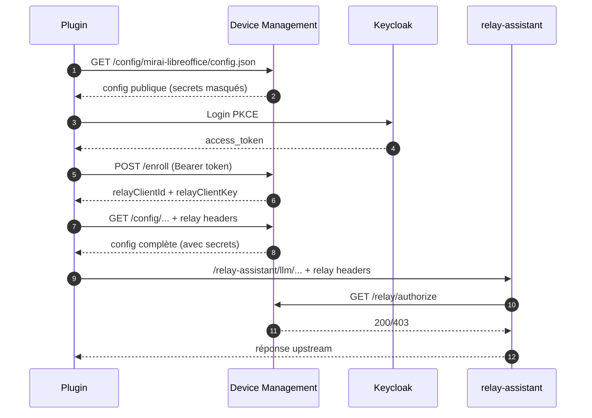

# Device Management

> Le serveur qui distribue, configure, met à jour et supervise les **extensions
> bureautiques** (LibreOffice, Thunderbird, navigateurs) d'une organisation —
> un peu comme un **magasin d'applications interne** doublé d'un **gestionnaire
> de déploiement** pour ces plugins.

---

## En deux mots

Imaginez une organisation qui veut équiper les postes de ses agents d'un **assistant
IA** intégré directement dans LibreOffice, Thunderbird ou le navigateur (sous forme
d'extension/plugin). Il faut alors :

- **distribuer** ces extensions et leurs mises à jour,
- les **configurer** différemment selon l'environnement (test, production…),
- **déployer progressivement** une nouvelle version (d'abord 5 % des postes, puis 25 %, puis tout le monde),
- **contrôler qui y a accès**,
- et leur permettre de **parler à un service d'IA** de façon sécurisée.

**Device Management** (« DM ») est le **serveur central** qui fait tout cela. Chaque
extension installée est vue comme un « device » à gérer — d'où le nom.

> 💡 **Analogie** : c'est l'équivalent d'un *app store d'entreprise* + un système de
> *gestion de flotte* (type MDM), mais pour des **extensions de logiciels bureautiques**
> au lieu de téléphones.

## À quoi ça sert concrètement ?

Un exemple de bout en bout, du point de vue d'un administrateur :

1. Il a une nouvelle version de l'extension « Assistant LibreOffice ». Il l'**upload**
   dans l'interface d'administration.
2. Le serveur **analyse le paquet** et, à l'aide d'un modèle d'IA, **génère
   automatiquement la fiche** (nom, description, fonctionnalités, logo) pour le catalogue.
3. Il lance un **déploiement progressif** : 5 % des postes reçoivent la mise à jour,
   puis 25 %, puis 100 %, avec un **suivi en temps réel**.
4. Côté poste agent, l'extension **récupère sa configuration** auprès du serveur (quel
   modèle d'IA utiliser, quels réglages selon l'environnement…) et **se met à jour** toute seule.
5. Quand l'extension a besoin d'appeler l'IA, elle passe par un **relais sécurisé**
   du serveur (jamais de secret exposé côté poste).

## Pour qui ?

- **Administrateurs / équipes support** : publient les plugins, pilotent les déploiements,
  communiquent avec les utilisateurs (annonces, sondages), gèrent les accès.
- **Développeurs de plugins** : enregistrent leur extension et son gabarit de configuration.
- **Postes des utilisateurs finaux** (LibreOffice, Thunderbird, navigateurs) : consomment
  la configuration et les mises à jour, de façon transparente.

---

> **Note de sécurité (dépôt public)** — Ce dépôt ne contient **aucun secret réel** :
> toutes les valeurs sensibles (tokens, clés, mots de passe) sont des placeholders `<...>`,
> injectées au déploiement via des secrets Kubernetes / overlays non versionnés. Les
> références d'infrastructure interne sont également des placeholders (`<SSO_HOSTNAME>`,
> `<INTERNAL_DOMAIN>`, `<DOCKERHUB_NAMESPACE>`...), à renseigner selon votre environnement.
> Un *boot gate* refuse le démarrage en production si un secret est resté à sa valeur par défaut.

## Ce que fait l'application (résumé)

| Fonction | En clair |
|---|---|
| **Catalogue de plugins** | Une vitrine (publique et admin) listant les extensions disponibles, leurs versions et leur maturité. |
| **Déploiement progressif** | Pousser une mise à jour par paliers (5 % → 25 % → 100 %) avec suivi, plutôt qu'à tout le monde d'un coup. |
| **Configuration centralisée** | Chaque extension récupère ses réglages depuis le serveur, adaptés à l'environnement (test/prod…). |
| **Contrôle d'accès** | Ouvert à tous, sur liste d'attente, ou réservé à un groupe (via le SSO Keycloak). |
| **Assistance par IA** | Un modèle de langage (LLM) génère les fiches catalogue, classe les plugins, suggère du contenu à partir du README. |
| **Relais sécurisé** | Les extensions appellent l'IA via le serveur, sans jamais manipuler de secret en clair. |
| **Télémétrie** | Collecte (optionnelle) de traces d'usage, relayées vers un système d'observabilité. |
| **Communication** | Annonces, alertes, sondages express et changelogs vers les utilisateurs. |

## Comment ça marche (vue d'ensemble)

```
   Poste agent (extension)            Serveur Device Management            Services
  ┌───────────────────────┐         ┌────────────────────────────┐      ┌──────────┐
  │ LibreOffice / Thunder- │  config │  • Catalogue & versions     │      │ Keycloak │ (SSO)
  │ bird / navigateur      │◄───────►│  • Configuration par env.   │◄────►│ LLM (IA) │
  │  + plugin "Assistant"  │  maj/   │  • Déploiement progressif   │      │ Stockage │ (S3)
  │                        │  relais │  • Admin UI + Catalogue web │      │ Postgres │ (BD)
  └───────────────────────┘         └────────────────────────────┘      └──────────┘
```

Côté technique, c'est un **backend FastAPI (Python)** avec une base PostgreSQL, une
interface d'administration web, un catalogue public, et un déploiement Kubernetes.

## Plateformes supportées

| Plateforme | Extension | Protocole de mise à jour |
|------------|-----------|--------------------------|
| LibreOffice | .oxt | Device Management (déploiement progressif) |
| Thunderbird | .xpi | Device Management (déploiement progressif) |
| Firefox | .xpi | Device Management ou AMO (addons.mozilla.org) |
| Chrome / Chromium | .crx | Device Management ou Chrome Web Store |
| Edge | .crx | Device Management ou Edge Add-ons |

## Plugins actifs (exemples)

| Plugin | Identifiant (`device_name`) | Extension | Maturité |
|--------|-----------------------------|-----------|----------|
| Assistant Mirai LibreOffice | `mirai-libreoffice` | .oxt | release |
| Matisse Thunderbird | `mirai-matisse` | .xpi | beta |

De nouveaux plugins (Firefox, Chrome, Edge) s'ajoutent via le catalogue admin, sans
redéploiement du serveur.

---

# Référence technique

> Tout ce qui suit s'adresse aux développeurs et aux personnes qui exploitent le service.

## Concepts clés

### device_name, device_type, alias

```
device_name  = slug = identifiant universel    ex: "mirai-libreoffice"
device_type  = type interne (gabarit de config) ex: "libreoffice"
alias        = rétrocompatibilité               ex: "libreoffice" → "mirai-libreoffice"
```

Un plugin appelle `/config/mirai-libreoffice/config.json` (ou `/config/libreoffice/...`
via alias). Le serveur résout le slug/alias, charge le gabarit de configuration, et
applique les surcharges du catalogue. Les **alias** assurent la compatibilité avec
les anciens plugins.

### Environnements (profils)

Les environnements sont **libres** — pas de liste fermée. 4 profils standards sont recommandés :

| Profil | DM présent ? | LLM | Usage |
|--------|-------------|-----|-------|
| `local` | Non | Ollama localhost | Dev autonome, zéro infra |
| `dev` | Docker local | `${{LLM_BASE_URL}}` | Dev avec DM Docker Compose |
| `int` | Serveur int | `${{LLM_BASE_URL}}` | Intégration / recette |
| `prod` | Serveur prod | `${{LLM_BASE_URL}}` | Production |

Les valeurs `${{VAR}}` sont des **placeholders plateforme** substitués au runtime par
les variables d'environnement du serveur DM.

### Maturité et accès

| Maturité | Description | | Mode d'accès | Description |
|----------|-------------|-|--------------|-------------|
| `dev` | Équipe dev uniquement | | `open` | Libre |
| `alpha` | Expérimental, interne | | `waitlist` | Validation admin requise |
| `beta` | Early adopters validés | | `keycloak_group` | Groupe Keycloak requis |
| `pre-release` | Validation finale | | | |
| `release` | Stable, tous | | | |

## Catalogue de plugins

Le catalogue est le hub central de gestion. Il permet d'**enregistrer un plugin** (fiche
produit, logo), de **gérer le cycle de vie** des versions (draft → published → deprecated
→ yanked), de **définir la maturité**, de **contrôler l'accès**, de **configurer par
environnement**, de **gérer les clients Keycloak** (export JSON), de **suivre les alias**
(métriques de migration), de **déployer** via l'assistant 1-2-3, et de **communiquer**
avec les utilisateurs (annonces, sondages, changelogs).

### Pages publiques et API

Le catalogue expose une **vitrine publique** (sans authentification, design DSFR — Système
de Design de l'État) et une **API JSON** (CORS ouvert, doc Swagger) pour qu'un portail
externe affiche les plugins :

- `/catalog` : page d'accueil (grille de plugins, badges maturité, statistiques)
- `/catalog/{slug}` : fiche plugin (mode d'emploi, changelog, feedback, téléchargement)
- `/catalog/{slug}/download` : téléchargement direct de la dernière version
- `/catalog/api/plugins` · `/catalog/api/plugins/{slug}` · `/catalog/api/docs` : API JSON + Swagger

### Onboarding d'un plugin (découplage cluster / catalogue)

Le déploiement se fait en **2 temps** : (1) déployer le cluster DM une fois (générique,
sans connaissance des plugins), puis (2) enregistrer un plugin via l'admin UI (upload du
paquet, zéro redéploiement). Le gabarit de configuration vient du **plugin lui-même** via
un fichier `dm-config.json` (bundlé dans le paquet .oxt/.xpi, ou uploadé séparément) :

```json
{
  "configVersion": 1,
  "default": { "systemPrompt": "...", "telemetryEnabled": true },
  "local":   { "llm_base_urls": "http://localhost:11434/api" },
  "dev":     { "llm_base_urls": "${{LLM_BASE_URL}}" },
  "prod":    { "llm_base_urls": "${{LLM_BASE_URL}}" }
}
```

### Création assistée par IA

À la création d'un plugin, le système analyse le paquet uploadé (type, version, README,
changelog, `dm-config.json`) et, via un LLM, génère nom, intention, description,
fonctionnalités clés et catégorie.

## Endpoints

**Configuration** — `GET /config/{device_name}/config.json?profile=local|dev|int|prod|...`
(accepte slug ou alias ; pipeline : merge default+profil → placeholders → overrides
catalogue → keycloak → scrub des secrets).

**Enrollment & relais** — `POST|PUT /enroll` (PKCE Bearer), `GET /relay/authorize`,
`/relay-assistant/{path}`.

**Télémétrie** — `GET /telemetry/token` (Bearer court), `POST /telemetry/v1/traces`.

**Binaires** — `GET /binaries/{path}` (S3 presign ou proxy).

**Santé** — `GET /healthz` (dépendances), `GET /livez` (liveness).

**Administration** (`/admin/`, OIDC + groupe `admin-dm`) — `/admin/` (tableau de bord),
`/admin/deploy` (assistant 1-2-3), `/admin/catalog`, `/admin/communications`,
`/admin/devices`, `/admin/campaigns`, `/admin/debug`, `/admin/{cohorts,flags,artifacts,audit}`.

**Catalogue public** (`/catalog/`) — voir section catalogue ci-dessus.

**API de déploiement** (`/api/`) — `POST /api/plugins/{slug}/deploy` (token admin) : upload
binaire + upsert artifact/version + dm-config + changelog + campagne, en une requête.

**Monitoring** (`/ops/`) — `/ops/health/full` (JSON), `/ops/metrics` (Prometheus).

## Architecture

```
app/
  main.py              # API FastAPI (config, enroll, relais, télémétrie, binaires)
  admin/
    router.py          # Admin UI (Jinja2 + HTMX)
    auth.py            # OIDC session + CSRF
    services/          # Couche service (DB) : catalog, campaigns, communications,
                       #   keycloak, devices, flags, cohorts, artifacts, audit
    templates/ static/ # HTML admin + CSS
  catalog/             # Templates DSFR publics (vitrine)
config/                # Gabarit de config générique (fallback ; les gabarits vivent en DB)
db/schema.sql          # Schéma consolidé
deploy/
  docker/              # Docker Compose (dev local)
  k8s/{base,overlays}  # Manifests Kubernetes + overlays (local, scaleway, dgx)
scripts/               # build-local.sh, build-k8s.sh, scripts/k8s/
```

## Variables d'environnement (préfixe `DM_`)

| Variable | Description |
|----------|-------------|
| `PUBLIC_BASE_URL` | URL publique du service |
| `DM_CONFIG_PROFILE` | Profil par défaut (dev/int/prod) |
| `DM_TELEMETRY_ENABLED` / `DM_RELAY_ENABLED` | Activer télémétrie / relais |
| `KEYCLOAK_ISSUER_URL` / `KEYCLOAK_REALM` / `KEYCLOAK_CLIENT_ID` | SSO Keycloak |
| `LLM_BASE_URL` / `LLM_API_TOKEN` / `DEFAULT_MODEL_NAME` | Modèle IA (analyse catalogue) |
| `DATABASE_URL` | PostgreSQL |

## Lancer en local

```bash
cd deploy/docker
docker compose up --build
```
Services : DM (3001), relay-assistant (8088), postgres (5432), adminer (8080).

## Build et déploiement

```bash
./scripts/build-local.sh                 # Local (arm64, rapide)
./scripts/build-k8s.sh <version>         # Kubernetes (multi-arch amd64+arm64 + push)
./scripts/k8s/deploy.sh scaleway         # Déploiement sur un overlay
```

## Flux relais sécurisé



## Déploiement progressif

L'admin UI propose un assistant **« Déploiement 1-2-3 »** : (1) choisir le plugin et
uploader le fichier (analyse IA), (2) définir la cible (tous, groupe, pourcentage),
(3) configurer le rythme et lancer. Suivi en temps réel.

| Stratégie | Paliers |
|----------|---------|
| `canary` | 5 % (24 h) → 25 % (48 h) → 100 % |
| `immediate` | 100 % immédiatement |

En CI/CD, tout passe par `POST /api/plugins/{slug}/deploy` (artifact upsert, version
publiée, anciennes dépréciées, campagne activée — en une requête).

**Distribution des binaires (pull-on-miss)** : le pod *admin* a un stockage persistant et
détient les binaires uploadés ; les pods *API* (sans volume partagé) tirent le binaire au
premier téléchargement et le cachent localement. Les icônes sont stockées en base (data URL).

## Validation

```bash
./scripts/test-all.sh
./scripts/k8s/validate-all.sh
curl -sS http://localhost:3001/healthz
```

## Documentation complémentaire

- `developer-readme.md` — guide opérations (dev/infra)
- `consumer-readme.md` — intégration client (PKCE, endpoints, cURL)
- `prompts/` — prompts exécutables pour l'IA (admin UI, assistant de déploiement, catalogue…)
