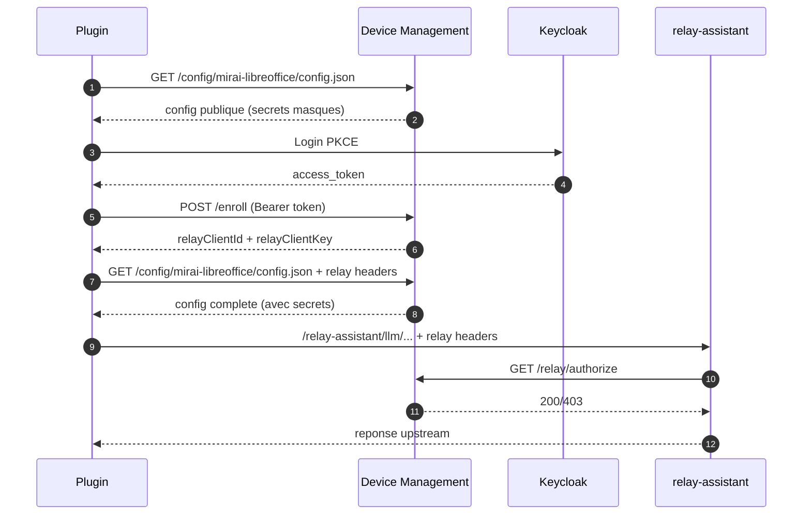

# Device Management (FastAPI)

Backend de gestion de plugins pour les outils bureautiques (LibreOffice, Thunderbird ou tout autre solutions permettant l'ajout de fonctionnalite).
Configuration centralisee, catalogue de plugins, deploiement progressif, telemetrie et relay securise.
Le systeme s'appuie sur un **LLM** (modele de langage) pour assister l'administrateur et automatiser certaines taches : analyse de packages, generation de fiches catalogue, suggestion de contenu a partir de README, et classification automatique des plugins.

## Plateformes supportees

| Plateforme | Extension | Protocole de mise a jour |
|------------|-----------|--------------------------|
| LibreOffice | .oxt | Device Management (deploiement progressif) |
| Thunderbird | .xpi | Device Management (deploiement progressif) |
| Firefox | .xpi | Device Management ou AMO (addons.mozilla.org) |
| Chrome / Chromium | .crx | Device Management ou Chrome Web Store |
| Edge | .crx | Device Management ou Edge Add-ons |

## Plugins actifs

| Plugin | device_name | device_type | Extension | Alias | Maturite |
|--------|-------------|-------------|-----------|-------|----------|
| Assistant Mirai LibreOffice | `mirai-libreoffice` | libreoffice | .oxt | `libreoffice` | release |
| Matisse Thunderbird | `mirai-matisse` | matisse | .xpi | `matisse` | beta |

Le `device_name` est l'identifiant universel du plugin. Il sert dans les URLs,
le catalogue, l'enrollment et le matching de configuration.
Les **alias** assurent la retrocompatibilite avec les anciens plugins.
De nouveaux plugins (Firefox, Chrome, Edge) peuvent etre ajoutes via le catalogue admin.

## Documentation

- `developer-readme.md` : guide operations (dev/infra)
- `consumer-readme.md` : integration client (PKCE, endpoints, cURL)
- `prompts/` : prompts executables pour l'IA

| Prompt | Description |
|--------|-------------|
| `prompts/prompt-admin-ui.md` | Interface d'administration (DSFR, OIDC) |
| `prompts/prompt-deploy-wizard.md` | Assistant deploiement 1-2-3 |
| `prompts/prompt-catalog-v2.md` | Catalogue v2 (alias, env, keycloak, maturite, page publique) |
| `prompts/prompt-plugin-catalog.md` | Catalogue v1 (obsolete, remplace par v2) |

## Concepts cles

### device_name, device_type, alias

```
device_name  = slug = identifiant universel    ex: "mirai-libreoffice"
device_type  = type interne (template config)  ex: "libreoffice"
alias        = retrocompatibilite              ex: "libreoffice" → "mirai-libreoffice"
```

Un plugin appelle `/config/mirai-libreoffice/config.json` (ou `/config/libreoffice/...` via alias).
Le serveur resout le slug/alias, charge le template config, applique les overrides catalogue.

### Environnements (profils)

Les environnements sont **libres** — pas de liste fermee. 4 profils standards sont recommandes :

| Profil | DM present ? | LLM | Usage |
|--------|-------------|-----|-------|
| `local` | Non | Ollama localhost | Dev autonome, zero infra |
| `dev` | Docker local | `${{LLM_BASE_URL}}` | Dev avec DM Docker Compose |
| `int` | Serveur int | `${{LLM_BASE_URL}}` | Integration / recette |
| `prod` | Serveur prod | `${{LLM_BASE_URL}}` | Production |

Les valeurs `${{VAR}}` sont des **placeholders plateforme** substitues au runtime
par les variables d'environnement du serveur DM.

### Maturite et acces

| Maturite | Description |
|----------|-------------|
| `dev` | Developpement, equipe dev uniquement |
| `alpha` | Experimental, interne |
| `beta` | Early adopters valides |
| `pre-release` | Validation finale |
| `release` | Stable, tous |

| Mode d'acces | Description |
|-------------|-------------|
| `open` | Libre |
| `waitlist` | Validation admin requise |
| `keycloak_group` | Groupe Keycloak requis |

## Catalogue de plugins

Le catalogue est le hub central de gestion des plugins. Il permet de :

- **Enregistrer un plugin** avec sa fiche produit (nom, description, intention, fonctionnalites cles, logo/mascotte)
- **Gerer le cycle de vie** des versions : draft → published → deprecated → yanked
- **Definir la maturite** du produit : dev → alpha → beta → pre-release → release
- **Controler l'acces** : ouvert a tous, liste d'attente avec validation admin, ou groupe Keycloak requis
- **Configurer par environnement** (local/dev/int/prod et profils libres) : surcharges de variables specifiques au plugin
- **Gerer les clients Keycloak** par environnement avec export JSON pour import direct dans Keycloak
- **Suivre les alias** avec metriques de migration (% de devices encore sur l'ancien chemin)
- **Deployer** via l'assistant 1-2-3 directement depuis la fiche d'une version
- **Communiquer** avec les utilisateurs : annonces, alertes, sondages express, changelogs

### Page publique

Le catalogue expose une **vitrine publique** (sans authentification) au design DSFR
(Systeme de Design de l'Etat Francais), proche de mirai.interieur.gouv.fr :

- `/catalog` : page d'accueil avec grille de plugins, badges maturite, statistiques
- `/catalog/{slug}` : fiche plugin avec mode d'emploi, changelog, feedback utilisateurs, telechargement
- `/catalog/{slug}/download` : telechargement direct de la derniere version

### API JSON publique

Le catalogue expose une API JSON (CORS ouvert, documentation Swagger) permettant
a des sites externes (ex: mirai.interieur.gouv.fr) d'afficher les plugins :

- `/catalog/api/plugins` : liste des plugins avec nom, intent, tags, version, installs
- `/catalog/api/plugins/{slug}` : detail complet d'un plugin
- `/catalog/api/docs` : documentation Swagger/OpenAPI interactive

### Onboarding d'un plugin (decouplage cluster / catalogue)

Le deploiement se fait en **2 temps** :

1. **Deployer le cluster DM** (une fois, generique, aucune connaissance des plugins)
2. **Enregistrer un plugin** via l'admin UI (upload package, zero redeploy)

Le template de configuration vient du **plugin** lui-meme via un fichier `dm-config.json` :
- **Bundle dans le package** (.oxt/.xpi) : extrait automatiquement, retire du binaire distribue
- **Ou upload separe** dans le formulaire admin

Format `dm-config.json` (default + sections par environnement) :
```json
{
  "configVersion": 1,
  "default": { "systemPrompt": "...", "telemetryEnabled": true },
  "local":   { "llm_base_urls": "http://localhost:11434/api" },
  "dev":     { "llm_base_urls": "${{LLM_BASE_URL}}" },
  "prod":    { "llm_base_urls": "${{LLM_BASE_URL}}" }
}
```

Les placeholders `${{VAR}}` sont substitues par les variables de la plateforme DM.
Les sections serveur sont **auto-completees** avec les placeholders si le dev ne les fournit pas.

### Creation assistee par IA

Lors de la creation d'un plugin, le systeme analyse le package uploade et extrait :
- Le type de plugin, la version, le README, le changelog
- Le `dm-config.json` (template config)
- Via un LLM : nom, intention, description, fonctionnalites cles, categorie

## Endpoints

### Configuration
- `GET /config/{device_name}/config.json?profile=local|dev|int|prod|...` : config specifique au plugin
  - Accepte le slug (`mirai-libreoffice`) ou un alias (`libreoffice`)
  - Profils libres (local, dev, int, prod, staging, dgx, etc.)
  - Template depuis `plugins.config_template` (DB) avec fallback fichier
  - Pipeline : merge default+profil → placeholders → overrides catalogue → keycloak → scrub

### Enrollment et relay
- `POST|PUT /enroll` : enregistrement d'un plugin (PKCE Bearer token)
- `GET /relay/authorize` : autorisation relay (interne nginx)
- `/relay-assistant/{path}` : proxy vers le relay-assistant

### Telemetrie
- `GET /telemetry/token` : token Bearer court-duree (rotation)
- `POST /telemetry/v1/traces` : relay telemetrie vers upstream

### Binaires
- `GET /binaries/{path}` : binaires S3 (presign ou proxy)

### Sante
- `GET /healthz` : verification dependances (DB, S3, storage)
- `GET /livez` : liveness probe (toujours 200)

### Administration (`/admin/`)
- `/admin/` : tableau de bord (OIDC, groupe `admin-dm` requis)
- `/admin/deploy` : assistant deploiement 1-2-3
- `/admin/catalog` : catalogue de plugins (fiches, versions, overrides env, keycloak, alias)
- `/admin/communications` : campagnes de communication et sondages
- `/admin/devices` : appareils enregistres
- `/admin/campaigns` : campagnes de deploiement (avance)
- `/admin/debug` : sante des services (DB, Keycloak, LLM, relay, telemetrie)
- `/admin/cohorts`, `/admin/flags`, `/admin/artifacts`, `/admin/audit`

### Catalogue public (`/catalog/`)
- `/catalog` : page d'accueil (DSFR, style mirai.interieur.gouv.fr)
- `/catalog/{slug}` : fiche plugin (mode d'emploi, changelog, feedback, telechargement)
- `/catalog/{slug}/download` : telechargement derniere version
- `/catalog/api/plugins` : API JSON publique (CORS ouvert)
- `/catalog/api/plugins/{slug}` : detail JSON d'un plugin
- `/catalog/api/status` : disponibilite des services
- `/catalog/api/docs` : documentation Swagger/OpenAPI

### Monitoring (`/ops/`)
- `/ops/health/full` : sante detaillee (JSON, pour Grafana/alerting)
- `/ops/metrics` : metriques Prometheus (text exposition)
- `/catalog/api/plugins` : API JSON publique (CORS ouvert, pour integration mirai)
- `/catalog/api/plugins/{slug}` : detail JSON d'un plugin
- `/catalog/api/docs` : documentation Swagger/OpenAPI

## Architecture

```
app/
  main.py              # API FastAPI (config, enroll, relay, telemetrie, binaires)
  admin/
    router.py          # Admin UI (Jinja2 + HTMX)
    auth.py            # OIDC session + CSRF
    services/          # Couche service (DB)
      catalog.py       # Plugins, versions, overrides, alias
      campaigns.py     # Campagnes de deploiement
      communications.py # Annonces, alertes, sondages
      keycloak.py      # Clients Keycloak, export JSON
      devices.py, flags.py, cohorts.py, artifacts.py, audit.py
    templates/         # Templates HTML (admin + catalogue preview)
    static/            # CSS (dm-admin.css)
  catalog_public/      # Templates DSFR publics (catalogue)

config/
  mirai-libreoffice/   # Templates config LibreOffice (fallback fichier)
  matisse/             # Templates config Matisse (fallback fichier)
  # Note : a terme les templates config vivent dans plugins.config_template (DB)
  # et les dossiers config/ deviennent un fallback pour la retrocompatibilite

db/
  schema.sql           # Schema unique consolide (toutes les tables)

deploy/
  docker/              # Docker Compose (dev local)
  k8s/
    base/              # Manifests Kubernetes
    overlays/          # Overlays (local, scaleway, dgx)

scripts/
  build-local.sh       # Build Docker arm64 (dev rapide)
  build-k8s.sh         # Build multi-arch amd64+arm64 + push registry
  k8s/                 # Scripts deploiement Kubernetes
```

## Variables d'environnement (`DM_` prefix)

| Variable | Description |
|----------|-------------|
| `PUBLIC_BASE_URL` | URL publique du service |
| `DM_CONFIG_PROFILE` | Profil par defaut (dev/int/prod) |
| `DM_TELEMETRY_ENABLED` | Activer la telemetrie |
| `DM_RELAY_ENABLED` | Activer le relay |
| `KEYCLOAK_ISSUER_URL` | Issuer Keycloak |
| `KEYCLOAK_REALM` | Realm |
| `KEYCLOAK_CLIENT_ID` | Client ID par defaut |
| `LLM_BASE_URL` | Endpoint LLM (analyse IA catalogue) |
| `LLM_API_TOKEN` | Token API LLM |
| `DEFAULT_MODEL_NAME` | Modele LLM par defaut |
| `DATABASE_URL` | PostgreSQL |

## Lancer en local

```bash
cd deploy/docker
docker compose up --build
```

Services : DM (3001), relay-assistant (8088), postgres (5432), adminer (8080)

## Build et deploiement

```bash
# Local (arm64, rapide)
./scripts/build-local.sh

# Kubernetes (multi-arch)
./scripts/build-k8s.sh 0.1.1-catalog
./scripts/k8s/deploy.sh scaleway
```

Rollout complet ~12s (probes optimisees).

## Secure Relay Flow



## Deploiement progressif

L'admin UI propose un assistant **"Deploiement 1-2-3"** :
1. Choisir le plugin et uploader le fichier (analyse IA automatique)
2. Definir la cible (tous, groupe, pourcentage)
3. Configurer le rythme (5% → 25% → 50% → 100%) et lancer

Suivi en temps reel avec courbe de progression.

## Validation

```bash
./scripts/test-all.sh
./scripts/k8s/validate-all.sh
curl -sS http://localhost:3001/healthz
```
