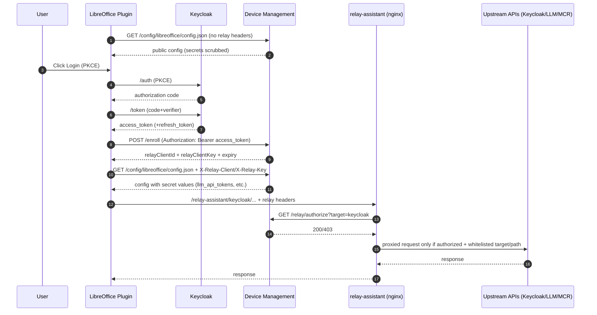
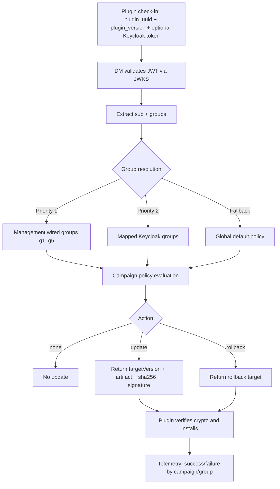
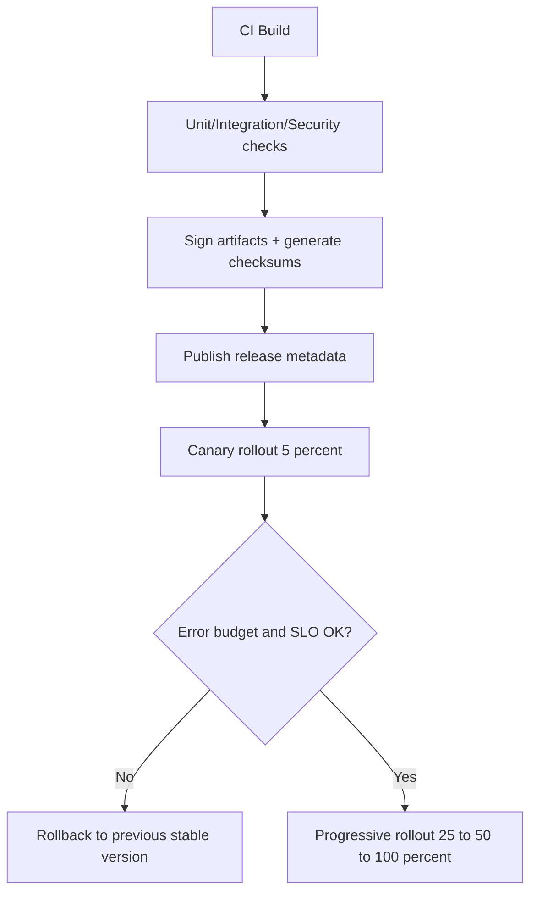
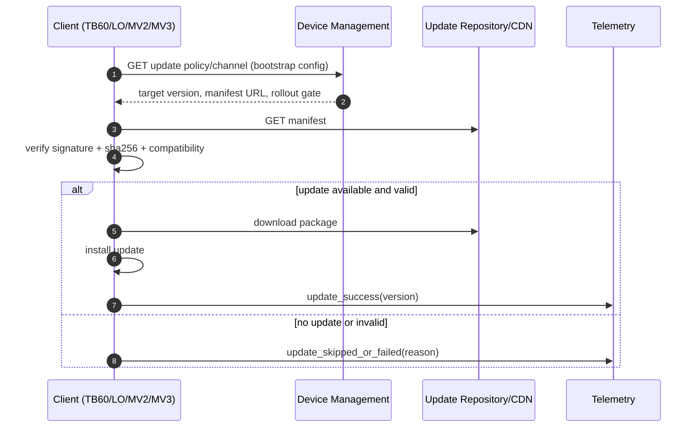
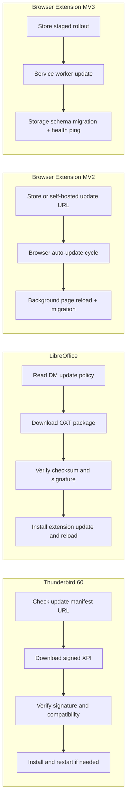

# Device Management (FastAPI)

Replacement of the Nginx/Lua implementation with a FastAPI API.

## Documentation
- `developer-readme.md`: operations guide (dev/infra)
- `consumer-readme.md`: client integration (PKCE, endpoints, cURL)

## Endpoints

- `GET /config/config.json`: returns configuration (dynamic via environment variables)
- `GET /config/<device>/config.json`: device-specific configuration (matisse, libreoffice, chrome, edge, firefox, misc)
- `POST|PUT /enroll`: records a JSON payload (local storage and/or S3)
- `GET /telemetry/token`: returns a short-lived telemetry Bearer token (rotation)
- `POST /telemetry/v1/traces` (or `/v1/traces`): telemetry relay endpoint to upstream collector
- `GET /healthz`: returns health status (200 if OK, 412 if prerequisites missing)
- `GET /binaries/{path}`: serves binaries stored in S3
  - `presign` mode (default): redirects to a presigned URL
  - `proxy` mode: proxy/streaming via the API (client does not see S3)

## Environment variables (`DM_` prefix)

### Public URL (used in config/config.json)
- `PUBLIC_BASE_URL=https://server.com`

The `config/config.json` file supports placeholders `${VARNAME}` (e.g. `${PUBLIC_BASE_URL}`).

### API / CORS
- `DM_ALLOW_ORIGINS="*"` or CSV list of origins
- `DM_MAX_BODY_SIZE_MB=10`

### /config/config.json
- `DM_CONFIG_ENABLED=true`
- `DM_APP_ENV=dev`
- `DM_ENROLL_URL=/enroll`

### Telemetry relay and rotation
- `DM_TELEMETRY_ENABLED=true`
- `DM_TELEMETRY_PUBLIC_ENDPOINT=/telemetry/v1/traces`
- `DM_TELEMETRY_AUTHORIZATION_TYPE=Bearer`
- `DM_TELEMETRY_UPSTREAM_ENDPOINT=https://telemetry.minint.fr/v1/traces`
- `DM_TELEMETRY_UPSTREAM_AUTH_TYPE=Bearer`
- `DM_TELEMETRY_UPSTREAM_KEY=...` (optional if upstream requires auth)
- `DM_TELEMETRY_TOKEN_TTL_SECONDS=300`
- `DM_TELEMETRY_TOKEN_SIGNING_KEY=...` (required when `DM_TELEMETRY_REQUIRE_TOKEN=true`)
- `DM_TELEMETRY_REQUIRE_TOKEN=true`
- `DM_RELAY_FORCE_KEYCLOAK_ENDPOINTS=false` (default: keep Keycloak issuer/token endpoints from config template)

### Enroll storage
- `DM_STORE_ENROLL_LOCALLY=true`
- `DM_ENROLL_DIR=/data/enroll`
- `DM_STORE_ENROLL_S3=false`
- `DM_S3_BUCKET=...`
- `DM_S3_PREFIX_ENROLL=enroll/`

### S3 binaries
- `DM_S3_PREFIX_BINARIES=binaries/`
- `DM_BINARIES_MODE=presign` (or `proxy`)
- `DM_PRESIGN_TTL_SECONDS=300`

### AWS
The app uses standard mechanisms (IAM role, `AWS_REGION`, `AWS_ACCESS_KEY_ID`, etc.)

## Load environment variables and secrets

- Docker Compose: `.env` + `.env.secrets`
- Kubernetes: Helm (`values.yaml` → `env:` and `secrets:`)

## TODO (Enrollment)

Goal: secure enrollment with **PKCE**, enable **silent provisioning** (refresh token), and **secure parameter retrieval** in applications.

### 1) PKCE authentication (public client)
- Create a **public** Keycloak client with mandatory PKCE.
- Disable ROPC (Direct Access Grants).
- Strict redirect URL (localhost + allowed port).

### 2) Application enrollment
- The plugin retrieves the token via PKCE.
- Checks the token’s `email` field (and `email_verified` if available).
- Stores the refresh token in the system vault (Keychain/SecretService/Windows CredMan).

### 3) Silent provisioning
- Renew `access_token` via `refresh_token` without user interaction.
- If refresh fails → force re-auth.

### 4) Settings and configuration
- Fetch config via `/config/<device>/config.json`.
- Use `dm_bootstrap_url` to point to the source (prod vs dev).
- Keep secrets server-side (not in the plugin).

## Run locally

```bash
python -m venv .venv
source .venv/bin/activate
pip install -r requirements.txt
uvicorn app.main:app --host 0.0.0.0 --port 8088
```

## Run with Docker

```bash
docker build -t device-management-fastapi .
docker run --rm -p 8088:8088 -e DM_APP_ENV=dev -v "$(pwd)/data:/data" device-management-fastapi
```

## Run with docker-compose

```bash
cp .env.example .env
cp .env.secrets.example .env.secrets
# Edit .env and .env.secrets (PUBLIC_BASE_URL, S3, secrets...)
docker compose up --build
```

## Kubernetes deployment (Helm)

The Helm chart is available in `helm/device-management`.

Example install:

```bash
helm upgrade --install device-management ./helm/device-management \
  --set env.PUBLIC_BASE_URL=https://server.com \
  --set env.DM_APP_ENV=prod
```

### Configuration / secrets via Helm

- Non-sensitive variables: `values.yaml` → `env:`
- Secrets: `values.yaml` → `secrets:` or `existingSecretName`
- `config.json` file: `values.yaml` → `config.configJson`

Minimal `values.yaml` example:

```yaml
env:
  PUBLIC_BASE_URL: https://server.com
  DM_APP_ENV: prod
secrets:
  TELEMETRY_SALT: "super-secret"
  TELEMETRY_KEY: "super-secret-key"
```

## TODO (Cloud Pi Native)

- Convert all Kubernetes manifests into a **Helm chart** (single entry point, centralized values, environment profiles).
- Externalize secrets in an **environment vault** compliant with **Cloud Pi Native** (www.cloud-pi-native.fr):
  - avoid plaintext secrets in Git,
  - define a rotation and access policy (least privilege),
  - inject secrets via native mechanisms (external-secrets / CSI / vault provider).

## Secure Relay Flow (PKCE -> enroll -> relay)



### Security model summary
- Enrollment requires a user PKCE access token.
- Relay credentials are generated server-side at enroll and rotated on re-enroll.
- Secret config values are returned only with valid relay credentials.
- `relay-assistant` is a standard nginx proxy with strict path whitelist.
- Authorization is delegated to DM (`/relay/authorize`) with an internal shared token.
- No free-form URL forwarding: target is constrained to allowed prefixes (`keycloak`, `llm`, `mcr-api`).

## Auto-Update Workflow (TB60 / LibreOffice / MV2 / MV3)

Progressive rollout summary: the plugin sends `plugin_uuid`, current version, and (after PKCE login) a Keycloak token; Device Management validates the JWT (JWKS/signature, `iss`, `aud`, `exp`), derives user identity (`sub`) and `groups`, then applies rollout targeting priority (first the 5 management-wired deployment groups, then mapped Keycloak groups). DM returns a campaign policy (`none/update/rollback`, target version, artifact URL, checksum/signature, rollout percentage). The client installs only if policy allows and cryptographic verification succeeds, then reports status (`success/failure`) so campaigns can be started, paused, promoted, or rolled back with per-group tracking.



### 1) Unified release and progressive rollout



### 2) Client-side update cycle via Device Management



### 3) Platform tracks



## Validation scripts

### Full validation (all targets)

```bash
./scripts/test-all.sh
```

### DM (Docker / infra-minimal)

```bash
./infra-minimal/validate-all.sh
```

### DM (deploy-dgx)

```bash
./deploy-dgx/validate-all.sh
./deploy-dgx/scripts/smoke-test-dgx.sh
```

### Kubernetes manifest sanity (client-side)

```bash
kubectl apply --dry-run=client -f infra-minimal/bootstrap-app.yaml
kubectl apply --dry-run=client -k deploy-dgx
```

### Reset from zero

```bash
FORCE=1 RESET_K8S=1 ./scripts/reset-from-scratch.sh
```

### Plugin-side validation (from plugin repo)

```bash
cd ../AssistantMiraiLibreOffice
./scripts/03-test-local.sh
```

## Kubernetes agnostique (nouveau socle)

Le déploiement Kubernetes est maintenant structuré en **base + overlays**:

- `deploy/k8s/base`
- `deploy/k8s/overlays/local`
- `deploy/k8s/overlays/scaleway`
- `deploy/k8s/overlays/dgx`

Profils cibles:

- `local`: `http://bootstrap.home`
- `scaleway`: `https://bootstrap.fake-domain.name`
- `dgx`: `https://onyxia.gpu.minint.fr/bootstrap`

Commandes unifiées:

```bash
cp .env.registry.example .env.registry
./scripts/k8s/create-registry-secret.sh local
./scripts/k8s/render.sh local
./scripts/k8s/deploy.sh local
./scripts/k8s/validate.sh local
./scripts/k8s/validate-all.sh
```

Notes HTTP/HTTPS:

- `local` en HTTP est strictement réservé au dev local (réseau de confiance).
- `scaleway` et `dgx` doivent rester en HTTPS avec certificats valides.
- En production, ne pas désactiver la vérification TLS.

### Dépréciation `infra-minimal`

`infra-minimal` est désormais un chemin legacy. La cible est:

1. valider la parité fonctionnelle via `deploy/k8s/overlays/*`,
2. basculer CI/CD et opérations sur `scripts/k8s/*`,
3. supprimer `infra-minimal` une fois la parité confirmée.
