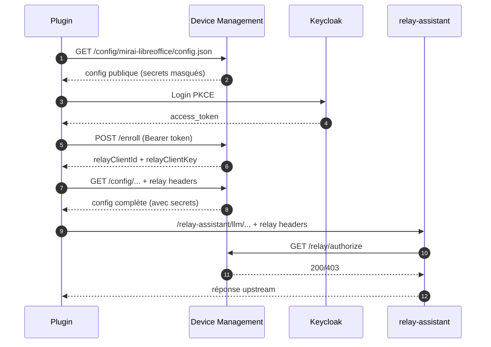

# Device Management

> Le serveur qui distribue, configure, met à jour et supervise les **extensions
> bureautiques** (LibreOffice, Thunderbird, navigateurs) d'une organisation —
> un peu comme un **magasin d'applications interne** doublé d'un **gestionnaire
> de déploiement** pour ces plugins.

---

## Le problème

Une organisation veut équiper les postes de ses agents d'un **assistant IA** intégré
directement dans LibreOffice, Thunderbird ou le navigateur (sous forme d'extension/plugin).
**Poser le logiciel sur les postes**, un outil de gestion de parc (WAPT, SCCM, Intune) sait
déjà le faire. Le vrai défi commence **après l'installation** :

- **distribuer** les mises à jour des extensions,
- les **configurer** différemment selon l'environnement (test, production…),
- **déployer progressivement** une nouvelle version (5 % des postes, puis 25 %, puis tout le monde),
- **contrôler qui y a accès**,
- et leur permettre de **parler à un service d'IA** de façon sécurisée.

Et surtout, le faire **vite** : ces extensions évoluent au rythme des **retours de leurs
utilisateurs**. Il faut pouvoir ajuster un réglage, activer une fonctionnalité pour un groupe
pilote, mesurer son usage réel, puis la généraliser ou la couper — **sans réinstaller la flotte,
sans exposer de secret sur les postes, et en gardant 100 % de la main sur sa politique de magasin**.

## En deux mots

**Device Management** (« DM ») est le **serveur central** qui répond à ce problème. Il ne pose
pas le paquet sur le poste : il **gouverne tout ce qui se passe après l'installation** —
configuration, mises à jour, déploiement progressif, accès sécurisé aux services et mesure
d'usage. Chaque extension installée est vue comme un « device » à gouverner — d'où le nom.

> 💡 **Analogie** : c'est l'équivalent d'un *app store d'entreprise* + un système de
> *gestion de flotte* (type MDM), mais pour des **extensions de logiciels bureautiques**
> au lieu de téléphones.

## Concrètement

Un exemple de bout en bout, du point de vue d'un administrateur :

1. Il a une nouvelle version de l'extension « Assistant LibreOffice ». Il l'**upload**
   dans l'interface d'administration.
2. Le serveur **analyse le paquet** et, à l'aide d'un modèle d'IA, **génère
   automatiquement la fiche** (nom, description, fonctionnalités, logo) pour le catalogue.
3. Il lance un **déploiement progressif** : 5 % des postes reçoivent la mise à jour,
   puis 25 %, puis 100 %, avec un **suivi en temps réel**.
4. Côté poste agent, l'extension **récupère sa configuration** auprès du serveur (quel
   modèle d'IA utiliser, quels réglages selon l'environnement…) et **se met à jour** toute seule.
5. Quand l'extension a besoin d'appeler l'IA, elle passe par un **relais sécurisé**
   du serveur (jamais de secret exposé côté poste).

## Comment ça marche

```
   Poste agent (extension)            Serveur Device Management            Services
  ┌───────────────────────┐         ┌────────────────────────────┐      ┌──────────┐
  │ LibreOffice / Thunder- │  config │  • Catalogue & versions     │      │ Keycloak │ (SSO)
  │ bird / navigateur      │◄───────►│  • Configuration par env.   │◄────►│ LLM (IA) │
  │  + plugin "Assistant"  │  maj/   │  • Déploiement progressif   │      │ Stockage │ (S3)
  │                        │  relais │  • Admin UI + Catalogue web │      │ Postgres │ (BD)
  └───────────────────────┘         └────────────────────────────┘      └──────────┘
```

Le principe : **le poste demande, le serveur décide**. L'extension interroge périodiquement
le serveur (sa configuration) ; le serveur lui répond, *pour ce poste précis*, ce qu'elle doit
faire — quels réglages appliquer, s'il y a une mise à jour, quelles fonctionnalités sont actives.
Côté technique, c'est un **backend FastAPI (Python)** avec une base PostgreSQL, une interface
d'administration web, un catalogue public, et un déploiement Kubernetes. Le détail de la boucle de
mise à jour est décrit plus bas (« [Comment fonctionnent les mises à jour](#comment-fonctionnent-les-mises-à-jour) »).

## Pour qui ?

- **Administrateurs / équipes support** : publient les plugins, pilotent les déploiements,
  communiquent avec les utilisateurs (annonces, sondages), gèrent les accès.
- **Développeurs de plugins** : enregistrent leur extension et son gabarit de configuration.
- **Postes des utilisateurs finaux** (LibreOffice, Thunderbird, navigateurs) : consomment
  la configuration et les mises à jour, de façon transparente.

## Positionnement : complément de la gestion de parc (WAPT, SCCM, Intune)

Device Management **n'est pas un concurrent** des outils de télédistribution de parc
(WAPT, SCCM, Intune…) — il en est le **complément naturel**. Les deux se passent le relais
à une frontière nette :

- **L'outil de gestion de parc pose le paquet sur la machine** : il installe le binaire de
  l'extension (`.oxt`/`.xpi`/`.crx`) au **déploiement initial** et à chaque **montée de version
  majeure**. C'est une opération **centrée machine**, pilotée par l'inventaire de parc.
- **Device Management gouverne tout ce qui se passe après l'installation** : configuration
  dynamique, activation progressive de fonctionnalités, télémétrie d'usage, accès sécurisé aux
  services tiers. C'est une opération **centrée identité (IAM)**, pilotée par cohortes, au rythme
  du produit.

```
   ┌────────────────────────────────┐
   │      Gestionnaire de parc      │   ①  installe / met à jour le PAQUET
   │     (WAPT · SCCM · Intune)     │       (.oxt/.xpi/.crx) : déploiement
   └───────────────┬────────────────┘       initial + montées de version majeures
                   │ ①
                   ▼
   ┌────────────────────── Poste agent ───────────────────────┐
   │   ┌──────────────┐    héberge    ┌─────────────────────┐  │
   │   │ Hôte         │ ────────────▶ │ Extension (plug-in) │  │
   │   │ LibreOffice  │               │ « Assistant MirAI » │  │
   │   │ Thunderbird  │               │ s'exécute dans      │  │
   │   │ Navigateur   │               │ l'hôte              │  │
   │   └──────────────┘               └──────────┬──────────┘  │
   └─────────────────────────────────────────────┼────────────┘
                                                 │ ②  configuration, directive
                                                 │    d'update, feature flags
                                                 │    (par cohorte), télémétrie
                                                 ▼
   ┌──────────────────────────────────────────────────────────┐
   │  Device Management (DM) — cycle de vie APRÈS installation │
   │  • configuration par environnement                       │
   │  • déploiement progressif (canari) + feature toggling    │
   │  • télémétrie d'usage   • relais sécurisé (médiation)     │
   └───────────────────────────┬──────────────────────────────┘
                               │ ③  médiation authentifiée
                               │    (secrets jamais sur le poste)
                               ▼
   ┌──────────────────────────────────────────────────────────┐
   │  Services tiers / fournisseurs                           │
   │  Keycloak (SSO) · LLM (IA) · API métier · Stockage S3     │
   └──────────────────────────────────────────────────────────┘
```

> **① Gestionnaire de parc → hôte** : pose le binaire sur le poste (initial + montées majeures),
> opération *centrée machine*. **② Plug-in ↔ DM** : tout le cycle de vie post-installation, sans
> réinstaller, opération *centrée identité*. **③ DM → services tiers** : point de médiation unique,
> secrets côté serveur. **Frontière de responsabilité** : le gestionnaire de parc s'arrête à
> l'installation du paquet, DM gouverne la suite, le plug-in s'exécute dans son hôte et consomme.

| | Outil de gestion de parc (WAPT…) | Device Management |
|---|---|---|
| **Unité gérée** | Le paquet binaire (version) | La configuration et la fonctionnalité |
| **Clé de ciblage** | La machine (inventaire) | L'identité (groupes Keycloak, e-mail, cohorte, %) |
| **Cadence** | Cycle d'empaquetage | Cycle produit (changement serveur, sans réinstall) |
| **Retour terrain** | Statut d'installation | Télémétrie d'**usage fonctionnel** (pertinence des fonctionnalités) |
| **Config & secrets** | Figés dans le paquet (sur le disque) | Servis dynamiquement, secrets jamais sur le poste (relais) |

**Cinq apports propres à DM :** (1) on bascule un *feature flag* ou on change le modèle d'IA
**sans réinstaller** ; (2) le ciblage **épouse l'annuaire** (on adresse des agents, pas des postes) ;
(3) un changement de config **ne repasse pas par l'outil de parc** → cycle de dev très rapide ;
(4) la **télémétrie fonctionnelle** ferme la boucle produit et oriente la roadmap ; (5) la config
est **dynamique et sécurisée**, les secrets restent côté serveur (révocation atomique).

**Feature toggling par cohorte.** DM porte des *feature flags* surchargeables **par cohorte**
(valeur par défaut globale + surcharges ciblées, avec seuil de version mini). On peut ainsi
**activer une fonctionnalité pour une cohorte pilote** afin de la tester en conditions réelles avant
généralisation, ou la **désactiver instantanément** (*kill switch*) en cas de défaut — **sans réinstaller
ni faire de rollback de version du paquet**. Couplé à la télémétrie d'usage, cela permet d'éprouver une
fonctionnalité sur une population restreinte, de mesurer son adoption, puis de l'étendre ou de la retirer.

**Objectif directeur : un cycle dev/déploiement très rapide, piloté par le feedback utilisateur.**
Tout ce qui précède sert une même finalité — **raccourcir au maximum la boucle entre un retour
utilisateur et sa prise en compte en production**. DM collecte le feedback de deux façons : **implicite**
(télémétrie d'usage : quelles fonctionnalités sont réellement utilisées, où sont les erreurs) et
**explicite** (sondages, annonces et retours intégrés au catalogue). En face, les leviers d'action —
config dynamique, *feature toggling* par cohorte, déploiement progressif — s'actionnent **côté serveur,
sans ré-empaquetage ni réinstallation**. Résultat : **mesurer → décider → déployer** en heures plutôt
qu'en cycles d'empaquetage, sur une cohorte pilote d'abord, puis à l'échelle.

**Contrat et responsabilités face aux tiers.** Le couple **plugin + DM** forme un contrat explicite :
le plugin déclare son besoin de config (`dm-config.json`) et consomme via le relais ; DM est le
**point de médiation unique** (credentials, quotas, autorisations, audit, masquage des secrets) ;
le fournisseur tiers (modèle d'IA, API métier) expose sa capacité sans connaître les postes.
*Le tiers fournit la capacité, DM gouverne l'accès, le plugin consomme.* À noter : les **politiques
d'autorisation et d'exception** (éligibilité des postes au déploiement, dérogations) restent **à la
main du gestionnaire de parc** — DM opère dans ce cadre.

**Souveraineté.** Contrairement aux magasins publics (Chrome Web Store, AMO), **l'organisation
garde la main à 100 % sur la politique de son magasin** : catalogue, maturité, modes d'accès,
rythme et cible de déploiement, retrait — sans dépendance à un store externe ni export de
l'inventaire d'usage.

**Sécurisation de la chaîne d'approvisionnement.** DM y contribue par des **mesures organisationnelles** :
toute opération du cycle de déploiement (publication d'une version, activation / pause / retour arrière
d'une campagne, mise en ligne d'un artefact) est **soumise à autorisation** — authentification OIDC,
**groupe d'administration** requis, **journal d'audit** horodaté.

**Sur la roadmap (après une phase de stabilisation).** (1) le **scan des packages** déposés — analyse de
sécurité des artefacts (anti-malware, signature/intégrité, **analyse du contenu par inférence**) avant
publication ; (2) la **distribution par plaque** selon la topologie et la charge réseau, pour éviter la
**saturation d'un point unique** lors d'un déploiement massif (ex. *hotfix* de sécurité poussé à toute la flotte).

> **En une phrase** : l'outil de gestion de parc **installe et met à jour le paquet** (déploiement
> initial + montées majeures) ; Device Management **gouverne le cycle de vie post-installation** —
> configuration, fonctionnalités, mesure d'usage, accès sécurisé — au rythme du produit, sur la
> clé de l'identité.

---

> **Note de sécurité (dépôt public)** — Ce dépôt ne contient **aucun secret réel** :
> toutes les valeurs sensibles (tokens, clés, mots de passe) sont des placeholders `<...>`,
> injectées au déploiement via des secrets Kubernetes / overlays non versionnés. Les
> références d'infrastructure interne sont également des placeholders (`<SSO_HOSTNAME>`,
> `<INTERNAL_DOMAIN>`, `<DOCKERHUB_NAMESPACE>`...), à renseigner selon votre environnement.
> Un *boot gate* refuse le démarrage en production si un secret est resté à sa valeur par défaut.

## Ce que fait l'application (résumé)

| Fonction | En clair |
|---|---|
| **Catalogue de plugins** | Une vitrine (publique et admin) listant les extensions disponibles, leurs versions et leur maturité. |
| **Déploiement progressif** | Pousser une mise à jour par paliers (5 % → 25 % → 100 %) avec suivi, plutôt qu'à tout le monde d'un coup. |
| **Configuration centralisée** | Chaque extension récupère ses réglages depuis le serveur, adaptés à l'environnement (test/prod…). |
| **Contrôle d'accès** | Ouvert à tous, sur liste d'attente, ou réservé à un groupe (via le SSO Keycloak). |
| **Assistance par IA** | Un modèle de langage (LLM) génère les fiches catalogue, classe les plugins, suggère du contenu à partir du README. |
| **Relais sécurisé** | Les extensions appellent l'IA via le serveur, sans jamais manipuler de secret en clair. |
| **Télémétrie** | Collecte (optionnelle) de traces d'usage, relayées vers un système d'observabilité. |
| **Communication** | Annonces, alertes, sondages express et changelogs vers les utilisateurs. |

## Comment fonctionnent les mises à jour

C'est le cœur de l'outil. Le principe : **le poste demande, le serveur décide**. Une
extension installée ne « reçoit » pas une mise à jour poussée de force — elle **interroge
régulièrement** le serveur, qui lui répond *s'il doit se mettre à jour ou non*.

**Le cycle, étape par étape :**

1. **Le plugin interroge le serveur** périodiquement en récupérant sa configuration :
   `GET /config/{plugin}/config.json`, en indiquant *qui il est* (identifiant unique du
   poste, version installée, type et version du logiciel hôte).
2. **Le serveur décide pour CE poste précis** s'il y a une mise à jour à faire, et répond :
   - soit `"update": null` → rien à faire, le plugin continue ;
   - soit une **directive de mise à jour** : version cible, lien de téléchargement,
     empreinte (checksum), urgence, échéance éventuelle.
3. **Si une mise à jour est proposée**, le plugin **télécharge** le nouveau paquet
   (`GET /binaries/...`), **vérifie son empreinte** SHA-256, puis l'**installe**.
4. **Le plugin rend compte** au serveur (`POST /update/status`) : « installé en version X » —
   ce qui alimente le **suivi en temps réel** côté admin.

**Comment le serveur décide qui reçoit quoi ?** Quand un admin publie une nouvelle version,
il crée une **campagne** de déploiement. Pour chaque poste qui interroge le serveur, celui-ci
vérifie, dans l'ordre :

- **À qui s'adresse la campagne ?** (les *cohortes*) : tout le monde, un groupe Keycloak, une
  liste de postes, un motif d'e-mail, ou **un pourcentage** des postes.
- **Le logiciel hôte est-il compatible ?** (versions min/max de LibreOffice, Thunderbird…).
- **Où en est le déploiement progressif ?** En mode *canary*, la campagne monte par paliers
  (ex. 5 % → 25 % → 100 % au fil des heures). Chaque poste est rangé de façon **stable** dans
  un percentile (calculé à partir de son identifiant) : il « passe » dès que le palier atteint
  son rang. Un même poste a donc toujours le même comportement — pas de tirage au sort à chaque appel.

**Deux stratégies de déploiement :**

| Stratégie | Effet |
|-----------|-------|
| `immediate` | 100 % des postes ciblés tout de suite |
| `canary` | Montée progressive par paliers temporisés, avec possibilité de stopper en cours |

> Une **seule campagne active à la fois** par type : publier une nouvelle version clôt
> automatiquement la précédente. Les rollbacks (revenir en arrière) se font en publiant une
> campagne qui cible une version antérieure.

Détails techniques (endpoints, tables, stratégies) : voir [Déploiement progressif](#déploiement-progressif)
plus bas et `docs/plugin-developer/plugin-dm-protocol-update-features.md`.

## Plateformes supportées

| Plateforme | Extension | Protocole de mise à jour |
|------------|-----------|--------------------------|
| LibreOffice | .oxt | Device Management (déploiement progressif) |
| Thunderbird | .xpi | Device Management (déploiement progressif) |
| Firefox | .xpi | Device Management ou AMO (addons.mozilla.org) |
| Chrome / Chromium | .crx | Device Management ou Chrome Web Store |
| Edge | .crx | Device Management ou Edge Add-ons |

## Plugins actifs (exemples)

| Plugin | Identifiant (`device_name`) | Extension | Maturité |
|--------|-----------------------------|-----------|----------|
| Assistant Mirai LibreOffice | `mirai-libreoffice` | .oxt | release |
| Matisse Thunderbird | `mirai-matisse` | .xpi | beta |

De nouveaux plugins (Firefox, Chrome, Edge) s'ajoutent via le catalogue admin, sans
redéploiement du serveur.

---

# Référence technique

> Tout ce qui suit s'adresse aux développeurs et aux personnes qui exploitent le service.

## Concepts clés

### device_name, device_type, alias

```
device_name  = slug = identifiant universel    ex: "mirai-libreoffice"
device_type  = type interne (gabarit de config) ex: "libreoffice"
alias        = rétrocompatibilité               ex: "libreoffice" → "mirai-libreoffice"
```

Un plugin appelle `/config/mirai-libreoffice/config.json` (ou `/config/libreoffice/...`
via alias). Le serveur résout le slug/alias, charge le gabarit de configuration, et
applique les surcharges du catalogue. Les **alias** assurent la compatibilité avec
les anciens plugins.

### Environnements (profils)

Les environnements sont **libres** — pas de liste fermée. 4 profils standards sont recommandés :

| Profil | DM présent ? | LLM | Usage |
|--------|-------------|-----|-------|
| `local` | Non | Ollama localhost | Dev autonome, zéro infra |
| `dev` | Docker local | `${{LLM_BASE_URL}}` | Dev avec DM Docker Compose |
| `int` | Serveur int | `${{LLM_BASE_URL}}` | Intégration / recette |
| `prod` | Serveur prod | `${{LLM_BASE_URL}}` | Production |

Les valeurs `${{VAR}}` sont des **placeholders plateforme** substitués au runtime par
les variables d'environnement du serveur DM.

### Maturité et accès

| Maturité | Description | | Mode d'accès | Description |
|----------|-------------|-|--------------|-------------|
| `dev` | Équipe dev uniquement | | `open` | Libre |
| `alpha` | Expérimental, interne | | `waitlist` | Validation admin requise |
| `beta` | Early adopters validés | | `keycloak_group` | Groupe Keycloak requis |
| `pre-release` | Validation finale | | | |
| `release` | Stable, tous | | | |

## Catalogue de plugins

Le catalogue est le hub central de gestion. Il permet d'**enregistrer un plugin** (fiche
produit, logo), de **gérer le cycle de vie** des versions (draft → published → deprecated
→ yanked), de **définir la maturité**, de **contrôler l'accès**, de **configurer par
environnement**, de **gérer les clients Keycloak** (export JSON), de **suivre les alias**
(métriques de migration), de **déployer** via l'assistant 1-2-3, et de **communiquer**
avec les utilisateurs (annonces, sondages, changelogs).

### Pages publiques et API

Le catalogue expose une **vitrine publique** (sans authentification, design DSFR — Système
de Design de l'État) et une **API JSON** (CORS ouvert, doc Swagger) pour qu'un portail
externe affiche les plugins :

- `/catalog` : page d'accueil (grille de plugins, badges maturité, statistiques)
- `/catalog/{slug}` : fiche plugin (mode d'emploi, changelog, feedback, téléchargement)
- `/catalog/{slug}/download` : téléchargement direct de la dernière version
- `/catalog/api/plugins` · `/catalog/api/plugins/{slug}` · `/catalog/api/docs` : API JSON + Swagger

### Onboarding d'un plugin (découplage cluster / catalogue)

Le déploiement se fait en **2 temps** : (1) déployer le cluster DM une fois (générique,
sans connaissance des plugins), puis (2) enregistrer un plugin via l'admin UI (upload du
paquet, zéro redéploiement). Le gabarit de configuration vient du **plugin lui-même** via
un fichier `dm-config.json` (bundlé dans le paquet .oxt/.xpi, ou uploadé séparément) :

```json
{
  "configVersion": 1,
  "default": { "systemPrompt": "...", "telemetryEnabled": true },
  "local":   { "llm_base_urls": "http://localhost:11434/api" },
  "dev":     { "llm_base_urls": "${{LLM_BASE_URL}}" },
  "prod":    { "llm_base_urls": "${{LLM_BASE_URL}}" }
}
```

### Création assistée par IA

À la création d'un plugin, le système analyse le paquet uploadé (type, version, README,
changelog, `dm-config.json`) et, via un LLM, génère nom, intention, description,
fonctionnalités clés et catégorie.

## Endpoints

**Configuration** — `GET /config/{device_name}/config.json?profile=local|dev|int|prod|...`
(accepte slug ou alias ; pipeline : merge default+profil → placeholders → overrides
catalogue → keycloak → scrub des secrets).

**Enrollment & relais** — `POST|PUT /enroll` (PKCE Bearer), `GET /relay/authorize`,
`/relay-assistant/{path}`.

**Télémétrie** — `GET /telemetry/token` (Bearer court), `POST /telemetry/v1/traces`.

**Binaires** — `GET /binaries/{path}` (S3 presign ou proxy).

**Santé** — `GET /healthz` (dépendances), `GET /livez` (liveness).

**Administration** (`/admin/`, OIDC + groupe `admin-dm`) — `/admin/` (tableau de bord),
`/admin/deploy` (assistant 1-2-3), `/admin/catalog`, `/admin/communications`,
`/admin/devices`, `/admin/campaigns`, `/admin/debug`, `/admin/{cohorts,flags,artifacts,audit}`.

**Catalogue public** (`/catalog/`) — voir section catalogue ci-dessus.

**API de déploiement** (`/api/`) — `POST /api/plugins/{slug}/deploy` (token admin) : upload
binaire + upsert artifact/version + dm-config + changelog + campagne, en une requête.

**Monitoring** (`/ops/`) — `/ops/health/full` (JSON), `/ops/metrics` (Prometheus).

## Architecture

```
app/
  main.py              # API FastAPI (config, enroll, relais, télémétrie, binaires)
  admin/
    router.py          # Admin UI (Jinja2 + HTMX)
    auth.py            # OIDC session + CSRF
    services/          # Couche service (DB) : catalog, campaigns, communications,
                       #   keycloak, devices, flags, cohorts, artifacts, audit
    templates/ static/ # HTML admin + CSS
  catalog/             # Templates DSFR publics (vitrine)
config/                # Gabarit de config générique (fallback ; les gabarits vivent en DB)
db/schema.sql          # Schéma consolidé
deploy/
  docker/              # Docker Compose (dev local)
  k8s/{base,overlays}  # Manifests Kubernetes + overlays (local, scaleway, dgx)
scripts/               # build-local.sh, build-k8s.sh, scripts/k8s/
```

## Variables d'environnement (préfixe `DM_`)

| Variable | Description |
|----------|-------------|
| `PUBLIC_BASE_URL` | URL publique du service |
| `DM_CONFIG_PROFILE` | Profil par défaut (dev/int/prod) |
| `DM_TELEMETRY_ENABLED` / `DM_RELAY_ENABLED` | Activer télémétrie / relais |
| `KEYCLOAK_ISSUER_URL` / `KEYCLOAK_REALM` / `KEYCLOAK_CLIENT_ID` | SSO Keycloak |
| `LLM_BASE_URL` / `LLM_API_TOKEN` / `DEFAULT_MODEL_NAME` | Modèle IA (analyse catalogue) |

## Lancer en local

```bash
cd deploy/docker
docker compose up --build
```
Services : DM (3001), relay-assistant (8088), postgres (5432), adminer (8080).

## Build et déploiement

```bash
./scripts/build-local.sh                 # Local (arm64, rapide)
./scripts/build-k8s.sh <version>         # Kubernetes (multi-arch amd64+arm64 + push)
./scripts/k8s/deploy.sh scaleway         # Déploiement sur un overlay
```

## Flux relais sécurisé



## Déploiement progressif

L'admin UI propose un assistant **« Déploiement 1-2-3 »** : (1) choisir le plugin et
uploader le fichier (analyse IA), (2) définir la cible (tous, groupe, pourcentage),
(3) configurer le rythme et lancer. Suivi en temps réel.

| Stratégie | Paliers |
|----------|---------|
| `canary` | 5 % (24 h) → 25 % (48 h) → 100 % |
| `immediate` | 100 % immédiatement |

En CI/CD, tout passe par `POST /api/plugins/{slug}/deploy` (artifact upsert, version
publiée, anciennes dépréciées, campagne activée — en une requête).

**Distribution des binaires (pull-on-miss)** : le pod *admin* a un stockage persistant et
détient les binaires uploadés ; les pods *API* (sans volume partagé) tirent le binaire au
premier téléchargement et le cachent localement. Les icônes sont stockées en base (data URL).

## Validation

```bash
./scripts/test-all.sh
./scripts/k8s/validate-all.sh
curl -sS http://localhost:3001/healthz
```

## Documentation complémentaire

La documentation est organisée par audience sous [`docs/`](docs/) (voir [docs/README.fr.md](docs/README.fr.md)) :

- 🧩 **Développeur de plugin** — [`docs/plugin-developer/`](docs/plugin-developer/) (intégration client PKCE, endpoints, packaging, protocole update)
- 🏛️ **Architecte** — [`docs/architecture/`](docs/architecture/) (ADR : vue d'ensemble, architecture produit, déploiement DGX)
- 🔒 **Auditeur de sécurité** — [`docs/security/`](docs/security/) (remédiation d'audit, doctrine)
- 🛠️ **Opérateur** — [`docs/operations/`](docs/operations/) (dev local + K8s, campagnes, tests, troubleshooting)
