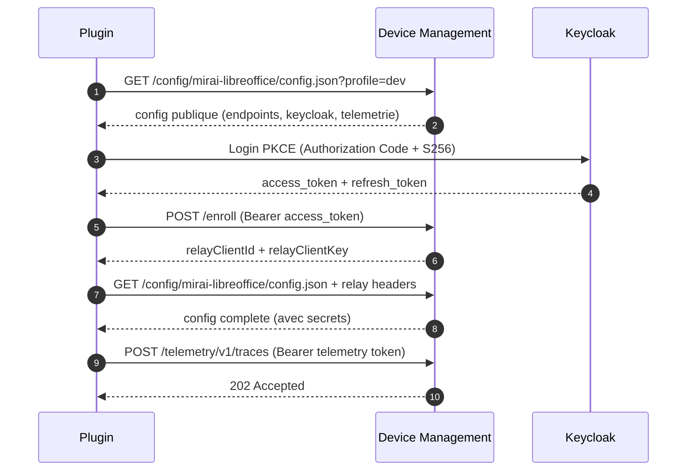

# Client Integration README

Guide pour les developpeurs integrant un plugin avec l'API Device Management.

## Plugins supportes

| Plugin | device_name | Extension |
|--------|-------------|-----------|
| Assistant Mirai LibreOffice | `mirai-libreoffice` | .oxt |
| Matisse Thunderbird | `mirai-matisse` | .xpi |

Le `device_name` est l'identifiant unique du plugin. Il est utilise dans toutes
les interactions avec le serveur (config, enrollment, telemetrie).

## Flow d'integration (sequence ideale)



## Endpoints

### 1) Configuration

```
GET /config/{device_name}/config.json
GET /config/{device_name}/config.json?profile=dev|int|prod
```

Le `device_name` peut etre :
- Le slug du plugin : `mirai-libreoffice`, `mirai-matisse`
- Un alias retrocompatible : `libreoffice`, `matisse`

Reponse (extrait) :
```json
{
  "meta": {
    "schema_version": 2,
    "device_type": "libreoffice",
    "profile": "dev"
  },
  "config": {
    "device_name": "mirai-libreoffice",
    "config_path": "/config/mirai-libreoffice/config.json",
    "bootstrap_url": "https://bootstrap.fake-domain.name/",
    "keycloakIssuerUrl": "https://sso.example.com/realms/openwebui",
    "keycloakRealm": "openwebui",
    "keycloakClientId": "bootstrap-mirai-lo-dev",
    "llm_base_urls": "https://api.scaleway.ai/.../v1",
    "telemetryEnabled": true,
    "telemetryEndpoint": "https://bootstrap.fake-domain.name/telemetry/v1/traces",
    "telemetryAuthorizationType": "Bearer",
    "telemetryKey": "<short-lived-jwt>"
  },
  "update": null,
  "features": {},
  "communications": []
}
```

Sans relay headers, les valeurs secretes (`llm_api_tokens`, etc.) sont vides.

### 2) Enrollment

```
POST /enroll
Authorization: Bearer <keycloak_access_token>
Content-Type: application/json
```

```json
{
  "device_name": "mirai-libreoffice",
  "plugin_uuid": "b9bdf6ad-3b1f-4f1a-9f07-4f8606c3fe5a",
  "email": "user@example.com",
  "plugin_version": "2.1.0"
}
```

Reponse :
```json
{
  "ok": true,
  "relayClientId": "abc123...",
  "relayClientKey": "xyz789...",
  "relay": { "client_id": "abc123...", "client_key": "xyz789...", "expires_at": "..." }
}
```

### 3) Configuration avec relay (secrets)

```
GET /config/mirai-libreoffice/config.json?profile=dev
X-Relay-Client: abc123...
X-Relay-Key: xyz789...
```

Retourne la config **complete** avec les valeurs secretes (tokens LLM, etc.).

### 4) Telemetrie

Le token telemetrie est fourni dans la config (`telemetryKey`). Il est court-duree (300s)
et renouvele a chaque fetch de config.

```
POST /telemetry/v1/traces
Authorization: Bearer <telemetry_token>
Content-Type: application/json
```

```json
{
  "resourceSpans": [{
    "resource": {},
    "scopeSpans": [{"spans": [{"name": "ExtensionLoaded", "...": "..."}]}]
  }]
}
```

### 5) Relay (acces aux services upstream)

Apres enrollment, le plugin peut acceder aux services via le relay :

```
POST /relay-assistant/llm/chat/completions
X-Relay-Client: abc123...
X-Relay-Key: xyz789...
Authorization: Bearer <keycloak_token>
Content-Type: application/json
```

Targets autorises : `keycloak`, `llm`, `mcr-api`, `telemetry`.

## Keycloak : Authorization Code + PKCE

### Configuration client recommandee

| Parametre | Valeur |
|-----------|--------|
| Client ID | `bootstrap-mirai-libreoffice` (genere par le catalogue) |
| Access type | `public` |
| Standard Flow | ON |
| Implicit Flow | OFF |
| Direct Access Grants (ROPC) | OFF |
| PKCE | `required` (S256) |
| Redirect URIs | `http://localhost:28443/callback` (dev) |

### Import JSON Keycloak

Le catalogue admin peut generer un fichier JSON d'import pour Keycloak :

```json
{
  "clientId": "bootstrap-mirai-libreoffice",
  "name": "Assistant Mirai LibreOffice",
  "enabled": true,
  "publicClient": true,
  "standardFlowEnabled": true,
  "directAccessGrantsEnabled": false,
  "redirectUris": ["http://localhost:28443/callback", "http://localhost:*/callback"],
  "webOrigins": ["*"],
  "attributes": {
    "pkce.code.challenge.method": "S256",
    "post.logout.redirect.uris": "+"
  },
  "defaultClientScopes": ["web-origins", "profile", "roles", "email"],
  "optionalClientScopes": ["offline_access", "groups"]
}
```

### Token settings recommandes

- Access token : 10-15 minutes
- Refresh token : 7-30 jours
- Rotation refresh token : ON
- Reutilisation refresh : OFF

### Test PKCE manuel

```bash
# 1. Generer PKCE
CODE_VERIFIER=$(python3 -c "import os,base64; print(base64.urlsafe_b64encode(os.urandom(32)).decode().rstrip('='))")
CODE_CHALLENGE=$(python3 -c "import hashlib,base64,os; print(base64.urlsafe_b64encode(hashlib.sha256(os.environ['CODE_VERIFIER'].encode()).digest()).decode().rstrip('='))")

# 2. Ouvrir dans le navigateur
echo "https://sso.example.com/realms/openwebui/protocol/openid-connect/auth?response_type=code&client_id=bootstrap-mirai-libreoffice&redirect_uri=http%3A%2F%2Flocalhost%3A28443%2Fcallback&scope=openid%20email&code_challenge_method=S256&code_challenge=${CODE_CHALLENGE}"

# 3. Echanger le code
curl -sS -X POST \
  https://sso.example.com/realms/openwebui/protocol/openid-connect/token \
  -d "grant_type=authorization_code" \
  -d "client_id=bootstrap-mirai-libreoffice" \
  -d "redirect_uri=http://localhost:28443/callback" \
  -d "code=${CODE}" \
  -d "code_verifier=${CODE_VERIFIER}"
```

## Silent Authentication (Refresh Token)

```
Token expire ?
  → refresh_token grant → nouveau access_token
  → si echec refresh → forcer re-login PKCE
```

Stockage securise des tokens :
- Windows : Credential Manager
- macOS : Keychain
- Linux : Secret Service (libsecret)

## cURL Examples

### Config
```bash
curl -sS 'https://bootstrap.fake-domain.name/config/mirai-libreoffice/config.json?profile=dev' | python3 -m json.tool
```

### Enroll
```bash
curl -sS -X POST \
  -H "Content-Type: application/json" \
  -H "Authorization: Bearer ${ACCESS_TOKEN}" \
  -d '{"device_name":"mirai-libreoffice","plugin_uuid":"b9bdf6ad-...","email":"user@example.com"}' \
  https://bootstrap.fake-domain.name/enroll
```

### Health check
```bash
curl -sS https://bootstrap.fake-domain.name/healthz
```

## Troubleshooting

| Erreur | Cause | Solution |
|--------|-------|----------|
| 400 `device inconnu` | device_name invalide | Verifier le slug ou alias |
| 400 `Body is not valid JSON` | Payload enroll invalide | Verifier le JSON |
| 401/403 sur config | Relay credentials invalides | Re-enrollment |
| 401 sur telemetrie | Token expire | Re-fetch config pour nouveau token |
| 500 `S3 bucket not configured` | Variable serveur manquante | Contacter l'admin |
