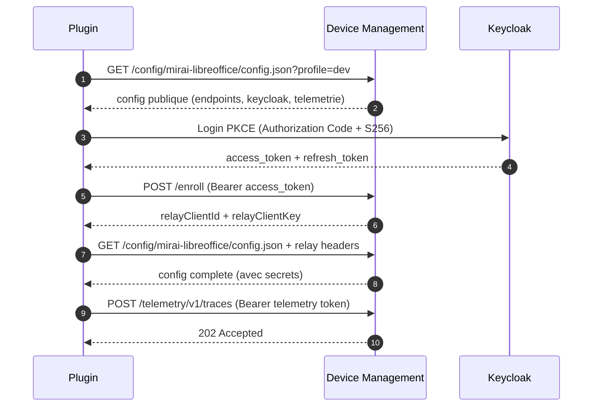

# Client Integration README

Guide pour les developpeurs integrant un plugin avec l'API Device Management.

## Plugins supportes

| Plugin | device_name | Extension | Alias |
|--------|-------------|-----------|-------|
| Assistant Mirai LibreOffice | `mirai-libreoffice` | .oxt | `libreoffice` |
| Matisse Thunderbird | `mirai-matisse` | .xpi | `matisse` |

Le `device_name` est l'identifiant unique du plugin. Utilisez-le dans toutes les
interactions avec le serveur.

> **Retrocompatibilite** : les anciens chemins via alias (`/config/libreoffice/...`)
> fonctionnent toujours. La reponse contiendra le vrai `device_name` et `config_path`
> pour migrer automatiquement au prochain cycle.

## Flow d'integration



## Endpoints

### 1) Configuration

```
GET /config/{device_name}/config.json
GET /config/{device_name}/config.json?profile=local|dev|int|prod|...
```

Les profils sont libres. 4 profils standards : `local` (dev autonome sans DM),
`dev` (DM local), `int` (recette), `prod` (production).
Les valeurs sont resolues depuis le template `dm-config.json` du plugin +
overrides catalogue + variables plateforme `${{VAR}}`.

Le `device_name` peut etre :
- Le slug du plugin : `mirai-libreoffice`, `mirai-matisse`
- Un alias : `libreoffice`, `matisse`

Reponse :
```json
{
  "meta": {
    "schema_version": 2,
    "device_type": "libreoffice",
    "profile": "dev"
  },
  "config": {
    "device_name": "mirai-libreoffice",
    "config_path": "/config/mirai-libreoffice/config.json",
    "bootstrap_url": "https://bootstrap.fake-domain.name/",
    "keycloakIssuerUrl": "https://sso.example.com/realms/openwebui",
    "keycloakRealm": "openwebui",
    "keycloakClientId": "bootstrap-mirai-lo-dev",
    "llm_base_urls": "https://api.scaleway.ai/.../v1",
    "telemetryEnabled": true,
    "telemetryEndpoint": "https://bootstrap.fake-domain.name/telemetry/v1/traces",
    "telemetryAuthorizationType": "Bearer",
    "telemetryKey": "<jwt-court-duree>"
  },
  "update": null,
  "features": {},
  "communications": []
}
```

> **Important** : meme si vous appelez `/config/libreoffice/...` (alias), la reponse
> contient `device_name: "mirai-libreoffice"` et `config_path: "/config/mirai-libreoffice/..."`.
> Utilisez ces valeurs pour les appels suivants.

Sans relay headers, les valeurs secretes (`llm_api_tokens`, etc.) sont vides.

#### Acces restreint

Si le plugin est en beta/alpha avec controle d'acces, la reponse peut etre :
```json
{
  "meta": { "schema_version": 2, "access_denied": true },
  "config": {
    "device_name": "mirai-matisse",
    "access_mode": "keycloak_group",
    "maturity": "beta",
    "message": "Acces restreint. Contactez votre administrateur."
  }
}
```

### 2) Enrollment

```
POST /enroll
Authorization: Bearer <keycloak_access_token>
Content-Type: application/json
```

```json
{
  "device_name": "mirai-libreoffice",
  "plugin_uuid": "b9bdf6ad-3b1f-4f1a-9f07-4f8606c3fe5a",
  "email": "user@example.com",
  "plugin_version": "2.1.0"
}
```

Reponse :
```json
{
  "ok": true,
  "relayClientId": "abc123...",
  "relayClientKey": "xyz789...",
  "relay": { "client_id": "abc123...", "client_key": "xyz789...", "expires_at": "..." }
}
```

### 3) Configuration avec relay (secrets)

```
GET /config/mirai-libreoffice/config.json?profile=dev
X-Relay-Client: abc123...
X-Relay-Key: xyz789...
```

Retourne la config complete avec les valeurs secretes.

### 4) Telemetrie

Le token est fourni dans la config (`telemetryKey`, 300s TTL, renouvele a chaque fetch).

```
POST /telemetry/v1/traces
Authorization: Bearer <telemetry_token>
Content-Type: application/json
```

```json
{
  "resourceSpans": [{
    "resource": {},
    "scopeSpans": [{"spans": [{"name": "ExtensionLoaded"}]}]
  }]
}
```

### 5) Relay (services upstream)

```
POST /relay-assistant/llm/chat/completions
X-Relay-Client: abc123...
X-Relay-Key: xyz789...
Authorization: Bearer <keycloak_token>
```

Targets : `keycloak`, `llm`, `mcr-api`, `telemetry`.

### 6) Mises a jour automatiques

Le serveur peut inclure une directive de mise a jour dans la config :
```json
{
  "update": {
    "action": "update",
    "current_version": "2.0.3",
    "target_version": "2.1.0",
    "artifact_url": "/binaries/libreoffice/2.1.0_mirai.oxt",
    "checksum": "sha256:...",
    "urgency": "normal"
  }
}
```

Le plugin doit verifier le checksum avant d'installer.

### 7) Communications

Le serveur peut inclure des messages pour l'utilisateur :
```json
{
  "communications": [
    {
      "id": 42,
      "type": "announcement",
      "title": "Nouvelle version disponible",
      "body": "La v2.1 corrige le freeze au demarrage.",
      "priority": "normal"
    }
  ]
}
```

Pour acquitter (ne plus afficher) : `POST /communications/42/ack`
Pour repondre a un sondage : `POST /communications/43/survey/respond`

## Keycloak : Authorization Code + PKCE

### Configuration client

| Parametre | Valeur |
|-----------|--------|
| Client ID | `bootstrap-mirai-libreoffice` (genere par le catalogue) |
| Access type | `public` |
| Standard Flow | ON |
| Direct Access Grants | OFF |
| PKCE | `required` (S256) |
| Redirect URIs | `http://localhost:28443/callback` |

Le catalogue admin peut generer un fichier JSON d'import pour Keycloak :

```json
{
  "clientId": "bootstrap-mirai-libreoffice",
  "name": "Assistant Mirai LibreOffice",
  "enabled": true,
  "publicClient": true,
  "standardFlowEnabled": true,
  "directAccessGrantsEnabled": false,
  "redirectUris": ["http://localhost:28443/callback"],
  "webOrigins": ["*"],
  "attributes": { "pkce.code.challenge.method": "S256" },
  "defaultClientScopes": ["web-origins", "profile", "roles", "email"],
  "optionalClientScopes": ["offline_access", "groups"]
}
```

### Token settings

- Access token : 10-15 min
- Refresh token : 7-30 jours
- Rotation refresh : ON

### Test PKCE

```bash
CODE_VERIFIER=$(python3 -c "import os,base64; print(base64.urlsafe_b64encode(os.urandom(32)).decode().rstrip('='))")
CODE_CHALLENGE=$(python3 -c "import hashlib,base64,os; print(base64.urlsafe_b64encode(hashlib.sha256(os.environ['CODE_VERIFIER'].encode()).digest()).decode().rstrip('='))")

# Ouvrir dans le navigateur
echo "https://sso.example.com/realms/openwebui/protocol/openid-connect/auth?response_type=code&client_id=bootstrap-mirai-libreoffice&redirect_uri=http%3A%2F%2Flocalhost%3A28443%2Fcallback&scope=openid%20email&code_challenge_method=S256&code_challenge=${CODE_CHALLENGE}"

# Echanger le code
curl -sS -X POST https://sso.example.com/realms/openwebui/protocol/openid-connect/token \
  -d "grant_type=authorization_code&client_id=bootstrap-mirai-libreoffice&redirect_uri=http://localhost:28443/callback&code=${CODE}&code_verifier=${CODE_VERIFIER}"
```

## Stockage securise des tokens

- Windows : Credential Manager
- macOS : Keychain
- Linux : Secret Service (libsecret)

## Convention `dm-config.json` (pour les developpeurs de plugins)

Pour que le DM serve automatiquement la bonne configuration, le developpeur
du plugin peut fournir un fichier `dm-config.json` (dans le package ou separement) :

```json
{
  "configVersion": 1,
  "default": {
    "systemPrompt": "Tu es un assistant...",
    "extend_selection_max_tokens": 15000,
    "telemetryEnabled": true,
    "llm_request_timeout_seconds": 45
  },
  "local": {
    "llm_base_urls": "http://localhost:11434/api",
    "llm_default_models": "llama3.2",
    "telemetryEnabled": false
  },
  "dev": {
    "llm_base_urls": "${{LLM_BASE_URL}}",
    "keycloakClientId": "${{KEYCLOAK_CLIENT_ID}}"
  },
  "prod": {
    "llm_base_urls": "${{LLM_BASE_URL}}"
  }
}
```

- `default` : valeurs communes a tous les environnements
- `local` : dev autonome, valeurs en dur (pas de DM)
- `dev`/`int`/`prod` : `${{VAR}}` substitues par les variables serveur
- Profils supplementaires libres (`staging`, `dgx`, etc.)
- Si une section serveur manque des cles plateforme, le DM les ajoute automatiquement

## Catalogue public

La page publique du catalogue est accessible sans authentification :

- `/catalog` : page d'accueil (grille de plugins)
- `/catalog/{slug}` : fiche plugin (mode d'emploi, changelog, feedback, telechargement)
- `/catalog/{slug}/download` : telechargement direct de la derniere version
- `/catalog/api/plugins` : API JSON (CORS ouvert, pour integration externe)
- `/catalog/api/docs` : documentation Swagger/OpenAPI

## cURL Examples

```bash
# Config
curl -sS 'https://bootstrap.fake-domain.name/config/mirai-libreoffice/config.json?profile=dev' | python3 -m json.tool

# Config via alias (retrocompatible)
curl -sS 'https://bootstrap.fake-domain.name/config/libreoffice/config.json?profile=dev' | python3 -m json.tool

# Enroll
curl -sS -X POST -H "Content-Type: application/json" -H "Authorization: Bearer ${TOKEN}" \
  -d '{"device_name":"mirai-libreoffice","plugin_uuid":"b9bdf6ad-...","email":"user@example.com"}' \
  https://bootstrap.fake-domain.name/enroll

# Health check
curl -sS https://bootstrap.fake-domain.name/healthz

# API catalogue (JSON public)
curl -sS https://bootstrap.fake-domain.name/catalog/api/plugins | python3 -m json.tool
```

## Troubleshooting

| Erreur | Cause | Solution |
|--------|-------|----------|
| 400 `device inconnu` | device_name ou alias invalide | Verifier le slug |
| 400 `Body is not valid JSON` | Payload enroll invalide | Verifier le JSON |
| 401 sur config | Relay credentials invalides | Re-enrollment |
| 401 sur telemetrie | Token expire | Re-fetch config (nouveau token inclus) |
| 403 `access_denied` | Plugin en beta/alpha, acces restreint | Contacter l'admin ou s'inscrire waitlist |
| 500 `S3 bucket not configured` | Variable serveur manquante | Contacter l'admin |
