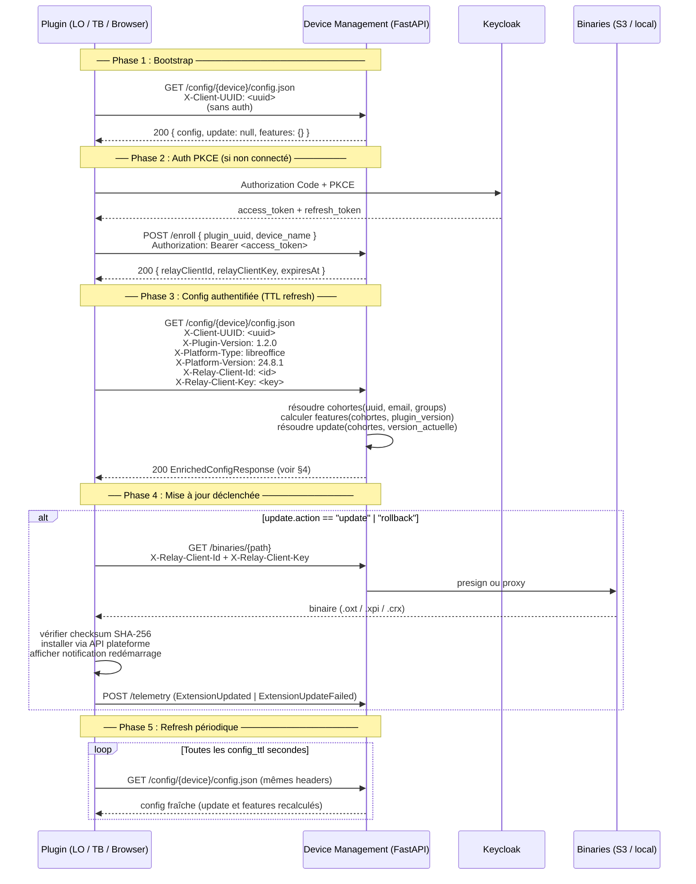
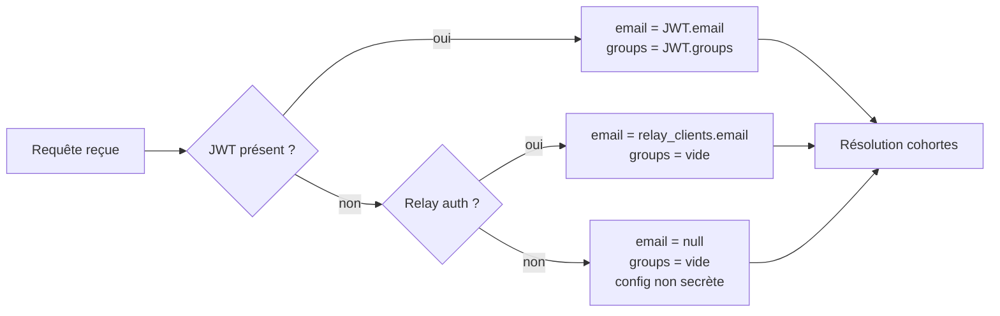
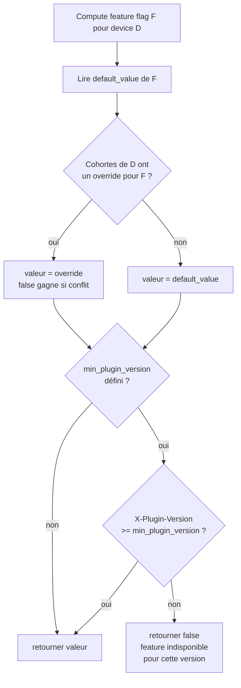
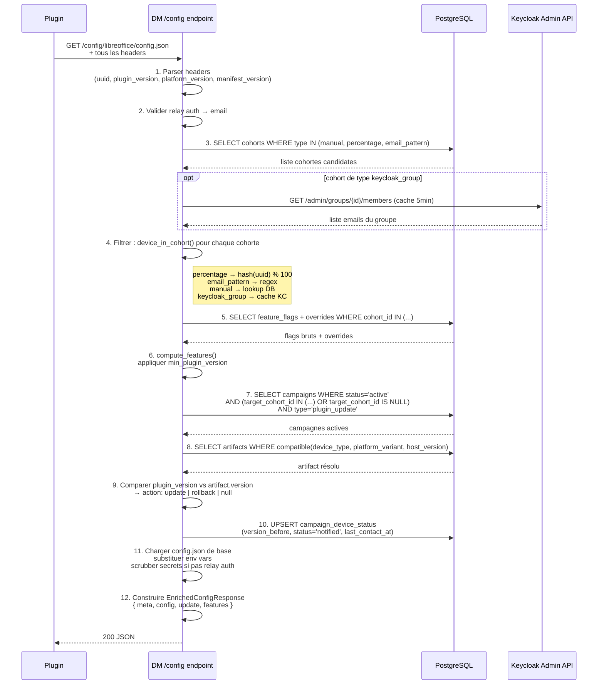
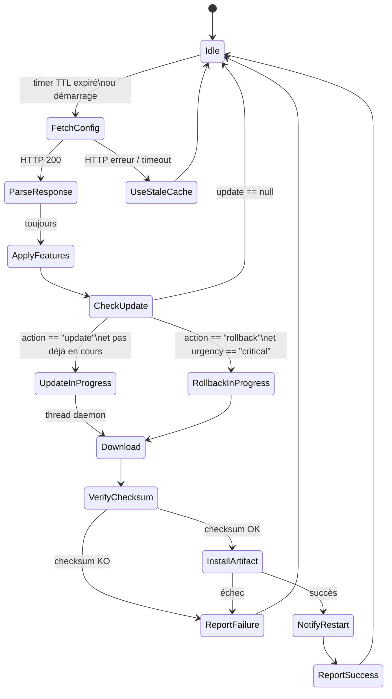

# Protocole Plugin ↔ Device Management — Update & Feature Toggling

> Périmètre : court terme — déploiement progressif et feature toggling
> Plateformes couvertes : LibreOffice, Thunderbird (TB60/TB128), Chrome/Edge (MV2/MV3), Firefox

---

## 1. Vue d'ensemble du cycle de vie



---

## 2. Headers envoyés par le plugin

| Header | Présent depuis | Valeur exemple | Rôle |
|---|---|---|---|
| `X-Client-UUID` | toujours | `d4e5f6...` | identité du device |
| `X-Plugin-Version` | **nouveau** | `1.2.0` | version actuelle du plugin |
| `X-Platform-Type` | **nouveau** | `thunderbird` | type d'hôte |
| `X-Platform-Version` | **nouveau** | `128.3.1` | version de l'application hôte |
| `X-Manifest-Version` | **nouveau** | `3` | MV2 ou MV3 (navigateurs seulement) |
| `X-Relay-Client-Id` | post-enroll | `rc_abc` | credential relay |
| `X-Relay-Client-Key` | post-enroll | `<key>` | credential relay |
| `Authorization` | post-login | `Bearer <JWT>` | Keycloak access token |

### Règle de priorité d'identification



---

## 3. Décision sur les objets dédiés

### Approche plate (actuelle) — à éviter

```json
{
  "config": {
    "llm_base_urls": "...",
    "lastversion": "2.0.0",
    "updateUrl": "...",
    "feature_writer": true,
    "feature_calc": false
  }
}
```

**Problèmes :**
- `update` et `features` sont noyés dans la config LLM / auth / telemetry
- Le plugin doit savoir quelle clé est un feature flag vs un paramètre métier
- Impossible de versionner le contrat séparément
- Pas de sémantique `action` (update ? rollback ? rien ?)

### Approche objets dédiés — cible

La réponse DM est une **directive personnalisée** calculée à la volée pour ce device
à cet instant. Chaque objet a sa propre sémantique et son propre cycle de vie.

```
EnrichedConfigResponse
├── meta     → identité de la réponse (version du schéma, timestamp)
├── config   → paramètres runtime (LLM, auth, telemetry) — inchangé
├── update   → directive de mise à jour pour CETTE version sur CETTE plateforme
└── features → flags calculés pour CE device (cohortes + version plugin)
```

> **`siblings` hors périmètre court terme.**
> Nécessite un daemon natif pour être actionnable. Sera ajouté quand `mirai-agent`
> existera. Ne pas implémenter côté plugin ni côté DM pour l'instant.

**Avantages de la séparation :**
- Le plugin traite chaque objet indépendamment
- `update` est `null` si pas de campagne → pas d'ambiguïté
- `features` peut être version-contraint (`min_plugin_version`)
- Évolution de schéma sans casser les clients anciens (ignore inconnu)
- Tests unitaires clairs : mocker `update` ou `features` séparément

---

## 4. Structure JSON complète de la réponse

### 4.1 Schéma général

```json
{
  "meta": {
    "schema_version": 2,
    "generated_at": "2026-03-15T10:00:00Z",
    "device_type": "libreoffice",
    "platform_variant": null,
    "client_uuid": "d4e5f6aa-...",
    "profile": "prod"
  },
  "config": { },
  "update": null,
  "features": { }
}
```

### 4.2 Objet `config` — inchangé, config runtime

```json
{
  "config": {
    "llm_base_urls": "https://openwebui.example.com/api/",
    "llm_default_models": "mistral:7b",
    "llm_api_tokens": "<redacted si pas de relay auth>",
    "authHeaderName": "Authorization",
    "authHeaderPrefix": "Bearer ",
    "keycloakIssuerUrl": "https://keycloak.example.com/realms/mirai",
    "keycloakRealm": "mirai",
    "keycloakClientId": "mirai-lo",
    "systemPrompt": "Tu es un assistant...",
    "telemetryEnabled": true,
    "telemetryEndpoint": "https://traces.example.com/v1/traces",
    "telemetryKey": "<token>"
  }
}
```

### 4.3 Objet `update` — directive de mise à jour

`null` si aucune campagne ne s'applique à ce device.

```json
{
  "update": {
    "action": "update",
    "current_version": "1.2.0",
    "target_version": "2.0.0",
    "artifact_url": "/binaries/libreoffice/2.0.0/mirai.oxt",
    "checksum": "sha256:e3b0c44298fc1c149afbf4c8996fb92427ae41e4649b934ca495991b7852b855",
    "urgency": "normal",
    "changelog_url": "https://bootstrap.example.com/changelog/2.0.0",
    "deadline_at": null,
    "campaign_id": 5
  }
}
```

| Champ | Valeurs | Description |
|---|---|---|
| `action` | `"update"` `"rollback"` | directive à exécuter (`null` = objet absent) |
| `current_version` | semver | ce que le DM sait de la version actuelle |
| `target_version` | semver | version cible |
| `artifact_url` | path relatif `/binaries/...` | chemin résolu selon plateforme |
| `checksum` | `sha256:<hex>` | vérification intégrité obligatoire |
| `urgency` | `"low"` `"normal"` `"critical"` | affecte l'UX (silencieux / dialog / bloquant) |
| `deadline_at` | ISO8601 ou `null` | si non null : forcer update avant cette date |
| `campaign_id` | int | pour le tracking dans `campaign_device_status` |

**Cas rollback :**

```json
{
  "update": {
    "action": "rollback",
    "current_version": "2.1.0",
    "target_version": "2.0.0",
    "artifact_url": "/binaries/libreoffice/2.0.0/mirai.oxt",
    "checksum": "sha256:...",
    "urgency": "critical",
    "deadline_at": "2026-03-16T08:00:00Z",
    "campaign_id": 5
  }
}
```

**Cas à jour :**

```json
{ "update": null }
```

### 4.4 Objet `features` — flags calculés pour ce device

Calcul : `défaut global` + `surcharge de cohorte` + `contrainte de version plugin`.

```json
{
  "features": {
    "writer_assistant":        true,
    "calc_assistant":          false,
    "edit_whole_document":     true,
    "show_thinking_widget":    true,
    "auto_update":             true,
    "telemetry":               true,
    "experimental_streaming":  false
  }
}
```

**Règle de résolution (priorité décroissante) :**

```
1. override cohorte  (false > true si plusieurs cohortes contradictoires)
2. défaut global du flag
3. true si flag absent côté DM (non-cassant pour les vieux clients)
```

**Contrainte de version sur un flag** — DB uniquement, transparent pour le plugin :

```
feature: edit_whole_document
  default: false
  override cohort=all: true  MAIS min_plugin_version = "1.5.0"

→ plugin v1.2.0 : features.edit_whole_document = false  (version trop ancienne)
→ plugin v1.5.0 : features.edit_whole_document = true
```



---

## 5. Évolution du JSON de config locale (plugin)

La config locale (`config.json` dans le profil utilisateur LO) ne stocke plus
les directives `update`/`features` — elles sont **éphémères et calculées à chaque fetch**.

```json
{
  "_comment": "Config locale minimale — les directives update/features sont en mémoire uniquement",
  "configVersion": 2,
  "enabled": true,
  "bootstrap_url": "https://bootstrap.example.com",
  "config_path": "/config/libreoffice/config.json",
  "device_name": "mirai-libreoffice",
  "plugin_uuid": "d4e5f6aa-...",
  "enrolled": true,
  "access_token": "",
  "refresh_token": "<stocké dans OS keyring, pas ici>"
}
```

**`lastversion` et `updateUrl` sont supprimés de la config locale** — ces informations
sont désormais dans `update.target_version` et `update.artifact_url` de la réponse DM,
recalculées dynamiquement à chaque fetch.

---

## 6. Flux de résolution complet côté DM



---

## 7. Flux de mise à jour dans le plugin



---

## 8. Format des événements telemetry liés aux mises à jour

```json
{
  "name": "ExtensionUpdated",
  "attributes": {
    "plugin.version_before": "1.2.0",
    "plugin.version_after":  "2.0.0",
    "plugin.action":         "update",
    "plugin.campaign_id":    "5",
    "plugin.platform_type":  "libreoffice",
    "plugin.urgency":        "normal"
  }
}
```

```json
{
  "name": "ExtensionUpdateFailed",
  "attributes": {
    "plugin.version_before": "1.2.0",
    "plugin.version_target": "2.0.0",
    "plugin.action":         "update",
    "plugin.campaign_id":    "5",
    "plugin.error":          "checksum_mismatch",
    "plugin.platform_type":  "libreoffice"
  }
}
```

Ces événements permettent au DM de mettre à jour `campaign_device_status.status`
(`updated` | `failed`) et `version_after` via le pipeline telemetry existant.

---

## 9. Contrat d'évolution (non-cassant)

| Règle | Raison |
|---|---|
| `update: null` si pas de campagne — jamais absent | le plugin vérifie `if update:` |
| `features: {}` si aucun flag défini — jamais absent | le plugin utilise `features.get(k, True)` |
| Nouveaux champs dans `update` → ignorés par vieux clients | parsing défensif |
| Nouveau flag dans `features` → `True` par défaut côté plugin | non-cassant |
| `meta.schema_version` incrémenté si breaking change | permet migration graduelle |
| `siblings` réservé aux versions futures (daemon natif requis) | hors périmètre court terme |

---

## 10. Ordre d'exécution des prompts fils

Les quatre composants sont implémentés indépendamment dans leurs repositories respectifs.
**Respecter l'ordre** : le DM doit être déployé en premier pour que les clients
puissent consommer la nouvelle réponse enrichie.

```
┌─────────────────────────────────────────────────────────────────┐
│  Prompt A  →  device-management/          (serveur — en premier) │
│  Prompt B  →  AssistantMiraiLibreOffice/  (plugin LO)           │
│  Prompt C  →  mirai-assistant/chrome-extension/  (MV3)          │
│  Prompt D  →  mirai-assistant/matisse/thunderbird/60.9.1/       │
└─────────────────────────────────────────────────────────────────┘
```

> Chaque prompt est **autonome** : il contient tout le contexte nécessaire pour
> être exécuté dans son repository sans avoir lu les autres.

---

## 11. Prompt A — Device Management (FastAPI/Python)

> Repository : `device-management/`
> Fichiers principaux : `app/main.py`, `db/schema.sql`

```text
Context
-------
You are working in the device-management FastAPI project (Python 3.12).
The main API is in app/main.py. The DB is PostgreSQL accessed via psycopg2.
The config endpoint currently serves a flat JSON loaded from disk with env var
substitution. Read the existing GET /config/{device}/config.json handler before
making any changes.

Goal
----
Extend the config endpoint to return an EnrichedConfigResponse that adds two
new top-level objects alongside the existing "config" dict: "update" and "features".
Also add the DB schema and resolution logic for cohorts, feature flags, and campaigns.

New request headers to parse (all optional, degrade gracefully if absent):
  X-Plugin-Version    — semver string, e.g. "1.2.0"
  X-Platform-Type     — "libreoffice" | "thunderbird" | "chrome" | "edge" | "firefox"
  X-Platform-Version  — semver string, e.g. "128.3.1"
  X-Manifest-Version  — integer 2 or 3 (browser extensions only)

Response shape — EnrichedConfigResponse:
{
  "meta": {
    "schema_version": 2,
    "generated_at": "<ISO8601>",
    "device_type": "<string>",
    "platform_variant": "<string|null>",
    "client_uuid": "<string>",
    "profile": "<string>"
  },
  "config": { <existing flat config dict — unchanged> },
  "update": null | {
    "action": "update" | "rollback",
    "current_version": "<semver reported by client>",
    "target_version": "<semver from campaign artifact>",
    "artifact_url": "/binaries/<s3_path>",
    "checksum": "sha256:<hex>",
    "urgency": "low" | "normal" | "critical",
    "changelog_url": "<url|null>",
    "deadline_at": "<ISO8601|null>",
    "campaign_id": <int>
  },
  "features": { "<flag_name>": <bool>, ... }
}

"siblings" is explicitly out of scope — do not implement it.

DB schema additions (add a migration file db/migrations/002_campaigns.sql):
  cohorts(id, name, description, type, config jsonb, created_at, updated_at)
    type IN ('manual', 'percentage', 'email_pattern', 'keycloak_group')
  cohort_members(cohort_id, identifier_type, identifier_value, added_at)
    identifier_type IN ('email', 'client_uuid')
  feature_flags(id, name, description, default_value bool, created_at, updated_at)
  feature_flag_overrides(feature_id, cohort_id, value bool, min_plugin_version varchar,
                         updated_at)
  artifacts(id, device_type, platform_variant, version, s3_path, checksum,
            min_host_version, max_host_version, changelog_url, is_active, released_at)
  campaigns(id, name, description, type, status, target_cohort_id, artifact_id,
            rollback_artifact_id, config_patch jsonb, features_patch jsonb,
            urgency, deadline_at, scheduled_at, completed_at, created_by,
            created_at, updated_at)
    type IN ('plugin_update', 'config_patch', 'feature_set')
    status IN ('draft', 'active', 'paused', 'completed', 'rolled_back')
  campaign_device_status(campaign_id, client_uuid, email, status,
                         version_before, version_after, error_message,
                         last_contact_at, updated_at)
    status IN ('pending', 'notified', 'updated', 'failed', 'rolled_back')

Resolution logic (add to config endpoint, after existing config load):
1. Extract client_uuid from X-Client-UUID header (already parsed elsewhere)
2. Extract plugin_version from X-Plugin-Version (default "")
3. Extract platform_type from X-Platform-Type (default = device path param)
4. Extract platform_version from X-Platform-Version (default "")
5. Extract manifest_version from X-Manifest-Version (default None)
6. Infer platform_variant:
   - thunderbird + host < 78   → "tb60"
   - thunderbird + 78 ≤ host < 128 → "tb78"
   - thunderbird + host ≥ 128  → "tb128"
   - chrome|edge + manifest=2  → "mv2"
   - chrome|edge + manifest=3  → "mv3"
   - others                    → None
7. Resolve device email from relay_clients table (existing logic)
8. Resolve cohorts: for each cohort in DB, call device_in_cohort():
   - manual       → cohort_members lookup by email or client_uuid
   - percentage   → int(sha256(client_uuid), 16) % 100 < config["percentage"]
   - email_pattern → re.match(config["pattern"], email)
   - keycloak_group → in-memory cache (TTL 5min) of Keycloak admin API response
9. Compute features dict:
   - start with {flag.name: flag.default_value for flag in feature_flags}
   - apply overrides for device cohorts: false wins over true on conflict
   - apply min_plugin_version filter: if plugin_version < override.min_plugin_version
     then treat override as not applied (use default)
10. Find active campaign: SELECT campaigns WHERE status='active'
    AND type='plugin_update'
    AND (target_cohort_id IS NULL OR target_cohort_id IN device_cohort_ids)
    ORDER BY created_at DESC LIMIT 1
11. Resolve artifact: SELECT artifacts WHERE campaign.artifact_id = id
    AND (min_host_version IS NULL OR platform_version >= min_host_version)
    AND (max_host_version IS NULL OR platform_version < max_host_version)
12. Build update directive:
    - if no campaign or no artifact → update = null
    - if plugin_version == artifact.version → update = null (already up to date)
    - if plugin_version < artifact.version → action = "update"
    - if plugin_version > artifact.version AND rollback_artifact exists → action = "rollback"
13. UPSERT campaign_device_status SET status='notified', version_before=plugin_version,
    last_contact_at=NOW() (only if update is not null)
14. Build meta dict
15. Return JSONResponse({"meta":..., "config":..., "update":..., "features":...},
                        headers={"Cache-Control": "no-store"})

Backward compatibility:
- If X-Plugin-Version is absent, skip update resolution entirely (update = null)
- Existing clients that don't send new headers get the same "config" as before
  plus "update: null" and "features: {}" — safe to ignore

Do NOT change: enrollment, telemetry, relay, binary serving endpoints.
Do NOT add admin endpoints in this task (separate scope).

Headless tests (add in tests/test_enriched_config.py using pytest + FastAPI TestClient):
- test_no_headers_returns_legacy_shape: GET without X-Plugin-Version → update=null, features={}
- test_schema_version_2_present: GET with X-Plugin-Version → meta.schema_version==2
- test_feature_flag_default_true: flag with default=True, no override → features[flag]=True
- test_feature_flag_cohort_override_false: device in cohort with override=False → features[flag]=False
- test_feature_flag_min_version_gate: override=True, min_plugin_version="2.0", plugin="1.5" → False
- test_update_action_when_behind: plugin_version < artifact.version → update.action=="update"
- test_update_null_when_current: plugin_version == artifact.version → update==null
- test_rollback_action: plugin_version > artifact.version, rollback_artifact exists → action=="rollback"
- test_campaign_device_status_upserted: after config fetch with update, row exists in DB
- test_percentage_cohort_stable: same uuid always in/out of 50% cohort
- test_platform_variant_tb60: X-Platform-Version=60.9, X-Platform-Type=thunderbird → variant=="tb60"
- test_platform_variant_mv3: X-Platform-Type=chrome, X-Manifest-Version=3 → variant=="mv3"
- test_backward_compat_no_new_tables: if DB tables absent, endpoint returns 200 with update=null

Use pytest-asyncio + psycopg2 against a real test PostgreSQL (docker-compose.test.yml).
Mock S3 with moto. Do NOT use mocks for the DB — use transactions rolled back after each test.
```

---

## 12. Prompt B — AssistantMiraiLibreOffice (Python / LibreOffice UNO)

> Repository : `AssistantMiraiLibreOffice/`
> Fichier principal : `src/mirai/entrypoint.py`

```text
Context
-------
You are working in the AssistantMiraiLibreOffice project.
The main file is src/mirai/entrypoint.py (~5000 lines, Python, LibreOffice UNO).
The plugin fetches remote config in the method _fetch_config() which already:
- builds relay auth headers (_relay_headers())
- calls _urlopen() with SSL context
- parses JSON response into self.config_cache
- has backoff, TTL cache, async refresh via _schedule_config_refresh()
The method get_config(key, default) reads from config_cache via _select_settings()
which looks for a "config" key inside the response dict.

Goal
----
Adapt _fetch_config() and add three new methods to support the EnrichedConfigResponse
format from the Device Management server (schema_version=2).

Changes required:

1. In _fetch_config(), add new request headers before building the Request object:
   - "X-Plugin-Version": self._get_extension_version() or ""
   - "X-Platform-Type": "libreoffice"
   - "X-Platform-Version": self._get_lo_version()  (use
     self.sm.createInstanceWithContext("com.sun.star.configuration.ConfigurationProvider", self.ctx)
     to read /org.openoffice.Setup/Product/ooSetupVersion)

2. In _fetch_config(), after json.loads(payload), branch on schema version:
   if isinstance(config_data, dict) and config_data.get("meta", {}).get("schema_version", 1) >= 2:
     # new format: store the whole response in cache, _select_settings() already
     # finds the "config" sub-dict, so existing get_config() calls keep working
     self.config_cache = config_data
     # extract features (ephemeral — memory only, never written to local config.json)
     features = config_data.get("features")
     if isinstance(features, dict):
       self._features_cache = features
     # extract update directive
     update = config_data.get("update")
     if isinstance(update, dict) and update.get("action") in ("update", "rollback"):
       if not getattr(self, "_update_in_progress", False):
         self._schedule_update(update)
   else:
     # legacy format: keep existing processing unchanged
     self.config_cache = config_data

3. Add method _get_extension_version(self) -> str:
   Try to read version from PackageInformationProvider:
     pip = self.sm.createInstanceWithContext(
       "com.sun.star.deployment.PackageInformationProvider", self.ctx)
     return pip.getExtensionVersion("org.libreoffice.mirai")
   On any exception return "".

4. Add method _get_lo_version(self) -> str:
   Try reading from ConfigurationProvider, return "" on failure.

5. Add method _is_feature_enabled(self, feature_name: str, default: bool = True) -> bool:
   cache = getattr(self, "_features_cache", None)
   if isinstance(cache, dict):
     return bool(cache.get(feature_name, default))
   return default

6. Add method _schedule_update(self, directive: dict):
   Set self._update_in_progress = True
   Start a daemon thread running self._perform_update(directive)

7. Add method _perform_update(self, directive: dict):
   Steps:
   a. Build artifact URL: base_url + directive["artifact_url"]
      (base_url = self._get_config_from_file("bootstrap_url", ""))
   b. Download via self._urlopen() with relay headers and SSL context, timeout=120
   c. Compute sha256 of downloaded bytes
   d. Compare with directive["checksum"] (format "sha256:<hex>")
      If mismatch: log error, send telemetry ExtensionUpdateFailed with
      error="checksum_mismatch", return
   e. Write bytes to tempfile with suffix ".oxt"
   f. Convert path to file URL: uno.systemPathToFileUrl(tmp_path)
   g. Install:
      mgr = self.sm.createInstanceWithContext(
        "com.sun.star.deployment.ExtensionManager", self.ctx)
      mgr.addExtension(file_url, {}, "user", None, None)
   h. Show non-blocking notification in LO toolbar area:
      "Mirai {version} installé. Redémarrez LibreOffice pour finaliser."
   i. Send telemetry event "ExtensionUpdated" with attributes:
      plugin.version_before, plugin.version_after, plugin.action,
      plugin.campaign_id (str), plugin.platform_type="libreoffice",
      plugin.urgency
   j. On any exception: log, send ExtensionUpdateFailed with error=str(e)
   k. In finally: self._update_in_progress = False

   If directive["urgency"] == "critical" and directive.get("deadline_at"):
     Parse deadline_at as ISO8601. If datetime.now(UTC) > deadline:
       Show blocking dialog before installing.

Security constraints:
- Never log downloaded bytes or full checksum values
- Always verify checksum before calling addExtension()
- _perform_update runs in daemon thread only — never block UNO thread
- _features_cache is never written to local config.json (memory only)
- Remove "lastversion" and "updateUrl" from set_config() sync logic
  (these flat keys are now superseded by update.target_version / update.artifact_url)

Headless tests (add in tests/test_update_features.py using pytest, NO UNO runtime):
Mock strategy: replace self.sm, self.ctx, self._urlopen, uno module with unittest.mock.
- test_feature_enabled_default_true: _features_cache absent → _is_feature_enabled returns True
- test_feature_enabled_from_cache: _features_cache={"f":False} → _is_feature_enabled("f")==False
- test_fetch_config_v2_populates_features: mock HTTP returns schema_version=2 response
    → self._features_cache populated correctly
- test_fetch_config_v2_schedules_update: mock response with update.action="update"
    → _schedule_update called once, _update_in_progress=True
- test_fetch_config_legacy_no_update: mock response without "meta" key
    → _features_cache unchanged, _schedule_update NOT called
- test_perform_update_checksum_ok: mock download returns known bytes, checksum matches
    → addExtension called with correct file URL
- test_perform_update_checksum_mismatch: checksum mismatch
    → addExtension NOT called, telemetry ExtensionUpdateFailed sent
- test_perform_update_clears_flag_on_exception: addExtension raises
    → _update_in_progress=False in finally
- test_get_extension_version_fallback: PackageInformationProvider raises → returns ""
- test_update_not_retriggered_while_in_progress: _update_in_progress=True
    → second _schedule_update call ignored
Run with: pytest tests/test_update_features.py -v --tb=short
```

---

## 13. Prompt C — Chrome/Firefox Extension MV3 (JavaScript / Service Worker)

> Repository : `mirai-assistant/`
> Dossier : `chrome-extension/`
> Fichiers : `background.js`, `options.js`, `popup.js`

```text
Context
-------
You are working in mirai-assistant/chrome-extension/.
The extension is Manifest V3 (service_worker in background).
manifest.json declares version "1.2.1", permissions: tabs, storage, identity, activeTab.
background.js currently only has install/activate service worker hooks and a message
listener — no config fetch exists yet.
options.js handles user-facing settings (read it before editing).
The Device Management server URL is stored in chrome.storage.local under key "dm_base_url".

Goal
----
Add config fetching, feature flag caching and update awareness to the extension.
Do NOT add a full auto-install mechanism — MV3 extensions cannot self-install a .crx
from arbitrary URLs. Instead, on update available: show a browser notification with
a link to the update URL (user installs manually or via admin policy).

1. Add to background.js a config fetch function fetchDMConfig():
   a. Read from chrome.storage.local: dm_base_url, dm_client_uuid, dm_relay_client_id,
      dm_relay_client_key (all may be empty strings)
   b. If dm_base_url is empty, return (no-op)
   c. Build URL: dm_base_url.trimEnd('/') + '/config/chrome/config.json'
   d. Build headers:
      { "Accept": "application/json",
        "X-Client-UUID": dm_client_uuid,
        "X-Plugin-Version": chrome.runtime.getManifest().version,
        "X-Platform-Type": "chrome",
        "X-Manifest-Version": "3" }
      If dm_relay_client_id is set, add:
        "X-Relay-Client-Id": dm_relay_client_id,
        "X-Relay-Client-Key": dm_relay_client_key
   e. fetch(url, { headers }) with a 10s timeout (AbortController)
   f. Parse response as JSON
   g. If response.meta?.schema_version >= 2:
        store in chrome.storage.local: { dm_features: response.features || {} }
        if response.update?.action in ["update", "rollback"]:
          store in chrome.storage.local: { dm_pending_update: response.update }
          call handleUpdateDirective(response.update)
      else (legacy flat format):
        store in chrome.storage.local: { dm_features: {} }
   h. On fetch error: log to console only, do not throw

2. Add handleUpdateDirective(directive):
   Show a browser notification (chrome.notifications.create):
     title: "Mirai — Mise à jour disponible"
     message: "Version " + directive.target_version + " disponible."
               + (directive.urgency === "critical" ? " ⚠️ Critique." : "")
     type: "basic"
     iconUrl: "icons/icon48.png"
   Store directive.artifact_url in chrome.storage.local as dm_update_url
   (admin or user can open it to download the new .crx)

3. Add isFeatureEnabled(featureName, defaultValue = true):
   Read dm_features from chrome.storage.local synchronously if possible,
   or wrap in a promise. Return features[featureName] ?? defaultValue.

4. Schedule fetchDMConfig() on:
   - service worker startup (self.addEventListener('activate', ...))
   - chrome.alarms.create("dm-config-refresh", { periodInMinutes: 30 })
   - chrome.alarms.onAlarm.addListener(alarm => { if (alarm.name==="dm-config-refresh") fetchDMConfig() })

5. In options.js, add fields for:
   - dm_base_url (text input, saved to chrome.storage.local)
   - dm_client_uuid (read-only, auto-generated UUID if absent, saved to storage)
   These are the minimum bootstrap fields needed before enrollment.

Do NOT implement enrollment (PKCE flow) in this task — it is a separate scope.
Do NOT implement .crx download or chrome.runtime.requestUpdate() — not applicable
for self-hosted non-webstore extensions in MV3.

Headless tests (add tests/dm.test.js using Jest + chrome API mock via jest-chrome):
- fetchDMConfig_noop_when_no_base_url: storage returns empty dm_base_url → fetch not called
- fetchDMConfig_sends_correct_headers: mock fetch → assert X-Plugin-Version, X-Platform-Type headers
- fetchDMConfig_stores_features_on_v2: mock response schema_version=2, features={f:true}
    → chrome.storage.local.set called with {dm_features:{f:true}}
- fetchDMConfig_calls_handleUpdate_on_action: response.update.action="update"
    → handleUpdateDirective called with directive
- handleUpdateDirective_creates_notification: assert chrome.notifications.create called
    with correct title containing target_version
- isFeatureEnabled_returns_default_when_absent: storage has no dm_features → returns true
- isFeatureEnabled_returns_stored_value: storage has {f:false} → isFeatureEnabled("f")==false
- fetchDMConfig_handles_fetch_error_silently: fetch rejects → no throw, console.error called
Run with: npx jest tests/dm.test.js --coverage
```

---

## 14. Prompt D — Thunderbird 60.9.1 Extension (JavaScript / bootstrap.js / XPCOM)

> Repository : `mirai-assistant/`
> Dossier : `matisse/thunderbird/60.9.1/`
> Fichiers à modifier : `modules/plugin-state.js`, `modules/auto-updater.js`

```text
Context
-------
You are working in mirai-assistant/matisse/thunderbird/60.9.1/ — a legacy
Thunderbird 60 extension using the bootstrap.js / XUL / XPCOM stack.

plugin-state.js (JSM module, imported via ChromeUtils.import):
- Has PluginState singleton with _checkRemoteConfig() that fetches a remote JSON
  using XMLHttpRequest (imported via Cu.importGlobalProperties(['XMLHttpRequest']))
- Currently reads response.updateUrl and response.lastVersion (flat keys on the
  top-level response object) and stores them in PluginState._updateUrl and
  PluginState._lastVersion
- Exports: checkRemoteConfig, getUpdateUrl, getLastVersion, setRemoteEnabled,
  getSensitiveConfig, isPluginGloballyEnabled

auto-updater.js (script loaded via Services.scriptloader.loadSubScript):
- Reads updateUrl and lastVersion via getUpdateUrl() / getLastVersion() from plugin-state
- Uses AddonManager.getAddonByID() to get current version
- Uses AddonManager.getInstallForURL() to install the XPI
- Has _installUpdate(updateUrl, targetVersion) method

The Device Management server now returns an EnrichedConfigResponse (schema_version=2)
where update info is in response.update.* instead of flat response.updateUrl / response.lastVersion.
The "config" sub-dict contains all other settings (owuiEndpoint, etc.).

Goal
----
Migrate plugin-state.js and auto-updater.js to consume the new response format
while keeping full backward compatibility with the old flat format.

1. In plugin-state.js, modify _checkRemoteConfig():

   After fetching and parsing the JSON response, add schema detection:

   const schemaVersion = response.meta?.schema_version || 1;

   if (schemaVersion >= 2) {
     // New enriched format
     const settings = response.config || {};
     // Apply settings (owuiEndpoint, systemPrompts, etc.) — same as before
     // but reading from response.config instead of root response

     // Extract update directive
     const update = response.update;
     if (update && (update.action === 'update' || update.action === 'rollback')) {
       self._updateUrl      = update.artifact_url;
       self._lastVersion    = update.target_version;
       self._updateUrgency  = update.urgency || 'normal';
       self._updateChecksum = update.checksum || '';
       self._campaignId     = update.campaign_id || null;
     } else {
       self._updateUrl   = null;
       self._lastVersion = null;
     }

     // Extract features
     self._features = response.features || {};

   } else {
     // Legacy flat format — keep existing logic unchanged
     if (response.updateUrl) { self._updateUrl = response.updateUrl; }
     if (response.lastVersion) { self._lastVersion = response.lastVersion; }
     self._features = {};
   }

   Add X-Plugin-Version, X-Platform-Type, X-Platform-Version headers to the
   XMLHttpRequest before send():
     const currentVersion = self._currentInstalledVersion || '';
     xhr.setRequestHeader('X-Plugin-Version', currentVersion);
     xhr.setRequestHeader('X-Platform-Type', 'thunderbird');
     xhr.setRequestHeader('X-Platform-Version', '60.9.1');

   To get currentVersion before the fetch, call AddonManager.getAddonByID() once
   at init time and store it in self._currentInstalledVersion.

2. Export new symbols from plugin-state.js EXPORTED_SYMBOLS:
   Add 'isFeatureEnabled', 'getUpdateUrgency', 'getUpdateChecksum', 'getCampaignId'

   isFeatureEnabled(name, defaultValue=true):
     return (name in PluginState._features) ? PluginState._features[name] : defaultValue;

   getUpdateUrgency(): return PluginState._updateUrgency || 'normal';
   getUpdateChecksum(): return PluginState._updateChecksum || '';
   getCampaignId():     return PluginState._campaignId || null;

3. In auto-updater.js, modify _installUpdate(updateUrl, targetVersion):

   After successful installation (AddonManager callback confirms install):
   - If getUpdateChecksum() is non-empty:
     Verify the downloaded XPI bytes against sha256:<hex> before calling
     AddonManager.getInstallForURL() — use crypto.subtle.digest('SHA-256', bytes)
     (available via Cu.importGlobalProperties(['crypto']))
     If mismatch: log error and abort installation.
   - After install: log campaign_id from getCampaignId() for telemetry correlation.
   - If getUpdateUrgency() === 'critical': show a modal notification to the user
     that a critical update has been installed and TB must restart.

4. Do NOT change:
   - bootstrap.js module loading order
   - loadCoreModules() / loadAllModules() function signatures
   - Any XUL UI code
   - The existing AddonManager.getInstallForURL() call pattern
   - Any preferences (PREF_BRANCH) that are not update-related

Backward compatibility:
   If the DM server returns a legacy flat response (no "meta" key), the plugin
   continues to work exactly as before. The schema detection in step 1 handles this.

Headless tests (add tests/test_plugin_state.js and tests/test_auto_updater.js using Jest):
Mock strategy: stub ChromeUtils, Services, AddonManager, XMLHttpRequest with jest.fn().
test_plugin_state.js:
- parseV2Response_extracts_update: response with meta.schema_version=2, update.action="update"
    → _updateUrl, _lastVersion, _updateUrgency, _updateChecksum, _campaignId populated
- parseV2Response_null_update: response.update=null → _updateUrl=null, _lastVersion=null
- parseV1Response_legacy_flat: no "meta" key, response.updateUrl="http://x"
    → _updateUrl="http://x" (legacy path)
- parseV2Response_extracts_features: response.features={f:true} → _features={f:true}
- isFeatureEnabled_present: _features={f:false} → isFeatureEnabled("f")==false
- isFeatureEnabled_absent: _features={} → isFeatureEnabled("x", true)==true
- xhrHeaders_sent: after init, XHR setRequestHeader called with X-Plugin-Version, X-Platform-Type
test_auto_updater.js:
- checksum_verified_before_install: getUpdateChecksum returns "sha256:abc"
    → crypto.subtle.digest called, if mismatch AddonManager.getInstallForURL NOT called
- checksum_absent_skips_verify: getUpdateChecksum returns "" → install proceeds without verify
- critical_urgency_shows_modal: getUpdateUrgency returns "critical" → notification shown
Run with: npx jest tests/test_plugin_state.js tests/test_auto_updater.js --coverage
```
