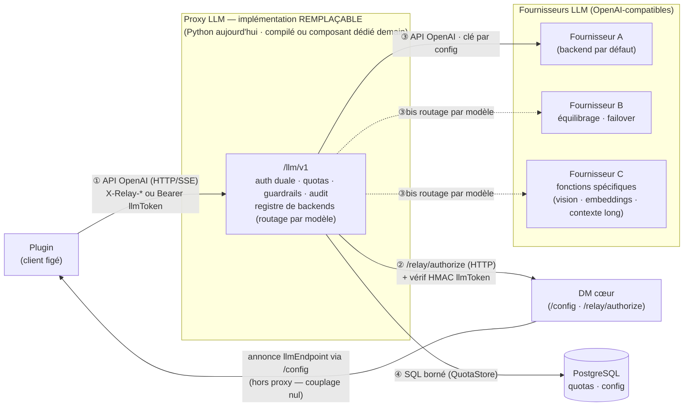

# ADR-0002 : Proxy LLM dans le DM — découplage des domaines de responsabilité et sécabilité

**Date** : 2026-07-10 — **mise à jour 2026-07-11** (§3 : généralisation de la sécabilité —
hypothèse de long terme sur le portage des responsabilités, alignement homologation ;
contexte : sécabilité organisationnelle et découplage d'obsolescence des composants)
**Statut** : En vigueur
**Auteurs** : eric.tiquet + Claude Fable 5
**Portée** : introduction du relais LLM OpenAI-compatible `/llm/v1` (package `app/llm/`,
deployment `llm-proxy`) et de l'override `FORCE_LLM_ENDPOINT_OVERRIDE` du `llmEndpoint`
annoncé aux plugins via `/config` ; érige la séparation des préoccupations et la
**sécabilité** en principe d'architecture opposable à l'ensemble des composants.

---

## Contexte

Le plugin Thunderbird « matisse » (TB 60.9.1 / Gecko 60) est **figé** : il ne parle que
TLS 1.3 draft-23 — que les serveurs modernes rejettent — et n'a aucune gestion de
certificat auto-signé. On ne peut pas le corriger côté client. Les backends LLM, eux,
évoluent en permanence (terminaison TLS, URL, clés, modèles). Sans intermédiaire, chaque
évolution du backend casse la flotte.

**Découplage d'obsolescence — le problème général dont matisse est l'archétype.** Les
composants du système vieillissent à des rythmes radicalement différents : le client,
adhérent au poste et à son hôte bureautique, peut rester figé des années (parc non
ré-empaqueté, hôte en fin de vie) ; le backend LLM évolue en semaines (modèles,
terminaisons, contrats de fourniture) ; les règles d'usage (quotas, filtrage, routage)
évoluent au rythme des besoins métier. **Absorber ces courbes d'obsolescence divergentes
est le domaine de responsabilité du DM** : c'est lui — et lui seul — qui garantit qu'un
composant qui ne peut plus bouger continue de fonctionner face à des composants qui ne
cessent de bouger, sans que l'un impose jamais son rythme à l'autre. Aucun autre
composant ne peut porter cette responsabilité : le client figé par définition, le
backend banalisé par principe (frontière n°1).

**Sécabilité organisationnelle.** Ces composants ne sont pas — et ne resteront pas —
portés par les mêmes acteurs : équipes de développement, exploitants, autorités
d'homologation évoluent au gré des transferts, réorganisations et contractualisations.
Le système doit donc pouvoir être **découpé selon des lignes organisationnelles**, pas
seulement techniques : chaque frontière de composant est une ligne de partage possible
entre deux porteurs de responsabilité (et deux périmètres d'homologation). Cette
exigence, introduite ici comme donnée de contexte, est développée en §3 (hypothèse
structurante) avec les règles de découplage qui en découlent.

La décision : router tout le trafic LLM du plugin à travers le DM, qui devient la
**passerelle de compatibilité** (le plugin ne parle qu'à la terminaison TLS du DM, déjà
compatible puisqu'il atteint `/config` et `/enroll`) et le **point d'application des
règles** (quotas, guardrails, routage de backend, audit) — l'instrument concret par
lequel le DM exerce sa responsabilité de découplage d'obsolescence.

## Décision

### 1. Frontière n°1 — IAssistant + DM d'un côté, backend LLM de l'autre

Le couple plugin IAssistant + DM porte **tout ce qui est spécifique au parc** : identité
et enrôlement (relay clients), compatibilité TLS du client figé, politiques (quotas,
guardrails, routage), configuration poussée par le canal `/config`, observabilité,
périmètre d'homologation. Le backend LLM n'est qu'un **fournisseur d'inférence
OpenAI-compatible, banalisé et interchangeable** : aucune logique métier, aucune
connaissance des clients, aucun couplage. Le seul contrat entre les deux mondes est
l'API OpenAI (`/chat/completions`, `/models`) plus le backend registry côté DM.

**Principe directeur — asymétrie des cycles de vie : le DM va évoluer, le backend LLM
non.** Toute règle nouvelle (anti-prompt-injection, PII, A/B, failover, quotas fins)
naît côté DM ; on change/ajoute/bascule de backend par configuration (`LLM_BACKENDS`,
hot-reload) sans redéploiement ni impact plugin. Corollaire : tout couplage qui
apparaîtra devra être placé côté DM, jamais côté backend.

### 2. Frontière n°2 — la fonction relais est SÉCABLE à l'intérieur du DM

La fonction est livrée comme un module autonome (`app/llm/`, aucune dépendance inverse
du cœur DM vers lui ; l'auth relay y est injectée à l'init), un runtime mode dédié
(`DM_RUNTIME_MODE=llm` : seules les routes `/llm/v1` + sondes + métriques servent) et un
Deployment dédié (`llm-proxy`, sans PVC, HPA indépendante). Elle est donc **extractible
en service séparé — voire en repo séparé — sans toucher ni au contrat plugin ni au
backend**, le jour où les contraintes d'homologation (périmètre DAT/AIPD distinct,
exigences de cloisonnement) ou le cycle de vie des besoins l'exigent. Le pipeline
d'intercepteurs (pré-requête / post-réponse) garantit que l'évolution des règles ne
modifie jamais le cœur du relais.

**Le choix technologique initial est réversible à faible coût.** Python/FastAPI est un
choix d'*amorçage* (mutualisation avec le cœur DM : conventions, tests, image, équipe),
pas un engagement : le composant est défini par ses **contrats**, tous technologiquement
neutres. Deux trajectoires de remplacement restent ouvertes en permanence :

- **réimplémentation dans une technologie compilée** (Go, Rust…) si la densité de flux
  SSE par pod ou l'empreinte mémoire le justifient — HTTP, SSE, HMAC-SHA256 et SQL se
  réimplémentent partout ;
- **substitution par un composant dédié du marché** (passerelle LLM / API gateway
  spécialisée), à condition qu'il honore les mêmes contrats : auth duale, quotas par
  utilisateur, journal d'audit sans contenu.

La bascule opérationnelle tient à une valeur de configuration : le plugin ne connaît que
l'URL `llmEndpoint` annoncée par `/config` (`PUBLIC_LLM_PROXY_URL`) — pointer la nouvelle
implémentation (ou permuter le backend du Service/route d'entrée) suffit, et le retour
arrière est le chemin inverse. Les **critères d'acceptation testés** (auth, SSE, 429,
guardrails, multi-réplicas) constituent la **spécification exécutable** qu'une
réimplémentation doit satisfaire.

**Points d'interface du composant** — quatre contrats, aucun spécifique à Python :

| # | Interface | Contrat | Neutralité technologique |
|---|---|---|---|
| ① | Plugin → proxy (entrée) | API OpenAI-compatible : `POST /chat/completions` (SSE si `stream`), `GET /models` ; auth `X-Relay-Client`/`X-Relay-Key` **ou** `Authorization: Bearer <llmToken>` ; erreurs `{"error":…}` + `retry_after` | HTTP/SSE standard — c'est le contrat du client figé, il ne peut de toute façon pas changer |
| ② | Proxy → DM (autorisation) | Vérification des credentials relais : contrat HTTP existant `GET /relay/authorize` (celui que nginx consomme déjà) — l'appel de fonction injecté actuel n'est qu'une optimisation intra-process du même contrat ; vérification du `llmToken` : HMAC-SHA256 sur payload JSON documenté, clé partagée par secret | Un appel HTTP + un HMAC : quelques lignes dans n'importe quel langage |
| ③ | Proxy → backend LLM (sortie) | API OpenAI standard, clé backend injectée depuis la configuration (`LLM_BASE_URL`/`LLM_API_TOKEN`, registre `LLM_BACKENDS`) | HTTP sortant standard |
| ④ | Proxy → PostgreSQL (état) | SQL borné : UPSERT sur `llm_quota_counters` (quotas), lecture de la configuration runtime | Remplaçable par tout store partagé honorant l'atomicité (l'abstraction `QuotaStore` matérialise déjà cette porte) |

Le DM annonce par ailleurs `llmEndpoint` au plugin via `/config` — le proxy n'y participe
pas (couplage nul : c'est une URL écrite par le cœur).

*Légende — traits pleins : livré en 0.9.0 ; traits pointillés (fournisseurs B et C) :
**options futures** de la stratégie multifournisseur — équilibrage de charge, failover,
accès à des fonctions spécifiques — activables par le registre `LLM_BACKENDS`
(configuration seule, sans modification du code). Quotas, guardrails et audit
s'appliquent dans le proxy, en amont du routage, quel que soit le fournisseur.*

**Stratégie multifournisseur de LLM — trajectoire ouverte par l'interface ③.** L'interface
sortante n'est pas limitée à *un* backend : le registre de backends (`LLM_BACKENDS`,
mapping modèle→backend, clés par indirection `token_env`) fait du DM le **point de
politique de fourniture d'inférence** de la flotte. Trois motivations, cumulables,
justifient d'aller vers plusieurs fournisseurs :

- **équilibrage de charge** — répartir le trafic entre plusieurs backends équivalents
  quand la capacité d'un fournisseur unique devient le facteur limitant ;
- **résilience** — bascule (*failover*) vers un fournisseur secondaire en cas
  d'indisponibilité du primaire, ou double-fourniture assumée (souveraineté,
  réversibilité contractuelle : aucun fournisseur d'inférence n'est un point de
  dépendance) ;
- **accès à des fonctions spécifiques** — router certains modèles vers le fournisseur
  qui les porte (vision, *embeddings*, contexte long, génération de code, modèle
  spécialisé métier) : le plugin demande un modèle, le DM sait où il vit.

État au 0.9.0 : la **mécanique de sélection est livrée** (multi-backends + routage par
modèle, rechargeable à chaud, sans redéploiement) ; l'équilibrage et le *failover* sont
des **stratégies de sélection à ajouter dans ce même registre** — une évolution locale
du point d'accroche, pas un refactor. Ce qui ne varie pas, quel que soit le nombre de
fournisseurs : les clés restent côté serveur, et **quotas, guardrails et audit
s'appliquent uniformément en amont du routage** — c'est précisément l'intérêt d'un point
d'application unique, cohérent avec la frontière n°1 (le fournisseur d'inférence reste
banalisé ; la politique vit dans le DM).

### 3. Hypothèse structurante de long terme — le porteur de responsabilité de chaque composant évoluera

Les frontières n°1 et n°2 sont les cas particuliers d'un principe général, que la présente
mise à jour érige en règle d'architecture.

**L'hypothèse.** À terme, les composants du système ne seront pas portés — développés,
exploités, homologués — par le même acteur. Le backend LLM est déjà un service tiers ;
l'exploitation du relais, du cœur DM, de l'IHM d'administration ou du plugin pourra être
transférée à des équipes ou entités distinctes, à des rythmes différents. L'architecture
ne doit donc parier sur **aucune co-localisation durable des responsabilités** : ce qui
est aujourd'hui une commodité d'équipe (même dépôt, même image, même base) ne doit jamais
devenir un couplage qui interdirait demain la séparation.

**Le corollaire homologation.** Cette hypothèse est aussi celle de l'homologation des
systèmes : les périmètres d'homologation (DAT, AIPD, décision d'homologation) épousent
les frontières de responsabilité. Chaque frontière de sécabilité est une **frontière
possible de périmètre d'homologation** : un composant peut être homologué, ré-homologué,
transféré ou remplacé **sans rouvrir le dossier des autres**. Inversement, un couplage
technique entre deux composants soude leurs dossiers d'homologation — c'est précisément
ce que cette ADR interdit.

**Règles de découplage** (opposables à toute évolution du système) :

1. **Contrats d'interface explicites et neutres** — les composants ne communiquent que
   par des contrats nommés, versionnés, indépendants de la technologie d'implémentation
   (API OpenAI pour l'inférence, `/config` JSON pour la configuration, OIDC pour
   l'identité, OTLP pour la télémétrie, `auth_request`/`/relay/authorize` pour
   l'autorisation de relais). Jamais d'API « interne » implicite entre composants
   séparables.
2. **Zéro couplage de code** — pas de bibliothèque partagée imposée entre composants
   séparables ; au sein du monolithe, dépendances **unidirectionnelles** et injection à
   l'initialisation (le cœur n'importe pas le module `app/llm/`, qui reçoit ses
   dépendances — jamais l'inverse).
3. **Câblage par configuration** — les composants se découvrent par configuration (URL,
   clés, registres), jamais en dur : remplacer ou déplacer un composant est un changement
   de configuration, pas de code.
4. **État cloisonné** — chaque composant possède ses données ; l'accès à l'état d'un
   autre composant passe par un contrat désigné, pas par la lecture directe de ses
   structures internes.
5. **Déployabilité indépendante** — chaque composant se déploie, se scale, se met à jour
   et se redémarre séparément (runtime modes, deployments dédiés, HPA propres).
6. **Observabilité et secrets par composant** — journaux et métriques imputables au
   composant émetteur ; secrets **par domaine fonctionnel**, à rotation indépendante
   (rayon d'explosion minimal : faire tourner la clé d'un composant n'invalide rien chez
   les autres).

**Cartographie des préoccupations** (état au 0.9.0) :

| Composant | Préoccupation unique | Contrat d'interface | Sécabilité aujourd'hui |
|---|---|---|---|
| Plugin (IAssistant) | Expérience utilisateur dans l'hôte bureautique | `/config`, `/enroll`, `/llm/v1`, OTLP | Binaire distinct, posé par le gestionnaire de parc |
| DM cœur (catalogue, config, campagnes) | Cycle de vie post-installation | HTTP public + SQL | Mode `api`, deployment propre |
| Proxy LLM | Relais d'inférence + application des règles | API OpenAI (entrée), backend registry (sortie) | Module `app/llm/` sans dépendance inverse + mode `llm` + deployment dédié → **extractible en service/repo séparé** |
| Relais (relay-assistant) | Médiation deny-all vers services tiers | `auth_request` → `/relay/authorize` | Conteneur nginx séparé |
| Relais de télémétrie | Ingestion/réémission OTLP | OTLP/HTTP | Deployment séparé |
| IHM d'administration | Pilotage du parc | HTTP + SQL | Mode `admin`, deployment séparé |
| PostgreSQL | État partagé désigné | SQL | Service dédié (cible CNPG répliqué) |
| Backend LLM | Inférence (banalisée) | API OpenAI | Tiers, interchangeable par configuration |
| Keycloak | Identité | OIDC | Socle, hors périmètre |

**Couplages résiduels assumés — et leur voie de sortie.** La sécabilité n'exige pas de
tout séparer aujourd'hui ; elle exige que rien n'interdise de séparer demain. Les
couplages restants sont connus, bornés, et chacun a une sortie qui ne demande pas de
refonte :

- *une seule image pour quatre modes* : commodité de build — l'extraction du proxy LLM
  dans son propre artefact est possible à tout moment (aucune dépendance du cœur vers
  `app/llm/`, injection à l'init) ;
- *base PostgreSQL partagée* : le proxy ne touche qu'à ses tables (`llm_quota_counters`)
  plus deux lectures bornées (credentials relais, configuration runtime) ; voie de
  sortie : l'API d'introspection existante (`/relay/authorize`, même contrat que celui
  déjà consommé par nginx) et une base dédiée ;
- *secret Kubernetes partagé* : les clés sont déjà **séparées par domaine** (signature
  llmToken ≠ signature télémétrie ≠ pepper relais — rotation indépendante) ; voie de
  sortie : un `Secret` par deployment ;
- *auth relais injectée depuis le cœur* (`build_router(relay_auth=…)`) : contrat
  fonctionnel étroit, substituable par l'appel HTTP `/relay/authorize` sans changer le
  module.

### 4. Décisions techniques associées

| Décision | Choix | Justification |
|---|---|---|
| Store des quotas | **PostgreSQL** (abstraction `QuotaStore`) | Conforme ADR-0001 (« pas de Redis, pas de broker ») ; UPSERT atomique = compteurs exacts entre N réplicas ; Redis branchable plus tard derrière l'interface si le débit l'exige |
| Auth entrante | **Duale** : X-Relay-Client/Key (vérif DB) OU `llmToken` signé HMAC par client, minté au `/config` (pattern telemetryKey), re-check de révocation | Le comportement exact du client figé est incertain ; la source de vérité reste le relay client validé ; la clé backend ne transite jamais |
| Override `/config` | `FORCE_LLM_ENDPOINT_OVERRIDE`, **défaut ON**, hot-reload (onglet Config admin, propagation ~3 s) ; appliqué APRÈS les overrides catalogue | Bascule de toute la flotte au prochain poll `/config`, sans ré-enrôlement ; rollback instantané (OFF = mode direct) |
| Métriques | `prometheus_client`, registry dédié concaténé au `/metrics` existant | Percentiles de latence (histogrammes) infaisables proprement à la main |
| Format d'erreur | Objet OpenAI `{"error": {...}}` + `retry_after` top-level (429) + header `Retry-After` | Exploitable à la fois par le plugin figé et par tout client OpenAI standard |
| Streaming | Passthrough SSE `aiter_raw` → `StreamingResponse`, zéro bufferisation, `read` timeout inter-chunk | Backpressure naturelle, mémoire constante par stream ; limite assumée : guardrail de sortie best-effort par chunk |

## Conséquences

- **Positives** : backend swappable à chaud ; périmètre d'homologation découpable —
  chaque composant peut faire l'objet d'un dossier propre et être ré-homologué ou
  transféré sans rouvrir celui des autres ; **le transfert de responsabilité d'un
  composant devient un événement d'exploitation** (configuration, secrets, kubeconfig),
  pas un chantier de refonte ; montée en charge du relais indépendante du reste du DM
  (stateless, HPA 2→10, y compris sur les overlays où le PVC RWO force l'API à 1
  réplica) ; toutes les règles futures s'ajoutent par configuration.
- **Coûts assumés** : un hop réseau et 1-2 allers-retours Postgres par requête
  (~1-5 ms, négligeable devant les secondes d'inférence LLM) ; une dépendance DB pour le
  quota (fail-open documenté) ; le nginx `relay-assistant` historique reste en place pour
  ses autres cibles — le relais LLM, retiré de nginx car sans valeur là-bas, renaît ici
  avec la valeur qui manquait (masquage de clé, quotas, audit).
