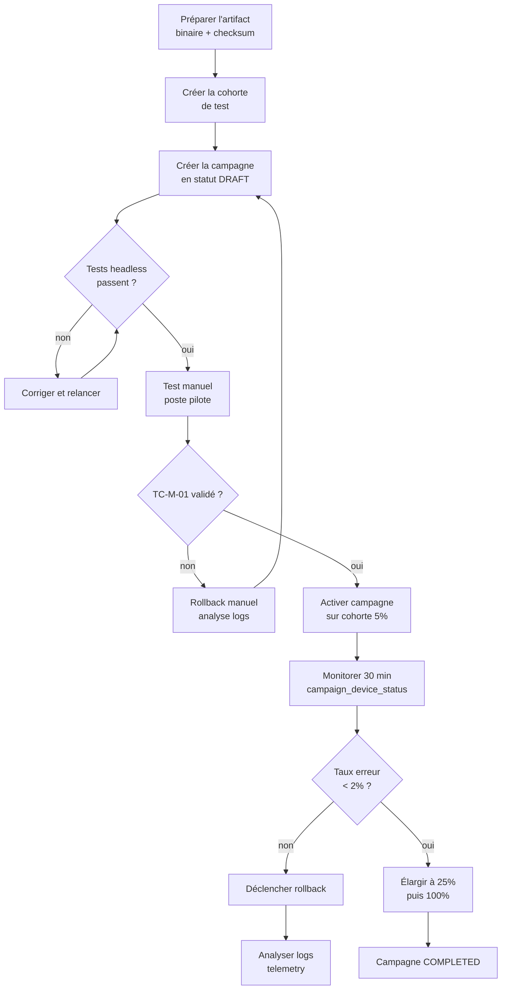

# Mode opératoire — Campagnes de déploiement & Feature Toggling

> Version : 1.0 — 2026-03-15
> Public : administrateurs DM, responsables de déploiement

---

## Vue d'ensemble du processus



---

## 1. Préparer un artifact

### 1.1 Construire et uploader le binaire

```bash
# LibreOffice (.oxt)
cd AssistantMiraiLibreOffice
make build-oxt          # génère dist/mirai-2.0.0.oxt
sha256sum dist/mirai-2.0.0.oxt   # noter le hash

# Uploader en S3 ou stockage local
aws s3 cp dist/mirai-2.0.0.oxt \
  s3://<bucket>/binaries/libreoffice/2.0.0/mirai.oxt

# Thunderbird TB60
# ... même principe avec le XPI

# Chrome/Edge : le .crx est distribué via la webstore ou un serveur interne
```

### 1.2 Vérifier l'accessibilité

```bash
# Tester que le DM peut servir le binaire
curl -I https://bootstrap.example.com/binaries/libreoffice/2.0.0/mirai.oxt
# Doit retourner 200 ou 302

# Vérifier le checksum servi
curl -s https://bootstrap.example.com/binaries/libreoffice/2.0.0/mirai.oxt \
  | sha256sum
# Doit correspondre au hash ci-dessus
```

### 1.3 Enregistrer l'artifact en DB

```sql
INSERT INTO artifacts (
    device_type, platform_variant, version,
    s3_path, checksum,
    min_host_version, max_host_version,
    changelog_url, is_active
) VALUES (
    'libreoffice', NULL, '2.0.0',
    'libreoffice/2.0.0/mirai.oxt',
    'sha256:<hash_calculé>',
    NULL, NULL,
    'https://bootstrap.example.com/changelog/2.0.0',
    true
);
-- noter l'id retourné : <artifact_id>
```

---

## 2. Créer et gérer les cohortes

### 2.1 Cohorte manuelle (liste d'emails/UUIDs)

```sql
INSERT INTO cohorts (name, description, type, config)
VALUES ('pilotes-dsi', 'Équipe DSI — tests internes', 'manual', '{}');
-- noter id : <cohort_id>

INSERT INTO cohort_members (cohort_id, identifier_type, identifier_value)
VALUES
  (<cohort_id>, 'email', 'alice@example.com'),
  (<cohort_id>, 'email', 'bob@example.com');
```

### 2.2 Cohorte pourcentage (canary progressif)

```sql
INSERT INTO cohorts (name, description, type, config)
VALUES ('canary-5pct', '5% de la population', 'percentage', '{"percentage": 5}');
```

**Pour élargir progressivement :**

```sql
-- Passer à 25%
UPDATE cohorts SET config = '{"percentage": 25}', updated_at = NOW()
WHERE name = 'canary-5pct';

-- Passer à 100%
UPDATE cohorts SET config = '{"percentage": 100}', updated_at = NOW()
WHERE name = 'canary-5pct';
```

### 2.3 Cohorte groupe Keycloak

```sql
INSERT INTO cohorts (name, description, type, config)
VALUES (
    'direction-si',
    'Groupe Keycloak direction-si',
    'keycloak_group',
    '{"group_name": "direction-si"}'
);
-- La synchronisation depuis Keycloak se fait automatiquement (cache 5min)
-- ou manuellement via POST /admin/cohorts/<id>/sync-keycloak
```

---

## 3. Créer une campagne

### 3.1 Campagne de mise à jour plugin

```sql
INSERT INTO campaigns (
    name, description, type, status,
    target_cohort_id, artifact_id, rollback_artifact_id,
    urgency, deadline_at,
    created_by
) VALUES (
    'Mirai LO 2.0.0 — canary 5%',
    'Déploiement version 2.0.0 sur cohorte canary initiale',
    'plugin_update',
    'draft',                      -- toujours créer en draft !
    <cohort_id_canary>,
    <artifact_id_2_0_0>,
    <artifact_id_1_9_0>,          -- artifact de rollback
    'normal',
    NULL,
    'admin@example.com'
);
-- noter l'id : <campaign_id>
```

### 3.2 Campagne de feature toggle

```sql
-- Désactiver une feature pour tout le monde
INSERT INTO feature_flags (name, description, default_value)
VALUES ('calc_assistant', 'Assistant IA dans Calc', true);

INSERT INTO feature_flag_overrides (feature_id, cohort_id, value, min_plugin_version)
VALUES (<flag_id>, <cohort_all_id>, false, NULL);
```

---

## 4. Valider avant activation

### 4.1 Lancer les tests

```bash
# Depuis device-management/
pytest tests/test_enriched_config.py -v
# Depuis AssistantMiraiLibreOffice/
pytest tests/test_update_features.py -v
# E2E
bash scripts/run-e2e.sh
```

**Tous les tests doivent être verts. Aucune exception.**

### 4.2 Test sur poste pilote (TC-M-01)

1. Configurer un poste de test avec le plugin en version **inférieure** à la cible
2. Configurer `bootstrap_url` pointant vers le DM de staging
3. Ajouter l'email du poste à la cohorte manuelle `pilotes-dsi`
4. Lancer LibreOffice et attendre max 60 secondes
5. Observer la notification : `"Mirai 2.0.0 installé. Redémarrez LibreOffice..."`
6. Redémarrer LO, vérifier la version en `Aide > À propos de LibreOffice`

**Si la notification n'apparaît pas après 120 secondes :**
```bash
# Consulter les logs
tail -f ~/log.txt | grep -i "update\|enrich\|campaign"
```

---

## 5. Activer la campagne

```sql
-- Uniquement après validation complète
UPDATE campaigns
SET status = 'active', updated_at = NOW()
WHERE id = <campaign_id>;
```

**Vérifier immédiatement :**

```sql
-- Les devices de la cohorte qui ont fetchés la config
SELECT client_uuid, email, status, version_before, last_contact_at
FROM campaign_device_status
WHERE campaign_id = <campaign_id>
ORDER BY last_contact_at DESC
LIMIT 20;
```

---

## 6. Monitorer la campagne

### 6.1 Tableau de bord SQL temps réel

```sql
-- Vue d'ensemble de la campagne
SELECT
    c.name,
    c.status,
    COUNT(cds.client_uuid)                                    AS total_devices,
    COUNT(cds.client_uuid) FILTER (WHERE cds.status='notified')  AS notified,
    COUNT(cds.client_uuid) FILTER (WHERE cds.status='updated')   AS updated,
    COUNT(cds.client_uuid) FILTER (WHERE cds.status='failed')    AS failed,
    ROUND(
        COUNT(cds.client_uuid) FILTER (WHERE cds.status='updated')::numeric
        / NULLIF(COUNT(cds.client_uuid), 0) * 100, 1
    )                                                          AS pct_success
FROM campaigns c
LEFT JOIN campaign_device_status cds ON cds.campaign_id = c.id
WHERE c.id = <campaign_id>
GROUP BY c.id, c.name, c.status;
```

```sql
-- Devices en échec
SELECT client_uuid, email, error_message, last_contact_at
FROM campaign_device_status
WHERE campaign_id = <campaign_id> AND status = 'failed'
ORDER BY last_contact_at DESC;
```

### 6.2 Seuils de décision

| Taux d'échec | Action |
|---|---|
| < 2% | Continuer, élargir à 25% |
| 2–10% | Pause, analyser les logs d'échec |
| > 10% | Rollback immédiat |

### 6.3 Élargir progressivement

```sql
-- Phase 1 : 5% → vérifier 30 min
UPDATE cohorts SET config = '{"percentage": 5}' WHERE id = <cohort_id>;

-- Phase 2 : 25% → vérifier 2h
UPDATE cohorts SET config = '{"percentage": 25}' WHERE id = <cohort_id>;

-- Phase 3 : 100%
UPDATE cohorts SET config = '{"percentage": 100}' WHERE id = <cohort_id>;
-- ou supprimer la cohort cible pour cibler tout le monde
UPDATE campaigns SET target_cohort_id = NULL WHERE id = <campaign_id>;
```

---

## 7. Clôturer ou rollback

### 7.1 Clôture normale

```sql
UPDATE campaigns
SET status = 'completed', completed_at = NOW(), updated_at = NOW()
WHERE id = <campaign_id>;
```

### 7.2 Rollback d'urgence

```sql
-- Basculer la campagne en rollback
UPDATE campaigns
SET status = 'rolled_back', updated_at = NOW()
WHERE id = <campaign_id>;
```

**Effet immédiat :** au prochain fetch config, les devices qui rapportent une version
supérieure à `rollback_artifact.version` reçoivent `action="rollback"`.

```sql
-- Vérifier que les devices reçoivent la directive rollback
SELECT status, COUNT(*) FROM campaign_device_status
WHERE campaign_id = <campaign_id>
GROUP BY status;
-- Le status 'rolled_back' doit apparaître au fil des fetches
```

### 7.3 Rollback manuel forcé (urgency critical)

Si le rollback doit être immédiat et bloquer l'utilisateur :

```sql
UPDATE campaigns
SET status = 'rolled_back',
    urgency = 'critical',
    deadline_at = NOW() + interval '1 hour'  -- forcer dans l'heure
WHERE id = <campaign_id>;
```

Les plugins verront `urgency=critical` + `deadline_at` dépassée → dialog bloquant.

---

## 8. Gestion des feature flags en production

### 8.1 Désactiver une feature pour tous

```sql
UPDATE feature_flags SET default_value = false WHERE name = 'calc_assistant';
```

**Effet :** au prochain fetch config (TTL ~5 min), tous les clients reçoivent le flag à false.

### 8.2 Activer pour une cohorte pilote uniquement

```sql
-- Flag global = false
UPDATE feature_flags SET default_value = false WHERE name = 'experimental_streaming';

-- Override = true pour la cohorte pilotes-dsi uniquement
INSERT INTO feature_flag_overrides (feature_id, cohort_id, value, min_plugin_version)
VALUES (<flag_id>, <cohort_pilotes_id>, true, '2.0.0');
-- min_plugin_version : la feature n'existe que depuis v2.0
```

### 8.3 Activer pour tout le monde

```sql
DELETE FROM feature_flag_overrides WHERE feature_id = <flag_id>;
UPDATE feature_flags SET default_value = true WHERE id = <flag_id>;
```

---

## 9. Diagnostics rapides

### Plugin ne reçoit pas l'update

```bash
# Sur le poste utilisateur
tail -f ~/log.txt | grep -E "DM bootstrap|update|feature|enrich"

# Questions à vérifier :
# 1. Le plugin envoie-t-il X-Plugin-Version ?
# 2. Le client_uuid est-il dans la cohorte ?
# 3. La campagne est-elle en status='active' ?
# 4. L'artifact est-il compatible avec la platform_version déclarée ?
```

```sql
-- Vérifier si le device a contacté le DM
SELECT * FROM device_connections
WHERE client_uuid = '<uuid_du_poste>'
ORDER BY created_at DESC LIMIT 10;

-- Vérifier l'appartenance à la cohorte (cohort manuelle)
SELECT * FROM cohort_members WHERE identifier_value = '<email_ou_uuid>';
```

### Checksum mismatch

```bash
# Recalculer le checksum de l'artifact en production
curl -s https://bootstrap.example.com/binaries/libreoffice/2.0.0/mirai.oxt \
  | sha256sum

# Comparer avec la DB
SELECT checksum FROM artifacts WHERE version = '2.0.0' AND device_type = 'libreoffice';
```

### Feature flag non appliqué

```sql
-- Vérifier la priorité des overrides
SELECT
    ff.name, ff.default_value,
    ffo.value AS override_value,
    ffo.min_plugin_version,
    c.name AS cohort_name
FROM feature_flags ff
LEFT JOIN feature_flag_overrides ffo ON ffo.feature_id = ff.id
LEFT JOIN cohorts c ON c.id = ffo.cohort_id
WHERE ff.name = '<flag_name>';
```

---

## 10. Contacts et escalade

| Situation | Contact |
|---|---|
| Taux d'échec > 10% | Déclencher rollback, alerter responsable DM |
| Binaire corrompu (checksum) | Remplacer en S3, recréer l'artifact en DB |
| DB inaccessible | Failsafe : les plugins utilisent leur cache local |
| Feature flag non propagé | Vérifier le TTL cache (défaut 5 min) |
