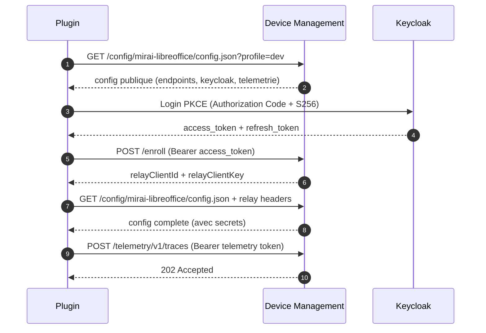

# Client Integration README

Guide pour les developpeurs integrant un plugin avec l'API Device Management.

## Plugins supportes

| Plugin | device_name | Extension | Alias |
|--------|-------------|-----------|-------|
| Assistant Mirai LibreOffice | `mirai-libreoffice` | .oxt | `libreoffice` |
| Matisse Thunderbird | `mirai-matisse` | .xpi | `matisse` |

Le `device_name` est l'identifiant unique du plugin. Utilisez-le dans toutes les
interactions avec le serveur.

> **Retrocompatibilite** : les anciens chemins via alias (`/config/libreoffice/...`)
> fonctionnent toujours. La reponse contiendra le vrai `device_name` et `config_path`
> pour migrer automatiquement au prochain cycle.

## Flow d'integration



## Endpoints

### 1) Configuration

```
GET /config/{device_name}/config.json
GET /config/{device_name}/config.json?profile=local|dev|int|prod|...
```

Les profils sont libres. 4 profils standards : `local` (dev autonome sans DM),
`dev` (DM local), `int` (recette), `prod` (production).
Les valeurs sont resolues depuis le template `dm-config.json` du plugin +
overrides catalogue + variables plateforme `${{VAR}}`.

Le `device_name` peut etre :
- Le slug du plugin : `mirai-libreoffice`, `mirai-matisse`
- Un alias : `libreoffice`, `matisse`

Reponse :
```json
{
  "meta": {
    "schema_version": 2,
    "device_type": "libreoffice",
    "profile": "dev"
  },
  "config": {
    "device_name": "mirai-libreoffice",
    "config_path": "/config/mirai-libreoffice/config.json",
    "bootstrap_url": "https://<SCALEWAY_HOSTNAME>/",
    "keycloakIssuerUrl": "https://sso.example.com/realms/openwebui",
    "keycloakRealm": "openwebui",
    "keycloakClientId": "bootstrap-mirai-lo-dev",
    "llm_base_urls": "https://api.scaleway.ai/.../v1",
    "telemetryEnabled": true,
    "telemetryEndpoint": "https://<SCALEWAY_HOSTNAME>/telemetry/v1/traces",
    "telemetryAuthorizationType": "Bearer",
    "telemetryKey": "<jwt-court-duree>"
  },
  "update": null,
  "features": {},
  "communications": []
}
```

> **Important** : meme si vous appelez `/config/libreoffice/...` (alias), la reponse
> contient `device_name: "mirai-libreoffice"` et `config_path: "/config/mirai-libreoffice/..."`.
> Utilisez ces valeurs pour les appels suivants.

Sans relay headers, les valeurs secretes (`llm_api_tokens`, etc.) sont vides.

> **Acces au modele.** La reponse porte aussi `llmEndpoint`, `llmToken` et `llmTokenExpiresAt` :
> par defaut, le trafic d'inference passe par le **relais du DM**, jamais en direct vers le
> fournisseur — sa cle ne descend pas sur le poste. `llm_base_urls` / `llm_api_tokens` sont
> conserves en miroir pour les clients existants, mais ne portent plus la cle du backend reel.
>
> Le meme relais sert les **embeddings** (recherche semantique) : `embdUrl` et `embdToken` sont
> des miroirs de `llmEndpoint` / `llmToken`, et `embdModel` designe le modele — **vide = embedder
> desactive**. Comment appeler, comment traiter 401/403/429, et pourquoi un changement de
> `embdModel` impose une re-indexation :
> [plugin-dm-protocol-update-features.md](plugin-dm-protocol-update-features.md) § 4 bis.

#### Acces restreint

Si le plugin est en beta/alpha avec controle d'acces, la reponse peut etre :
```json
{
  "meta": { "schema_version": 2, "access_denied": true },
  "config": {
    "device_name": "mirai-matisse",
    "access_mode": "keycloak_group",
    "maturity": "beta",
    "message": "Acces restreint. Contactez votre administrateur."
  }
}
```

### 2) Enrollment

```
POST /enroll
Authorization: Bearer <keycloak_access_token>
Content-Type: application/json
```

```json
{
  "device_name": "mirai-libreoffice",
  "plugin_uuid": "b9bdf6ad-3b1f-4f1a-9f07-4f8606c3fe5a",
  "email": "user@example.com",
  "plugin_version": "2.1.0"
}
```

Reponse :
```json
{
  "ok": true,
  "relayClientId": "abc123...",
  "relayClientKey": "xyz789...",
  "relay": { "client_id": "abc123...", "client_key": "xyz789...", "expires_at": "..." }
}
```

### 3) Configuration avec relay (secrets)

```
GET /config/mirai-libreoffice/config.json?profile=dev
X-Relay-Client: abc123...
X-Relay-Key: xyz789...
```

Retourne la config complete avec les valeurs secretes.

### 4) Telemetrie

Le token est fourni dans la config (`telemetryKey`, 300s TTL, renouvele a chaque fetch).
Il est aussi recuperable seul via `GET /telemetry/token?device=<slug>&profile=<profil>`, qui
renvoie `telemetryEndpoint`, `telemetryKey`, `telemetryKeyExpiresAt` et `telemetryKeyTtlSeconds`.

```
POST /telemetry/v1/traces
Authorization: Bearer <telemetry_token>
Content-Type: application/json
```

```json
{
  "resourceSpans": [{
    "resource": {},
    "scopeSpans": [{"spans": [{"name": "ExtensionLoaded"}]}]
  }]
}
```

**Rotation du jeton — strategie recommandee**

1. Jeton absent ou expirant dans moins de 30 s → le renouveler avant d'emettre.
2. `401` / `403` du relais de telemetrie → renouveler **une fois**, reessayer **une fois**.
3. Toujours en echec → mettre en file locale et reessayer en backoff exponentiel.
   Ne jamais boucler sans borne : la telemetrie ne doit pas degrader le plugin.

**Ce qu'on emet AVANT la connexion SSO**

Avant login, l'utilisateur n'est pas identifie : seuls les evenements techniques sont admis.

| Autorise avant login | Interdit avant login |
|---|---|
| demarrage / arret du plugin | contenu de courriel |
| statut de recuperation de config | texte de document |
| erreurs de transport de telemetrie | identifiants d'utilisateur en clair |

### 5) Relay (services upstream)

```
POST /relay-assistant/llm/chat/completions
X-Relay-Client: abc123...
X-Relay-Key: xyz789...
Authorization: Bearer <keycloak_token>
```

Targets : `keycloak`, `llm`, `mcr-api`, `telemetry`.

### 6) Mises a jour automatiques

Le serveur peut inclure une directive de mise a jour dans la config :
```json
{
  "update": {
    "action": "update",
    "current_version": "2.0.3",
    "target_version": "2.1.0",
    "artifact_url": "/binaries/libreoffice/2.1.0_mirai.oxt",
    "checksum": "sha256:...",
    "urgency": "normal"
  }
}
```

Le plugin doit verifier le checksum avant d'installer.

> `artifact_url` est un **chemin opaque** : le suivre tel quel (302 inclus), ne pas le
> reconstruire. Selon le cas il vaut `/catalog/{slug}/download` (derniere version main),
> `/catalog/{slug}/download/{slug}-{version}.{ext}` (epingle sur une version, campagnes
> d'experimentation) ou `/binaries/{chemin}` (repli).
>
> `target_version` **n'est pas garantie superieure** a `current_version`, ni meme semver
> (`1.6.0-rc1`) : en campagne d'experimentation le serveur epingle une version precise. Le
> client doit reemettre cette version **a l'identique** dans `X-Plugin-Version` apres
> installation, sinon il rebouclera sur la meme directive a chaque poll.
>
> Contrat complet et opposable : [plugin-dm-protocol-update-features.md](plugin-dm-protocol-update-features.md) §4.3 et §9.

### 7) Communications

Le serveur peut inclure des messages pour l'utilisateur :
```json
{
  "communications": [
    {
      "id": 42,
      "type": "announcement",
      "title": "Nouvelle version disponible",
      "body": "La v2.1 corrige le freeze au demarrage.",
      "priority": "normal"
    }
  ]
}
```

Pour acquitter (ne plus afficher) : `POST /communications/42/ack`
Pour repondre a un sondage : `POST /communications/43/survey/respond`

## Keycloak : Authorization Code + PKCE

### Configuration client

| Parametre | Valeur |
|-----------|--------|
| Client ID | `bootstrap-mirai-libreoffice` (genere par le catalogue) |
| Access type | `public` |
| Standard Flow | ON |
| Direct Access Grants | OFF |
| PKCE | `required` (S256) |
| Redirect URIs | `http://localhost:28443/callback` |

Le catalogue admin peut generer un fichier JSON d'import pour Keycloak :

```json
{
  "clientId": "bootstrap-mirai-libreoffice",
  "name": "Assistant Mirai LibreOffice",
  "enabled": true,
  "publicClient": true,
  "standardFlowEnabled": true,
  "directAccessGrantsEnabled": false,
  "redirectUris": ["http://localhost:28443/callback"],
  "webOrigins": ["*"],
  "attributes": { "pkce.code.challenge.method": "S256" },
  "defaultClientScopes": ["web-origins", "profile", "roles", "email"],
  "optionalClientScopes": ["offline_access", "groups"]
}
```

### Token settings

- Access token : 10-15 min
- Refresh token : 7-30 jours
- Rotation refresh : ON

> `offline_access` en `optionalClientScopes` rend le jeton hors-ligne **disponible**, pas
> **accorde** : Keycloak ne l'emet que si le client le demande explicitement dans `scope`
> (voir ci-dessous). L'utilisateur doit par ailleurs porter le role de realm `offline_access`.

### Renouvellement des jetons — et pourquoi il faut un jeton hors-ligne

Un plugin bureautique tourne des semaines sans que personne ne se reconnecte. Trois jetons
cohabitent, avec des durees de vie tres differentes :

| Jeton | Duree de vie | Renouvele par | Sert a |
|---|---|---|---|
| Access token Keycloak | ~10-15 min | le refresh token | **uniquement** `POST /enroll` |
| Refresh token Keycloak | voir ci-dessous | lui-meme (rotation) | obtenir un access token sans interaction |
| Credentials de relais | **30 jours** par defaut | un nouvel `/enroll` | tous les appels a DM |
| `llmToken`, `telemetryKey` | courte | chaque `/config` | modele, telemetrie |

La chaine se lit de droite a gauche : au bout de 30 jours, les credentials de relais expirent →
il faut ré-enrôler → il faut un access token Keycloak → il faut un refresh token encore valide.
**C'est ce dernier maillon qui casse**, et voici pourquoi.

**Refresh token ordinaire vs jeton hors-ligne.** Un refresh token classique est *lie a la session
SSO du navigateur* : il meurt avec elle (SSO Session Idle / SSO Session Max), quelle que soit sa
propre duree de vie affichee. Un **jeton hors-ligne** (`offline_access`) n'est affecte ni par
l'inactivite ni par le maximum de session SSO, et survit meme a une deconnexion — il ne se perime
que s'il n'est pas utilise pendant *Offline Session Idle* (30 jours par defaut).

Pour un plugin bureautique, seul le jeton hors-ligne tient la distance. Sans lui, l'utilisateur
est renvoye vers une authentification interactive des que sa session SSO expire — typiquement en
plein travail, et souvent au pire moment (une re-authentification declenchee pendant une mise a
jour interrompt les deux).

**Ce que vous devez faire :**

1. **Demander explicitement le scope** dans la requete d'autorisation :
   `scope=openid offline_access`. Sans ce parametre, Keycloak emet un refresh token ordinaire —
   le declarer en `optionalClientScopes` cote client ne suffit pas.
2. **Rafraichir avant expiration**, pas apres echec : renouveler l'access token quand il expire
   dans moins de ~60 s, plutot que d'attendre un 401.
3. **Utiliser le jeton hors-ligne au moins une fois par mois.** Il se perime sur l'inactivite :
   un poste eteint six semaines revient sans identite et devra se reconnecter.
4. **Le stocker comme un secret** (voir « Stockage securise des tokens »), et gerer la rotation :
   avec `Rotation refresh: ON`, chaque rafraichissement renvoie un **nouveau** jeton qui remplace
   le precedent — ecrasez-le, sinon vous rejouez un jeton invalide.
5. **Ré-enrôler quand DM repond 401**, sans anticiper : l'autorite de validite des credentials de
   relais est le serveur, pas votre horloge locale.

### Test PKCE

```bash
CODE_VERIFIER=$(python3 -c "import os,base64; print(base64.urlsafe_b64encode(os.urandom(32)).decode().rstrip('='))")
CODE_CHALLENGE=$(python3 -c "import hashlib,base64,os; print(base64.urlsafe_b64encode(hashlib.sha256(os.environ['CODE_VERIFIER'].encode()).digest()).decode().rstrip('='))")

# Ouvrir dans le navigateur
echo "https://sso.example.com/realms/openwebui/protocol/openid-connect/auth?response_type=code&client_id=bootstrap-mirai-libreoffice&redirect_uri=http%3A%2F%2Flocalhost%3A28443%2Fcallback&scope=openid%20email%20offline_access&code_challenge_method=S256&code_challenge=${CODE_CHALLENGE}"

# Echanger le code
curl -sS -X POST https://sso.example.com/realms/openwebui/protocol/openid-connect/token \
  -d "grant_type=authorization_code&client_id=bootstrap-mirai-libreoffice&redirect_uri=http://localhost:28443/callback&code=${CODE}&code_verifier=${CODE_VERIFIER}"
```

## Stockage securise des tokens

- Windows : Credential Manager
- macOS : Keychain
- Linux : Secret Service (libsecret)

## Convention `dm-config.json` (pour les developpeurs de plugins)

Pour que le DM serve automatiquement la bonne configuration, le developpeur
du plugin peut fournir un fichier `dm-config.json` (dans le package ou separement) :

```json
{
  "configVersion": 1,
  "default": {
    "systemPrompt": "Tu es un assistant...",
    "extend_selection_max_tokens": 15000,
    "telemetryEnabled": true,
    "llm_request_timeout_seconds": 45
  },
  "local": {
    "llm_base_urls": "http://localhost:11434/api",
    "llm_default_models": "llama3.2",
    "telemetryEnabled": false
  },
  "dev": {
    "llm_base_urls": "${{LLM_BASE_URL}}",
    "keycloakClientId": "${{KEYCLOAK_CLIENT_ID}}"
  },
  "prod": {
    "llm_base_urls": "${{LLM_BASE_URL}}"
  }
}
```

- `default` : valeurs communes a tous les environnements
- `local` : dev autonome, valeurs en dur (pas de DM)
- `dev`/`int`/`prod` : `${{VAR}}` substitues par les variables serveur
- Profils supplementaires libres (`staging`, `dgx`, etc.)
- Si une section serveur manque des cles plateforme, le DM les ajoute automatiquement

## Catalogue public

La page publique du catalogue est accessible sans authentification :

- `/catalog` : page d'accueil (grille de plugins)
- `/catalog/{slug}` : fiche plugin (mode d'emploi, changelog, feedback, telechargement)
- `/catalog/{slug}/download` : telechargement direct de la derniere version
- `/catalog/api/plugins` : API JSON (CORS ouvert, pour integration externe)
- `/catalog/api/docs` : documentation Swagger/OpenAPI

### Versions experimentales (DM 0.9.14+)

Les versions de statut `experimental` **n'apparaissent nulle part** ci-dessus : ni sur la fiche,
ni dans l'API, ni dans le telechargement par defaut. Elles ne sortent que si l'appelant connait
le `tag` de la branche :

- `/catalog/{slug}?exp=<tag>` : la fiche + la section « Versions experimentales » du tag
- `/catalog/{slug}/download?tag=<tag>` : derniere version de cette branche
- `/catalog/{slug}/download/{slug}-{version}.{ext}` : une version precise (main ou experimentale)
- `/catalog/api/plugins/{slug}?exp=<tag>` : le JSON habituel **plus** une cle `experiments`
  (`version`, `tag`, `hypotheses`, `release_notes`, `download_url`)

Sans `?exp=`, la reponse de l'API est identique a celle d'avant la 0.9.15 — la cle `experiments`
est absente, pas vide. Le `tag` est une **barriere de discretion, pas un controle d'acces** :
il evite l'exposition accidentelle, il ne protege pas un binaire.

## cURL Examples

```bash
# Config
curl -sS 'https://<SCALEWAY_HOSTNAME>/config/mirai-libreoffice/config.json?profile=dev' | python3 -m json.tool

# Config via alias (retrocompatible)
curl -sS 'https://<SCALEWAY_HOSTNAME>/config/libreoffice/config.json?profile=dev' | python3 -m json.tool

# Enroll
curl -sS -X POST -H "Content-Type: application/json" -H "Authorization: Bearer ${TOKEN}" \
  -d '{"device_name":"mirai-libreoffice","plugin_uuid":"b9bdf6ad-...","email":"user@example.com"}' \
  https://<SCALEWAY_HOSTNAME>/enroll

# Health check
curl -sS https://<SCALEWAY_HOSTNAME>/healthz

# API catalogue (JSON public)
curl -sS https://<SCALEWAY_HOSTNAME>/catalog/api/plugins | python3 -m json.tool
```

## Troubleshooting

| Erreur | Cause | Solution |
|--------|-------|----------|
| 400 `device inconnu` | device_name ou alias invalide | Verifier le slug |
| 400 `Body is not valid JSON` | Payload enroll invalide | Verifier le JSON |
| 401 sur config | Relay credentials invalides | Re-enrollment |
| 401 sur telemetrie | Token expire | Re-fetch config (nouveau token inclus) |
| 403 `access_denied` | Plugin en beta/alpha, acces restreint | Contacter l'admin ou s'inscrire waitlist |
| 500 `S3 bucket not configured` | Variable serveur manquante | Contacter l'admin |
