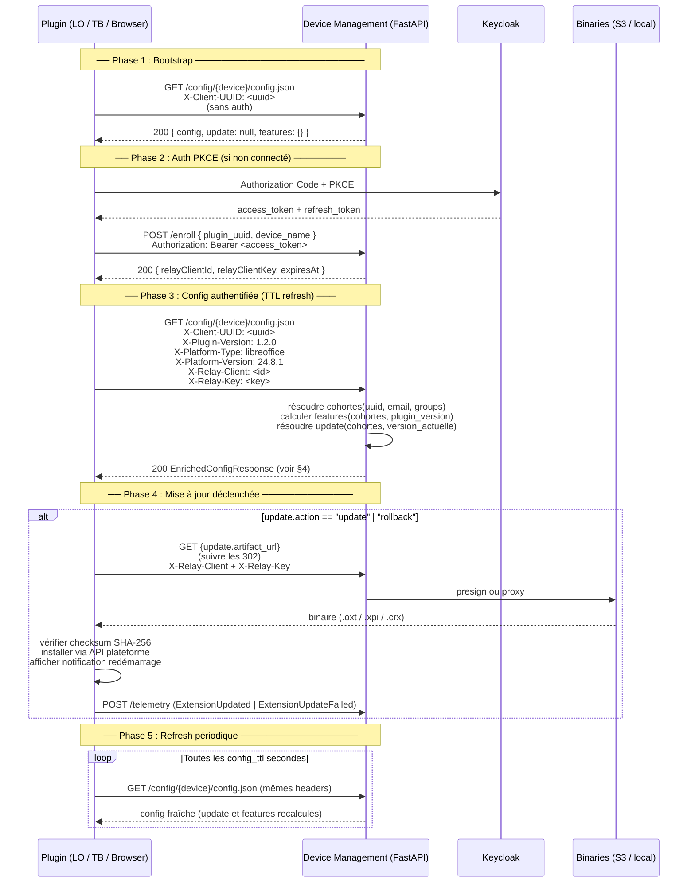
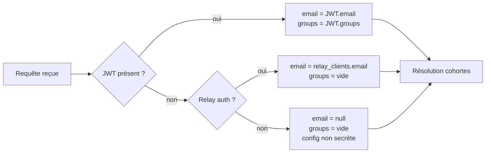
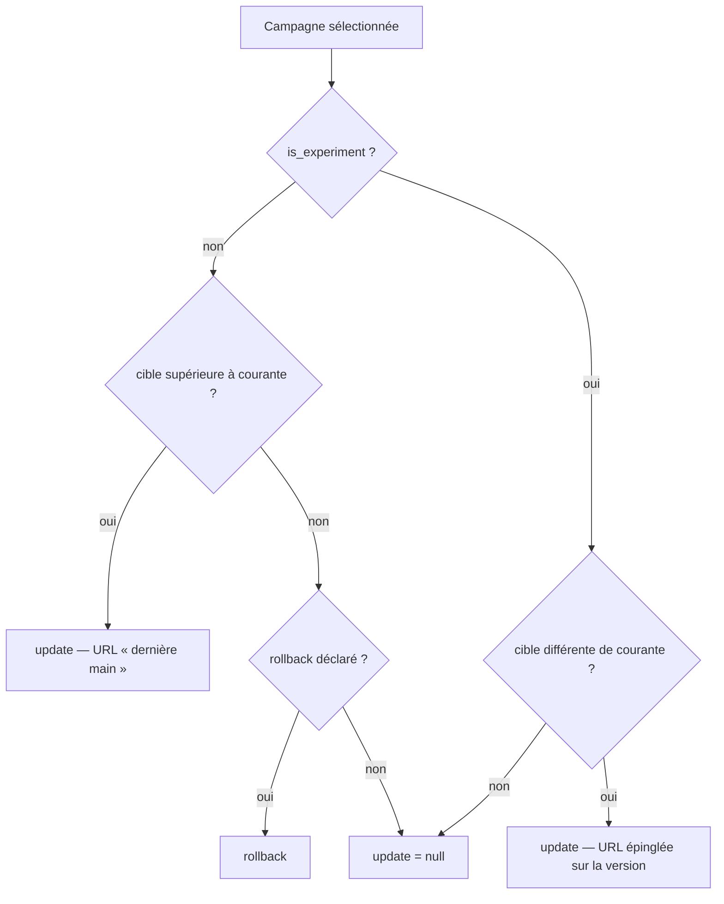
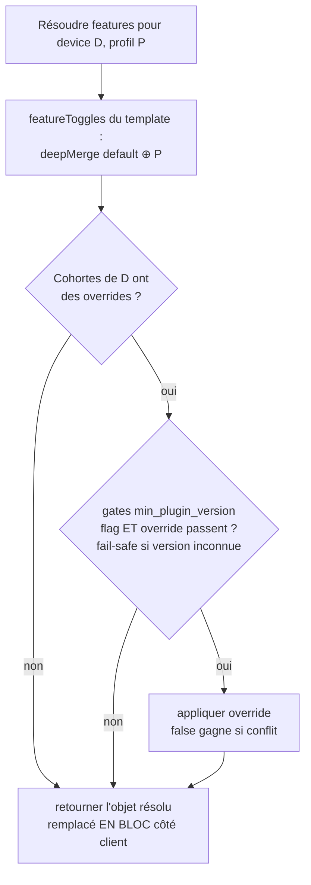
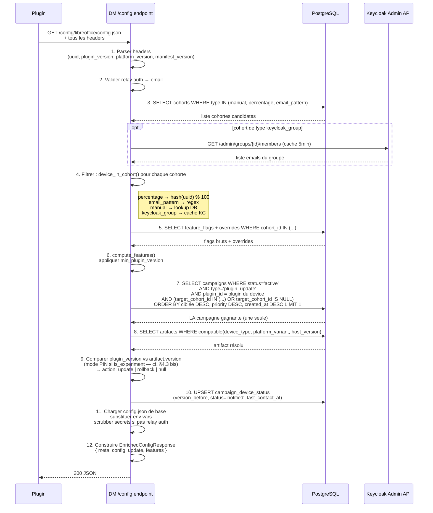
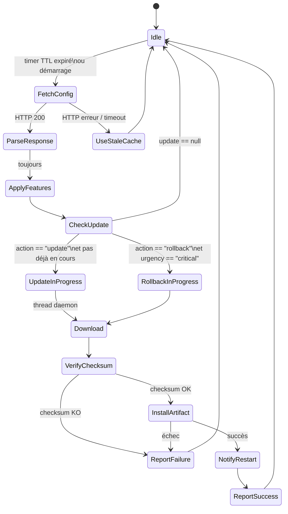

# Protocole Plugin ↔ Device Management — Update & Feature Toggling

> **Contrat d'interface** entre une extension et le Device Management : ce que le serveur
> s'engage à émettre, ce que le client s'engage à envoyer et à faire. Il fait foi des deux côtés.
> Périmètre : déploiement progressif, feature toggling, branches d'expérimentation.
> Plateformes couvertes : LibreOffice, Thunderbird (TB60/TB128), Chrome/Edge (MV2/MV3), Firefox.

---

## 0. Ce que votre client doit faire — la version courte

**Huit obligations.** Le reste du document les justifie et les détaille ; le squelette de code
correspondant est en [annexe](#annexe--client-de-référence-en-pseudo-code).

| # | Vous devez… | Sinon |
|---|---|---|
| 1 | Envoyer `X-Plugin-Version` à chaque appel `/config`, avec la version **réellement installée**, lue du manifeste — **jamais** une constante, **jamais** normalisée | vous ne serez **jamais** mis à jour (le serveur ne regarde même pas les campagnes) |
| 2 | Ne traiter `update` que si `meta.schema_version == 2` | vous interpréterez une réponse d'un ancien format |
| 3 | **Ne pas comparer les versions** pour décider d'agir. Le serveur a déjà décidé. Le seul test autorisé côté client est l'égalité stricte `target_version == version installée` (garde anti-boucle) | mises à jour ignorées (`1.6.0-rc1` n'est « supérieur » à rien) ou boucle infinie |
| 4 | Suivre `artifact_url` **telle quelle**, redirections 302 comprises — ne jamais la reconstruire à partir du slug et de la version | vous téléchargerez la mauvaise version, ou rien |
| 5 | Vérifier le checksum : format `sha256:<hex>`, comparaison **insensible à la casse**. Pas de checksum ou checksum différent → **ne pas installer**, rapporter `checksum_error` | vous installez un binaire non vérifié |
| 6 | Après installation, réémettre la version cible **à l'identique** dans `X-Plugin-Version` | boucle de mise à jour à chaque poll |
| 7 | Rapporter l'issue via `POST /update/status`, **avec les credentials relais** | 401 ; la campagne reste bloquée en « notifié » et l'admin pilote à l'aveugle |
| 8 | Remplacer `features` **en bloc** (jamais de fusion) ; un flag absent vaut **activé** | flags fantômes qui survivent à leur suppression côté serveur |

**Ce que le serveur garantit en retour :** `update` vaut `null` (jamais absent) quand il n'y a rien
à faire ; `features` vaut `{}` (jamais absent) ; les champs inconnus peuvent apparaître à tout
moment et doivent être ignorés ; aucun changement ne casse un client conforme (§9).

**Côté empaquetage**, deux fichiers `dm-*.json` déposés à la racine de l'archive déclarent
l'identité du plugin et ses défauts de configuration — dont ceux des feature flags
([§2 bis](#2-bis-fichiers-de-métadonnées-du-paquet-dm-json)).

**Si votre plugin appelle un modèle** — génération ou embeddings — deux obligations de plus :
passer par le relais du DM et relire son adresse à chaque poll ([§4 bis](#4-bis-accès-aux-modèles--le-relais-llmv1)), et
**journaliser fonctionnellement** les erreurs qu'il renvoie
([§8 bis](#8-bis-journalisation-fonctionnelle-des-erreurs-du-relais-llm-llmv1)) — c'est la seule
vue de ce que vivent réellement les utilisateurs.

---

## 1. Vue d'ensemble du cycle de vie



---

## 2. Headers envoyés par le plugin

| Header | Statut | Valeur exemple | Rôle |
|---|---|---|---|
| `X-Client-UUID` | toujours | `d4e5f6...` | identité du device |
| `X-Plugin-Version` | **requis pour l'update** | `1.2.0` | version actuellement installée |
| `X-Platform-Type` | recommandé | `thunderbird` | type d'hôte |
| `X-Platform-Version` | recommandé | `128.3.1` | version de l'application hôte |
| `X-Manifest-Version` | navigateurs | `3` | MV2 ou MV3 → variante d'artefact |
| `X-Relay-Client` | post-enroll | `rc_abc` | identifiant de credential relay |
| `X-Relay-Key` | post-enroll | `<key>` | clé de credential relay |
| `Authorization` | post-login | `Bearer <JWT>` | Keycloak access token |

> **Nom exact des en-têtes relais** : `X-Relay-Client` et `X-Relay-Key`. Le serveur accepte aussi
> les alias historiques `X-Client-Id` / `X-Client-Key`. Il ne lit **pas** `X-Relay-Client-Id` :
> une paire envoyée sous ce nom est ignorée, l'appel est traité comme non authentifié (secrets
> masqués), et `POST /update/status` répond 401.
>
> Envoyez vos credentials **même si vous les croyez expirés** : l'autorité de validité est le
> serveur. Un 401 est le signal de ré-enrôlement — ne l'anticipez pas côté client.

**La chaîne de credentials, et là où elle casse.** Les credentials de relais durent **30 jours**
par défaut. À leur expiration il faut ré-enrôler, donc présenter un access token Keycloak, donc
disposer d'un refresh token encore valide. Or un refresh token *ordinaire* est lié à la session
SSO du navigateur et meurt avec elle — bien avant les 30 jours.

Votre client doit donc demander un **jeton hors-ligne**, en envoyant explicitement
`scope=openid offline_access` dans la requête d'autorisation : lui seul n'est affecté ni par
l'inactivité ni par le maximum de session SSO. Le déclarer en `optionalClientScopes` côté client
Keycloak le rend disponible, **pas accordé**. Sans lui, l'utilisateur est renvoyé vers une
authentification interactive dès l'expiration de sa session — y compris en pleine mise à jour.

Durées de vie, rotation et règles de renouvellement :
[consumer-readme.md](consumer-readme.md) § « Renouvellement des jetons ».

> **`X-Plugin-Version` conditionne tout le mécanisme d'update.** Absente, vide, ou valant
> `unknown` / `0`, le serveur renvoie `update: null` sans même regarder les campagnes — un client
> qui ne l'envoie pas ne sera jamais mis à jour. `X-Platform-Version` sert au filtre de
> compatibilité hôte (`min_host_version` / `max_host_version` de l'artefact) : absente, le filtre
> est neutralisé et l'artefact est servi tel quel.

### Règle de priorité d'identification



---

## 2 bis. Fichiers de métadonnées du paquet (`dm-*.json`)

Les §2 et §4 décrivent le dialogue **à l'exécution**. Cette section décrit l'autre moitié du
contrat, celle que le plugin remplit **à l'empaquetage** : deux fichiers JSON déposés à la
**racine** de l'archive (`.oxt` / `.xpi` / `.crx` / `.zip`), qui déclarent au serveur ce qu'est le
plugin et comment le configurer.

| Fichier | Ce qu'il déclare | Alimente |
|---|---|---|
| `dm-manifest.json` | Fiche catalogue : identité, description, icône, changelog | Le catalogue public, les notes de version, la détection automatique de version |
| `dm-config.json` | Gabarit de configuration par profil, et **les défauts des feature flags** | L'objet `config` et l'objet `features` servis à chaque `/config` (§4.2, §4.4) |

Les deux sont **optionnels mais recommandés** : sans eux, la fiche catalogue doit être saisie à la
main et le plugin ne reçoit aucune configuration dynamique. Les variantes à tiret bas
(`dm_manifest.json`, `dm_config.json`) sont acceptées, et la casse du nom est ignorée.

### Ce qu'il faut absolument savoir

**1. Ces fichiers sont retirés du binaire distribué.** À la publication, le serveur les extrait,
en ingère le contenu, puis **reconstruit l'archive sans eux** avant de la stocker. Ils ne partent
donc jamais sur les postes — ils sont un canal éditeur → serveur, pas éditeur → poste.

**2. Le `checksum` porte sur l'archive *après* retrait.** C'est la conséquence directe du point
précédent, et le piège classique : l'empreinte que vous calculez sur le paquet que vous avez
construit **ne correspondra pas** à celle de la directive `update`. Ne comparez jamais les deux ;
côté client, vérifiez toujours le checksum contre le binaire **téléchargé** (§4.3, annexe).

**3. Racine de l'archive, impérativement.** Le serveur *lit* un `dm-*.json` situé dans un
sous-dossier, mais ne le *retire* que s'il est à la racine — un fichier imbriqué finirait publié
dans le binaire distribué.

### `dm-manifest.json`

Fiche catalogue. Seuls `slug` et `name` comptent vraiment ; tout le reste enrichit l'affichage.

```json
{
  "slug": "mon-plugin",
  "name": "Mon Plugin — description courte",
  "intent": "Proposition de valeur en une phrase.",
  "device_type": "libreoffice",
  "icon_url": "assets/logo.png",
  "key_features": ["Fonctionnalité 1", "Fonctionnalité 2"],
  "changelog": [
    { "version": "1.1.0", "date": "2026-03-15", "changes": ["Nouveauté X", "Correction Y"] },
    { "version": "1.0.0", "date": "2026-01-01", "changes": ["Première version"] }
  ]
}
```

Deux effets qui dépassent l'affichage :

- **Notes de version** — à la publication d'une version `V`, le serveur cherche dans `changelog`
  l'entrée dont le champ `version` vaut **exactement** `V` et en fait les notes de cette version.
  Un décalage de libellé (`1.1` vs `1.1.0`) et les notes restent vides.
- **Détection de version** — si la version n'est pas fournie explicitement à la publication, la
  première entrée du `changelog` sert de source de repli pour la déduire. C'est le filet de
  sécurité des formats sans manifeste exploitable.

Liste complète des champs, ordre exact de détection de version et résolution de l'icône :
[packaging-guide.md](packaging-guide.md).

### `dm-config.json`

Gabarit de configuration : une section `default` commune, puis une section par profil
(`local`, `dev`, `int`, `prod`…), fusionnées à la lecture. C'est **l'autorité des défauts** — ni
le catalogue ni l'IHM d'administration ne les remplacent.

```json
{
  "configVersion": 1,
  "default": {
    "systemPrompt": "Tu es un assistant...",
    "telemetryEnabled": true,
    "featureToggles": { "composePromptPanel": true, "search": true }
  },
  "prod": {
    "llm_base_urls": "${{LLM_BASE_URL}}",
    "featureToggles": { "search": false }
  }
}
```

| Élément | Rôle |
|---|---|
| `default` | valeurs communes à tous les profils |
| `<profil>` | surcharges par environnement, fusionnées par-dessus `default` |
| `${{VAR}}` | placeholder substitué par le serveur à l'exécution (endpoints, realm Keycloak, jetons…) |
| `featureToggles` | **défauts des feature flags**, par profil |
| `_description` | commentaire, retiré de la configuration servie |

**`featureToggles` est le point de contact avec le §4.4.** Trois conséquences :

- il est **fusionné en profondeur** (`default` ⊕ profil) : un profil qui surcharge un flag
  n'efface pas les autres — contrairement au reste de la section, fusionné à plat ;
- à chaque publication, le serveur **réconcilie le catalogue de flags** avec l'union des clés
  `featureToggles` de tous les profils. Un flag retiré du gabarit est marqué *orphelin* et cesse
  d'être diffusé, sans être supprimé ;
- l'administrateur ne pose que des **surcharges de cohorte** par-dessus. Pour changer un défaut,
  il faut republier le paquet — c'est voulu : une seule source de vérité.

Placeholders disponibles et auto-complétion des sections serveur :
[packaging-guide.md](packaging-guide.md).

---

## 3. Décision sur les objets dédiés

### Approche plate (héritée, abandonnée) — à éviter

```json
{
  "config": {
    "llm_base_urls": "...",
    "lastversion": "2.0.0",
    "updateUrl": "...",
    "feature_writer": true,
    "feature_calc": false
  }
}
```

**Problèmes :**
- `update` et `features` sont noyés dans la config LLM / auth / telemetry
- Le plugin doit savoir quelle clé est un feature flag vs un paramètre métier
- Impossible de versionner le contrat séparément
- Pas de sémantique `action` (update ? rollback ? rien ?)

### Approche objets dédiés — cible

La réponse DM est une **directive personnalisée** calculée à la volée pour ce device
à cet instant. Chaque objet a sa propre sémantique et son propre cycle de vie.

```
EnrichedConfigResponse
├── meta     → identité de la réponse (version du schéma, timestamp)
├── config   → paramètres runtime (LLM, auth, telemetry) — inchangé
├── update   → directive de mise à jour pour CETTE version sur CETTE plateforme
└── features → flags calculés pour CE device (cohortes + version plugin)
```

> **`siblings` hors périmètre court terme.**
> Nécessite un daemon natif pour être actionnable. Sera ajouté quand `mirai-agent`
> existera. Ne pas implémenter côté plugin ni côté DM pour l'instant.

**Avantages de la séparation :**
- Le plugin traite chaque objet indépendamment
- `update` est `null` si pas de campagne → pas d'ambiguïté
- `features` peut être version-contraint (`min_plugin_version`)
- Évolution de schéma sans casser les clients anciens (ignore inconnu)
- Tests unitaires clairs : mocker `update` ou `features` séparément

---

## 4. Structure JSON complète de la réponse

### 4.1 Schéma général

```json
{
  "meta": {
    "schema_version": 2,
    "generated_at": "2026-03-15T10:00:00Z",
    "device_type": "libreoffice",
    "platform_variant": null,
    "client_uuid": "d4e5f6aa-...",
    "profile": "prod"
  },
  "config": { },
  "update": null,
  "features": { }
}
```

### 4.2 Objet `config` — inchangé, config runtime

```json
{
  "config": {
    "llmEndpoint": "https://host/llm/v1",
    "llmToken": "<jeton signé, ou vide si pas de relay auth>",
    "llmTokenExpiresAt": 1769961300,
    "llm_base_urls": "https://host/llm/v1",
    "llm_default_models": "mistral:7b",
    "llm_api_tokens": "<= llmToken (ou vide si pas de relay auth)>",
    "authHeaderName": "Authorization",
    "authHeaderPrefix": "Bearer ",
    "keycloakIssuerUrl": "https://keycloak.example.com/realms/mirai",
    "keycloakRealm": "mirai",
    "keycloakClientId": "mirai-lo",
    "systemPrompt": "Tu es un assistant...",
    "embdModel": "bge-multilingual-gemma2",
    "embdUrl": "https://host/bootstrap/llm/v1",
    "embdToken": "<= llmToken minté (ou vide si pas de relay auth)>",
    "telemetryEnabled": true,
    "telemetryEndpoint": "https://traces.example.com/v1/traces",
    "telemetryKey": "<token>"
  }
}
```

**Accès aux modèles** — `llmEndpoint` et `llmToken` désignent où appeler la génération **et** les
embeddings, et avec quoi s'authentifier. **Ne les codez jamais en dur** : ils changent de valeur selon le mode d'exploitation
(voir [§4 bis](#4-bis-accès-aux-modèles--le-relais-llmv1)). Les clés historiques `llm_base_urls` et
`llm_api_tokens` sont maintenues en miroir pour les clients existants, mais elles ne portent plus la
clé du backend réel — utilisez `llmEndpoint` / `llmToken` dans tout nouveau code.

**Embedder (RAG)** — `embdModel` / `embdUrl` / `embdToken` sont émis par le DM en **miroir du LLM** :
`embdUrl = llmEndpoint` (le plugin appende `/embeddings`), `embdToken = llmToken`. Seul `embdModel`
(= `EMBD_MODEL_NAME` côté DM, vide = embedder désactivé) est propre à l'embedder. Côté plugin, `embdModel`
va en pref ; l'URL/token sont réutilisés in-memory depuis le LLM (pas de token périssable en `about:config`).

### 4.3 Objet `update` — directive de mise à jour

`null` si aucune campagne ne s'applique à ce device.

```json
{
  "update": {
    "action": "update",
    "current_version": "1.2.0",
    "target_version": "2.0.0",
    "artifact_url": "/binaries/libreoffice/2.0.0/mirai.oxt",
    "checksum": "sha256:e3b0c44298fc1c149afbf4c8996fb92427ae41e4649b934ca495991b7852b855",
    "urgency": "normal",
    "changelog_url": "https://bootstrap.example.com/changelog/2.0.0",
    "deadline_at": null,
    "campaign_id": 5,
    "plugin_slug": "mirai-libreoffice"
  }
}
```

| Champ | Valeurs | Description |
|---|---|---|
| `action` | `"update"` `"rollback"` | directive à exécuter (`null` = objet absent) |
| `current_version` | semver | ce que le DM sait de la version actuelle |
| `target_version` | semver | version cible |
| `artifact_url` | path relatif `/catalog/...` ou `/binaries/...` | voir « Formes d'`artifact_url` » ci-dessous |
| `checksum` | `sha256:<hex>` | vérification intégrité obligatoire |
| `urgency` | `"low"` `"normal"` `"critical"` | affecte l'UX (silencieux / dialog / bloquant) |
| `deadline_at` | ISO8601 ou `null` | si non null : forcer update avant cette date |
| `campaign_id` | int | pour le tracking dans `campaign_device_status` |
| `plugin_slug` | slug ou `null` | plugin résolu par le serveur ; `null` si le device n'a pas pu être rattaché à une fiche catalogue |

**Formes d'`artifact_url`** — trois formes possibles, toutes des chemins relatifs à la base
publique. Le client les suit sans les interpréter (la 1re et la 2e redirigent en 302) :

| Forme | Émise quand | Sémantique |
|---|---|---|
| `/catalog/{slug}/download` | campagne générale, plugin résolu | « la dernière version main » — résolue à chaque requête |
| `/catalog/{slug}/download/{slug}-{version}.{ext}` | campagne d'expé (PIN), plugin résolu, extension connue | **épinglée** sur une version exacte |
| `/binaries/{chemin}` | plugin non résolu, ou extension inconnue | repli : désigne l'artefact exact, quel que soit le mode de stockage |

**Cas rollback :**

```json
{
  "update": {
    "action": "rollback",
    "current_version": "2.1.0",
    "target_version": "2.0.0",
    "artifact_url": "/binaries/libreoffice/2.0.0/mirai.oxt",
    "checksum": "sha256:...",
    "urgency": "critical",
    "deadline_at": "2026-03-16T08:00:00Z",
    "campaign_id": 5
  }
}
```

**Cas à jour :**

```json
{ "update": null }
```

### 4.3 bis Campagnes d'expérimentation — le mode PIN

Une campagne peut être marquée **campagne d'expérimentation** (`is_experiment`). Elle sert alors
à faire tourner une version *non-main* sur une cohorte restreinte — release candidate, prototype,
branche martyre — pendant que le reste du parc reste sur le rollout général. Du point de vue du
client, la directive a exactement la même forme ; **deux règles changent** :

| | Campagne générale | Campagne d'expérimentation (PIN) |
|---|---|---|
| Condition d'émission | `target_version` **>** `current_version` | `target_version` **≠** `current_version` |
| `artifact_url` | `/catalog/{slug}/download` (dernière main) | `/catalog/{slug}/download/{slug}-{version}.{ext}` (épinglée) |
| Effet d'un downgrade | passe par le `rollback` déclaré | la cible est servie telle quelle |

**Pourquoi la comparaison change.** Une expérimentation déploie couramment des libellés que
l'ordre semver ne classe pas (`1.6.0-rc1`, `1.6.0-test3`) : exiger `cible > courante` les rendrait
indéployables. En mode PIN, le serveur sert la cible dès que le device n'y est pas déjà — y compris
si elle est « antérieure ». C'est le mécanisme qui permet aussi de **ramener** une cohorte sur une
version précise sans monter un rollback.

**Pourquoi l'URL est épinglée.** `/catalog/{slug}/download` sans `tag` résout toujours la dernière
version `published`, c'est-à-dire la **main**. L'utiliser pour un bras d'expérimentation servirait
le binaire stable sous l'étiquette de la RC : le checksum ne correspondrait pas, et le device
re-déclencherait un update à chaque poll. La route versionnée désigne la version exacte de la
campagne. Si l'extension du binaire n'est pas dans la liste connue (`.oxt`, `.xpi`, `.crx`, `.zip`,
`.bin`), le serveur retombe sur `/binaries/{chemin}`.

**Obligation côté client — non négociable.** Après installation, le plugin **doit** annoncer la
version cible exacte dans `X-Plugin-Version` (et dans `version_after` de `POST /update/status`).
Un client qui normalise `1.6.0-rc1` en `1.6.0` ne sera jamais vu comme à jour : le serveur
constatera `courante ≠ cible` à chaque poll et re-servira la directive en boucle.



### 4.4 Objet `features` — l'objet RÉSOLU par le serveur

> **Refonte 2026-07-14 (« feature flags v2 »).** L'ancienne résolution (défauts du
> catalogue `feature_flags` + overrides) créait une double source de vérité et des
> flags fantômes côté client. Depuis la v2 :

```
features = deepMerge(template.default, template.<profil>).featureToggles
           ⊕ overrides_cohorte
```

- **L'autorité des défauts est le config template** (dm-config.json du plugin,
  ingéré à l'upload), résolu PAR PROFIL avec un **deep-merge** : un profil qui
  surcharge un flag n'efface pas les autres.
- Le **catalogue** `feature_flags` est **scopé par plugin** (`plugin_slug`) et
  synchronisé automatiquement à chaque import (union des clés `featureToggles` de
  tous les profils) ; son `default_value` est **indicatif**. Un flag disparu du
  template est marqué **orphelin** (`deprecated`) — plus jamais diffusé, jamais
  auto-supprimé (suppression explicite via l'admin).
- Seuls les **overrides de cohorte** participent à la résolution serveur, par-dessus
  le template.

```json
{
  "features": {
    "composePromptPanel": true,
    "dailySummary":       true,
    "calendarDetector":   true,
    "threadSummary":      true,
    "search":             true
  }
}
```

**Règle de résolution (priorité décroissante) :**

```
1. override cohorte   (false gagne si plusieurs cohortes contradictoires)
2. valeur du PROFIL du template   (deep-merge default ⊕ profil)
3. côté client : défaut local (prefs.js) si le flag est absent de `features`
```

**Côté plugin (contrat de consommation)** : `features` est stocké tel quel dans un
pref d'override (`featureTogglesOverride`) **remplacé EN BLOC** à chaque `/config`
(jamais fusionné) ; l'état effectif est recalculé à chaque lecture :
`effectif = défauts prefs.js ⊕ override`. Un flag retiré côté DM disparaît donc du
poste à la réponse suivante — zéro fantôme, y compris via le cache disque.

**Contraintes de version** — deux gates, tous deux **fail-safe** (version inconnue
= gate fermé), transparents pour le plugin :

```
flag.min_plugin_version       (posé à la création admin ; NULL = toutes versions)
override.min_plugin_version   (posé sur l'override de cohorte)

→ l'override ne s'applique que si les DEUX gates passent pour X-Plugin-Version
```



---

## 4 bis. Accès aux modèles — le relais `/llm/v1`

> Deux usages sur un seul canal : la **génération** (dialogue) et les **embeddings** (vectorisation
> pour la recherche sémantique).

Votre plugin n'appelle **jamais** le fournisseur d'inférence directement : il appelle le DM, qui
relaie. Deux raisons, l'une de sécurité et l'autre de compatibilité — la clé du backend ne descend
jamais sur le poste, et les hôtes anciens dont la pile TLS n'atteint plus les services modernes
(Thunderbird 60) restent servis.

### Où appeler, avec quoi

Tout vient de l'objet `config` (§4.2), à chaque `/config` — **rien n'est à coder en dur** :

| Clé | Rôle |
|---|---|
| `llmEndpoint` | base d'appel, **compatible OpenAI** — vous y appendez `/chat/completions`, `/models`, `/embeddings` |
| `llmToken` | jeton d'authentification, signé par le serveur et **lié à votre client relais** |
| `llmTokenExpiresAt` | expiration (epoch secondes) — au-delà, refaites un `/config` |
| `embdModel` | modèle d'**embedding** à utiliser ; **vide = embedder désactivé** (voir ci-dessous) |
| `embdUrl` | miroir de `llmEndpoint` — même relais |
| `embdToken` | miroir de `llmToken` — même authentification |

Le relais sert donc **deux usages** : la génération (dialogue) et les **embeddings** (vectorisation
pour la recherche sémantique). Même endpoint, même jeton, même quota, même audit.

```http
POST {llmEndpoint}/chat/completions
Authorization: Bearer {llmToken}
Content-Type: application/json

{ "model": "...", "messages": [...], "stream": true }
```

L'authentification accepte deux formes équivalentes : `Authorization: Bearer {llmToken}`, ou la
paire `X-Relay-Client` / `X-Relay-Key`. Préférez le jeton : il est court, révocable, et évite de
faire circuler vos credentials relais vers un autre chemin.

`stream: true` renvoie du **SSE**, relayé sans mise en tampon — traitez-le en flux, ne l'attendez
pas en entier.

### Embeddings (RAG)

Si votre plugin fait de la recherche sémantique, il vectorise par le **même relais** :

```http
POST {embdUrl}/embeddings          ← embdUrl == llmEndpoint
Authorization: Bearer {embdToken}  ← embdToken == llmToken
Content-Type: application/json

{ "model": "{embdModel}", "input": ["texte à vectoriser", "..."] }
```

Une seule clé est propre à l'embedder : `embdModel`. Les deux autres sont des miroirs, fournis
pour que vous n'ayez rien à dériver vous-même. Côté plugin, ne persistez que `embdModel` : l'URL
et le jeton se relisent en mémoire depuis les valeurs LLM à chaque `/config` — un jeton périssable
n'a rien à faire dans un fichier de préférences.

Trois règles :

- **`embdModel` vide = embedder désactivé côté serveur.** Ce n'est pas une erreur : c'est
  l'interrupteur. Votre plugin doit alors désactiver proprement sa fonction de recherche, pas
  échouer ni retomber sur un modèle codé en dur.
- **Le nom du modèle peut changer.** L'exploitant en change par une simple variable serveur.
- **Un changement de modèle invalide vos index vectoriels.** Des vecteurs produits par deux
  modèles différents ne sont pas comparables. Mémorisez le `embdModel` utilisé à l'indexation :
  s'il diffère de celui reçu, **ré-indexez** — sinon la recherche renverra silencieusement
  n'importe quoi. C'est le piège le plus coûteux de cette section.

Quotas, erreurs et journalisation fonctionnelle s'appliquent à l'identique : un appel
`/embeddings` peut être refusé en `429` comme un appel de dialogue.

### Ce qui change sans prévenir, et que vous devez absorber

L'exploitant peut basculer à chaud entre relais et accès direct, changer de backend, ou couper le
service. Trois conséquences **côté client** :

1. **`llmEndpoint` peut changer d'une réponse `/config` à l'autre.** Relisez-le à chaque poll ;
   ne le mettez pas en préférence persistante.
2. **`llmToken` est vide si l'appel `/config` n'était pas authentifié par le relais.** Pas de
   jeton = pas d'appel au modèle : enrôlez-vous d'abord.
3. **`llm_api_tokens` ne contient plus la clé du fournisseur.** Un client qui l'utilise encore
   comme secret d'accès direct au backend ne fonctionnera pas en mode relais — c'est-à-dire dans
   la configuration par défaut.

### Erreurs à traiter

| Statut | Sens | Ce que vous faites |
|---|---|---|
| `401` | jeton invalide ou expiré | refaire un `/config` pour en obtenir un neuf ; si ça persiste, ré-enrôler |
| `403` | refus d'une règle de filtrage (*guardrail*), ou service coupé | ne pas réessayer ; informer l'utilisateur |
| `429` | quota utilisateur atteint | **respecter `retry_after`** (corps JSON et en-tête `Retry-After`), l'afficher, ne pas marteler |
| `5xx` / délai dépassé | backend indisponible | réessai borné, puis abandon explicite |

Le corps d'erreur est toujours exploitable : `{"error": {"message", "type", "code"}}`, plus
`retry_after` sur les `429`. Toute réponse porte un en-tête de corrélation `X-Request-Id`.

> **Ces erreurs doivent être journalisées fonctionnellement** — c'est une obligation, pas une
> bonne pratique : voir [§8 bis](#8-bis-journalisation-fonctionnelle-des-erreurs-du-relais-llm-llmv1).
> Sans elle, personne ne sait combien d'agents butent réellement sur le quota.

Exploitation du relais (quotas, bascule de backend, coupure) :
[../operations/llm-proxy.md](../operations/llm-proxy.md). Décision d'architecture :
[../architecture/adr-0002-proxy-llm-relais.md](../architecture/adr-0002-proxy-llm-relais.md).

---

## 5. Évolution du JSON de config locale (plugin)

La config locale (`config.json` dans le profil utilisateur LO) ne stocke plus
les directives `update`/`features` — elles sont **éphémères et calculées à chaque fetch**.

```json
{
  "_comment": "Config locale minimale — les directives update/features sont en mémoire uniquement",
  "configVersion": 2,
  "enabled": true,
  "bootstrap_url": "https://bootstrap.example.com",
  "config_path": "/config/libreoffice/config.json",
  "device_name": "mirai-libreoffice",
  "plugin_uuid": "d4e5f6aa-...",
  "enrolled": true,
  "access_token": "",
  "refresh_token": "<stocké dans OS keyring, pas ici>"
}
```

**`lastversion` et `updateUrl` sont supprimés de la config locale** — ces informations
sont désormais dans `update.target_version` et `update.artifact_url` de la réponse DM,
recalculées dynamiquement à chaque fetch.

---

## 6. Flux de résolution complet côté DM



### 6.1 Précédence — une seule campagne gagne

Plusieurs campagnes peuvent être actives en même temps sur un même plugin : le rollout général
et un ou plusieurs bras d'expérimentation. Le serveur n'en sert **jamais** plus d'une par device.
La sélection est déterministe :

1. **Filtre par plugin** — seules les campagnes du plugin du device demandeur sont candidates.
   *(Sans ce filtre, la campagne la plus récente tous plugins confondus fuyait vers tous les
   devices — un poste LibreOffice se voyait proposer la version Matisse. Issue #14.)*
2. **Filtre par cohorte** — campagnes non ciblées (`target_cohort_id IS NULL`) + campagnes
   ciblant une cohorte à laquelle le device appartient.
3. **Tri** : `campagne ciblée` avant `campagne générale` → puis `priority` décroissante →
   puis `created_at` décroissante. **La première l'emporte.**

Conséquence pratique : **un bras ciblé bat toujours le rollout général**. C'est ce qui permet
au stable et aux expérimentations de coexister sans se supprimer l'un l'autre. `priority` ne sert
qu'à départager deux bras ciblant la même cohorte.

**Auto-complétion scopée par classe.** À l'activation d'une campagne, le serveur clôt
automatiquement les campagnes qu'elle remplace — mais **uniquement dans sa propre classe** :

| Campagne activée | Ce qu'elle clôt | Ce qu'elle laisse vivre |
|---|---|---|
| Release générale (`is_experiment = false`) | toutes les campagnes générales du plugin | tous les bras d'expérimentation |
| Expérimentation (`is_experiment = true`) | l'expé active sur **la même cohorte** | le rollout général et les autres bras |

Un device qui appartient à plusieurs cohortes ciblées reçoit le bras de plus forte `priority`.
Les devices hors de toute cohorte d'expé ne voient jamais qu'une version : celle du rollout général.

---

## 6 bis. Canal de retrait (pull) — versions expérimentales du catalogue

Les §4 à §6 décrivent le canal **push** : le DM pousse une directive à une cohorte. Un second
canal, **opt-in**, permet à un testeur de retirer lui-même une version qui n'est pas la main.
Les deux sont indépendants : une version peut être servie en pull sans qu'aucune campagne existe.

Une version du catalogue porte un `status` et, optionnellement, un `tag` et des `hypotheses` :

| `status` | Visible dans le catalogue public | Servie par `/download` sans `tag` | Servie par version exacte |
|---|---|---|---|
| `published` (main) | oui | oui | oui |
| `experimental` | **non** | **non** | oui |

Une version `experimental` **ne déprécie rien** : elle coexiste avec la main. Elle n'apparaît nulle
part pour le grand public — il faut connaître son `tag` (ou sa version exacte) pour l'atteindre.

### Points d'entrée

| Requête | Effet |
|---|---|
| `GET /catalog/{slug}/download` | dernière version **main** (`published`), par `published_at` décroissant |
| `GET /catalog/{slug}/download?tag=<tag>` | dernière version portant ce `tag` (`published` **ou** `experimental`) |
| `GET /catalog/{slug}/download/{slug}-{version}.{ext}` | **cette** version exacte, si elle est `published` ou `experimental` |
| `GET /catalog/{slug}` | fiche HTML publique — aucune version expérimentale |
| `GET /catalog/{slug}?exp=<tag>` | même fiche + section « Versions expérimentales » du `tag` |
| `GET /catalog/api/plugins/{slug}` | JSON public — **réponse inchangée**, pas de clé `experiments` |
| `GET /catalog/api/plugins/{slug}?exp=<tag>` | même JSON + clé `experiments` |

Le `tag` est une **barrière de discrétion, pas un contrôle d'accès** : il évite l'exposition
accidentelle au grand public, il ne protège pas un binaire. Ne l'employez pas pour distribuer
quelque chose qui ne doit pas être téléchargeable.

### Clé `experiments`

Présente **uniquement** avec `?exp=<tag>` ; sans le paramètre, la réponse ne la contient pas du
tout — elle n'est pas vide, elle est absente. Elle outille les testeurs (script d'installation, tableau de bord de
branche) sans les obliger à gratter le HTML :

```json
{
  "slug": "mirai-libreoffice",
  "latest_version": "1.5.2",
  "experiments": [
    {
      "version": "1.6.0-rc1",
      "tag": "rc-juillet",
      "hypotheses": ["Le résumé long ne dégrade pas la latence perçue"],
      "release_notes": "RC1 — nouveau moteur de résumé",
      "download_url": "https://<base>/catalog/mirai-libreoffice/download/mirai-libreoffice-1.6.0-rc1.oxt"
    }
  ]
}
```

| Champ | Type | Description |
|---|---|---|
| `version` | string | libellé exact de la version — pas nécessairement semver |
| `tag` | string | nom de la branche d'expérimentation |
| `hypotheses` | liste de strings | ce que cette branche cherche à valider ; `[]` si non renseigné |
| `release_notes` | string | notes de version ; `""` si non renseigné |
| `download_url` | URL absolue | lien épinglé sur cette version |

Les branches sont ordonnées par date de publication décroissante : la dernière build d'un `tag`
arrive en premier.

### Cohabitation avec le canal push

Un device sous campagne d'expérimentation est piloté par le DM (§4.3 bis) et n'a rien à faire de
ce canal. Le canal pull sert aux cas où l'on ne veut *pas* enrôler de cohorte : essai ponctuel,
poste de développement, reproduction d'un bug sur une version précise. Les deux peuvent viser la
même version `experimental` — c'est le même binaire.

---

## 7. Flux de mise à jour dans le plugin



---

## 8. Format des événements telemetry liés aux mises à jour

```json
{
  "name": "ExtensionUpdated",
  "attributes": {
    "plugin.version_before": "1.2.0",
    "plugin.version_after":  "2.0.0",
    "plugin.action":         "update",
    "plugin.campaign_id":    "5",
    "plugin.platform_type":  "libreoffice",
    "plugin.urgency":        "normal"
  }
}
```

```json
{
  "name": "ExtensionUpdateFailed",
  "attributes": {
    "plugin.version_before": "1.2.0",
    "plugin.version_target": "2.0.0",
    "plugin.action":         "update",
    "plugin.campaign_id":    "5",
    "plugin.error":          "checksum_mismatch",
    "plugin.platform_type":  "libreoffice"
  }
}
```

Ces événements permettent au DM de mettre à jour `campaign_device_status.status`
(`updated` | `failed`) et `version_after` via le pipeline telemetry existant.

## 8 bis. Journalisation fonctionnelle des erreurs du relais LLM (`/llm/v1`)

Depuis la 0.9.0, le trafic LLM des plugins transite par le proxy du DM, qui répond avec
des erreurs **exploitables** : statut HTTP réel + corps JSON
`{"error": {"message", "type", "code"}}`, complété pour le quota (`429`) par
`"retry_after"` (secondes) et le header `Retry-After`, et pour toutes les réponses par
l'en-tête de corrélation `X-Request-Id`.

**Exigence plugin** : tout plugin actif DOIT journaliser fonctionnellement ces erreurs
via le pipeline télémétrie existant — c'est ce qui donne la vue *parc côté client*
(vécu utilisateur : combien d'agents butent sur le quota, réessaient, abandonnent),
complémentaire de la vue serveur (le DM compte déjà chaque 429 émis : métrique
`dm_llm_quota_denied_total` + journal d'audit par requête).

```json
{
  "name": "LlmRelayError",
  "attributes": {
    "llm.status_code":    429,
    "llm.error_code":     "rate_limit_exceeded",
    "llm.retry_after_s":  30,
    "llm.request_id":     "<valeur de l'en-tête X-Request-Id>",
    "llm.model":          "modele-demande",
    "llm.endpoint":       "chat/completions",
    "llm.will_retry":     true,
    "plugin.platform_type": "libreoffice"
  }
}
```

Règles :

- **statuts à couvrir** : `429` (quota — avec `retry_after_s`), `401` (credentials
  invalides/expirés → déclencher un rafraîchissement `/config`, voire un ré-enrôlement),
  `403` (guardrail), `5xx`/timeout (backend indisponible) ;
- **`llm.request_id` obligatoire** (recopie de `X-Request-Id`) : c'est la clé de
  corrélation avec le journal d'audit serveur du proxy — un incident se suit de bout en
  bout avec cet identifiant ;
- **jamais de contenu** : ni prompt ni réponse dans les attributs (même règle que le
  journal d'audit serveur) ;
- **anti-tempête** : dédupliquer côté client (au plus un événement par
  (`error_code`, fenêtre de ~1 min)) — un utilisateur au quota qui insiste ne doit pas
  générer une rafale d'événements ; le champ `llm.will_retry` distingue le réessai
  automatique de l'abandon ;
- **comportement UX attendu sur 429** : respecter `retry_after` (pas de réessai
  immédiat) et l'afficher à l'utilisateur (« réessayez dans N s »).

> **Cas du plugin figé (Thunderbird 60)** : il ne peut pas émettre ces événements. Le
> suivi de son parc repose sur la vue serveur (audit + métriques du proxy), qui couvre
> tous les clients sans exception — l'événement client est un enrichissement, pas la
> source de vérité.

---

## 9. Contrat d'évolution (non-cassant)

| Règle | Raison |
|---|---|
| `update: null` si pas de campagne — jamais absent | le plugin vérifie `if update:` |
| `features: {}` si aucun flag défini — jamais absent | le plugin utilise `features.get(k, True)` |
| Nouveaux champs dans `update` → ignorés par vieux clients | parsing défensif |
| Nouveau flag dans `features` → `True` par défaut côté plugin | non-cassant |
| `meta.schema_version` incrémenté si breaking change | permet migration graduelle |
| `siblings` réservé aux versions futures (daemon natif requis) | hors périmètre court terme |
| `plugin_slug` peut valoir `null` | le device n'est pas toujours rattachable à une fiche catalogue |
| `target_version` **n'est pas garantie supérieure** à `current_version` | mode PIN des expérimentations (§4.3 bis) |
| `target_version` n'est pas garantie semver (`1.6.0-rc1`) | branches d'expérimentation ; ne pas parser pour décider |
| `artifact_url` est un chemin **opaque** — le suivre, ne pas le reconstruire | trois formes possibles, dont une épinglée (§4.3) |
| Le client **réémet la version cible à l'identique** après installation | sinon boucle d'update en mode PIN |
| `experiments` **absente** de l'API catalogue sans `?exp=` | la réponse par défaut ne change jamais, rien ne trahit l'existence d'une branche |

**Règles côté client** : les huit obligations du [§0](#0-ce-que-votre-client-doit-faire--la-version-courte),
avec leur implémentation de référence en [annexe](#annexe--client-de-référence-en-pseudo-code).

---

## Annexe — Client de référence (en pseudo-code)

> Squelette minimal d'un client conforme. Il n'est pas exécutable tel quel : il montre **les
> décisions** et l'ordre dans lequel les prendre. Le style suit le client LibreOffice de référence
> (bibliothèque standard, fonctions courtes, en-têtes écrits en toutes lettres).

### Le cycle en cinq temps

```
    ┌─ 1. POLL ────────────────────────────────────────────────┐
    │  GET /config/{device}/config.json  + en-têtes d'identité  │
    └───────────────────────────┬───────────────────────────────┘
                                ▼
    ┌─ 2. DÉCIDER ─────────────────────────────────────────────┐
    │  meta.schema_version == 2 ?  →  appliquer features        │
    │                              →  update non nul ?          │
    │  garde anti-boucle : target == version installée → stop   │
    └───────────────────────────┬───────────────────────────────┘
                                ▼
    ┌─ 3. TÉLÉCHARGER ─────────────────────────────────────────┐
    │  suivre artifact_url telle quelle (302 inclus)             │
    │  vérifier sha256 — mismatch → checksum_error, on s'arrête │
    └───────────────────────────┬───────────────────────────────┘
                                ▼
    ┌─ 4. INSTALLER ───────────────────────────────────────────┐
    │  API de la plateforme ; retirer avant d'ajouter           │
    └───────────────────────────┬───────────────────────────────┘
                                ▼
    ┌─ 5. RENDRE COMPTE ───────────────────────────────────────┐
    │  POST /update/status  + credentials relais                 │
    │  au poll suivant : X-Plugin-Version = la version cible     │
    └───────────────────────────────────────────────────────────┘
```

### 1. Les en-têtes — à chaque appel

```python
def build_headers(state):
    """En-têtes de tout appel /config. Rien n'est optionnel ici."""
    headers = {"Accept": "application/json"}

    # La version RÉELLEMENT installée, lue du manifeste à chaque appel.
    # Jamais une constante compilée : après une mise à jour, une constante
    # mentirait et le serveur re-servirait la directive en boucle.
    # Jamais normalisée non plus : "1.6.0-rc1" part tel quel.
    headers["X-Plugin-Version"] = read_version_from_manifest() or "unknown"

    headers["X-Platform-Type"] = "libreoffice"        # thunderbird | chrome | firefox
    headers["X-Platform-Version"] = read_host_version()   # filtre min/max_host_version
    headers["X-Client-UUID"] = state.client_uuid          # stable, généré au 1er lancement

    # Noms exacts : X-Relay-Client / X-Relay-Key (PAS X-Relay-Client-Id).
    # On les envoie même si on les croit expirés : l'autorité, c'est le serveur.
    if state.relay_client and state.relay_key:
        headers["X-Relay-Client"] = state.relay_client
        headers["X-Relay-Key"] = state.relay_key

    return headers
```

### 2. Le poll et la décision

```python
def poll_and_apply(state):
    url = state.base_url.rstrip("/") + state.config_path   # config_path inclut ?profile=
    body = http_get_json(url, headers=build_headers(state), timeout=4)

    # Toute la sémantique de ce document suppose le schéma 2. Sur une réponse
    # d'un autre format, on applique la config et on ne touche à RIEN d'autre.
    if body.get("meta", {}).get("schema_version") != 2:
        apply_runtime_config(body.get("config", {}))
        return

    apply_runtime_config(body.get("config", {}))

    # features : REMPLACEMENT EN BLOC, jamais de fusion. Un flag retiré côté
    # serveur doit disparaître du client. À persister : au redémarrage, un cache
    # non rechargé rouvre une fenêtre où tout est aux valeurs par défaut.
    features = body.get("features")
    if isinstance(features, dict):
        state.features = features
        persist_features(features)

    handle_update(state, body.get("update"))


def is_feature_enabled(state, name, default=True):
    """Absent = activé (fail-open). Un kill switch doit être envoyé à false
    explicitement — ne jamais compter sur l'omission pour désactiver."""
    return bool(state.features.get(name, default))


def handle_update(state, directive):
    if not isinstance(directive, dict):
        return                                  # update: null → rien à faire
    if directive.get("action") not in ("update", "rollback"):
        return                                  # vocabulaire fermé

    target = str(directive.get("target_version", "")).strip()
    current = str(read_version_from_manifest() or "").strip()

    # LE SEUL test de version autorisé côté client : l'égalité stricte, garde
    # anti-boucle. Surtout PAS "if target > current" — en campagne
    # d'expérimentation la cible peut être « inférieure » ou non comparable.
    # Le serveur a déjà décidé ; ici on exécute.
    if target and current and target == current:
        return

    start_update_worker(state, directive)       # thread/tâche dédiée, un seul à la fois
```

### 3. Téléchargement et vérification

```python
def download_and_verify(state, directive):
    artifact_url = directive["artifact_url"]

    # URL OPAQUE : on la suit, on ne la reconstruit pas à partir du slug et de
    # la version. Selon la campagne, elle pointe « la dernière main » ou une
    # version épinglée — reconstruire, c'est se tromper de binaire.
    if artifact_url.startswith("/"):
        artifact_url = state.base_url.rstrip("/") + artifact_url

    # Suivre les redirections (302 vers la route versionnée, puis éventuellement
    # vers une URL présignée). Attention : ne pas propager les en-têtes relais
    # vers un hôte externe atteint par redirection.
    binary = http_get_bytes(artifact_url, follow_redirects=True, timeout=60)

    expected = str(directive.get("checksum", ""))
    if not expected.startswith("sha256:"):
        # Pas de checksum exploitable → ON N'INSTALLE PAS. Un client qui saute
        # silencieusement la vérification installe un binaire non vérifié.
        report_status(state, directive, "checksum_error", detail="checksum absent ou non préfixé")
        return None

    if sha256_hex(binary).lower() != expected[len("sha256:"):].strip().lower():
        report_status(state, directive, "checksum_error", detail="empreinte différente")
        return None

    return binary
```

### 4. Installation et compte rendu

```python
def run_update(state, directive):
    version_before = read_version_from_manifest() or ""

    binary = download_and_verify(state, directive)
    if binary is None:
        return                                  # statut déjà rapporté

    try:
        # Retirer AVANT d'ajouter : réinstaller par-dessus une extension active
        # laisse des implémentations en double sur certaines plateformes.
        install_package(binary)                 # API de la plateforme
    except Exception as exc:
        report_status(state, directive, "failed", version_before, "", str(exc))
        return

    report_status(state, directive, "installed", version_before, directive["target_version"])
    # Au prochain poll, read_version_from_manifest() doit renvoyer EXACTEMENT
    # directive["target_version"] — sinon la garde anti-boucle du §2 ne joue pas.


def report_status(state, directive, status, version_before="", version_after="", detail=""):
    """status ∈ installed | failed | checksum_error | download_error | deferred.
    Les credentials relais sont OBLIGATOIRES : 401 sans eux, et la campagne
    reste bloquée en « notifié » côté admin."""
    headers = {"Content-Type": "application/json"}
    headers["X-Relay-Client"] = state.relay_client
    headers["X-Relay-Key"] = state.relay_key

    payload = {
        "campaign_id": directive.get("campaign_id"),
        "client_uuid": state.client_uuid,       # doit correspondre au relais authentifié
        "status": status,
        "version_before": version_before,
        "version_after": version_after,
        "error_detail": detail,
    }
    http_post_json(state.base_url + "/update/status", payload, headers, retries=3)
```

### Variante navigateur / Thunderbird

Mêmes décisions, autres primitives. `fetch` suit les redirections par défaut ; l'empreinte se
calcule avec l'API WebCrypto :

```javascript
const res  = await fetch(configUrl, { headers: buildHeaders(state) });
const body = await res.json();
if (body.meta?.schema_version !== 2) return applyConfig(body.config);

state.features = body.features ?? state.features;   // remplacement en bloc
const up = body.update;
if (!up || !["update", "rollback"].includes(up.action)) return;
if (up.target_version === readVersionFromManifest()) return;   // garde anti-boucle

const bin    = await (await fetch(new URL(up.artifact_url, state.baseUrl))).arrayBuffer();
const digest = [...new Uint8Array(await crypto.subtle.digest("SHA-256", bin))]
                 .map(b => b.toString(16).padStart(2, "0")).join("");
if (!up.checksum?.startsWith("sha256:") ||
    digest !== up.checksum.slice(7).toLowerCase()) {
  return reportStatus(state, up, "checksum_error");
}
```

### Pièges à éviter

Chacun a déjà coûté un incident sur un client réel.

| Piège | Symptôme | Ce qu'il faut faire |
|---|---|---|
| Version en constante compilée au lieu du manifeste | boucle de mise à jour après installation | relire le manifeste à chaque appel |
| Normaliser `1.6.0-rc1` en `1.6.0` | boucle de mise à jour ; le serveur ne vous voit jamais à jour | réémettre le libellé **à l'identique** |
| `if target > current` pour décider | les versions d'essai ne sont jamais installées | ne comparer que par égalité |
| Version illisible → en-tête vide | re-téléchargement à chaque poll | envoyer `unknown` : le serveur s'abstient alors |
| Reconstruire l'URL depuis slug + version | mauvaise version servie, checksum faux | suivre `artifact_url` telle quelle |
| Comparer le checksum de la directive à celui du paquet construit localement | ils diffèrent toujours (les `dm-*.json` sont retirés avant publication, §2 bis) | ne vérifier que contre le binaire téléchargé |
| Checksum accepté sans préfixe `sha256:` | binaire non vérifié installé | exiger le préfixe, refuser sinon |
| Comparaison de checksum sensible à la casse | `checksum_error` systématique | comparer en minuscules des deux côtés |
| `POST /update/status` sans en-têtes relais | 401 silencieux ; campagne figée | toujours joindre `X-Relay-Client` / `X-Relay-Key` |
| Fusionner `features` au lieu de remplacer | flags fantômes après suppression côté serveur | remplacer en bloc, et persister |
| Ajouter le paquet sans retirer l'ancien | implémentations en double, extension cassée | retirer puis ajouter |
| Rapporter `installed` avant l'installation réelle | statistiques de campagne fausses | rapporter après succès effectif |
| Proposer la mise à jour pendant l'enrôlement SSO | le dialogue interrompt la connexion | différer tant qu'un flux d'authentification est en cours |

### Checklist de conformité

Les cas à couvrir par des tests avant de déclarer un client conforme :

- [ ] `update: null` → aucune action, aucun téléchargement
- [ ] `meta.schema_version != 2` → `update` ignoré, config appliquée
- [ ] `target_version == version installée` → aucune action (garde anti-boucle)
- [ ] `target_version` « inférieure » à la version installée → **mise à jour effectuée** (mode PIN)
- [ ] `target_version` non semver (`1.6.0-rc1`) → mise à jour effectuée, puis réémise à l'identique
- [ ] `artifact_url` relative → préfixée par la base, 302 suivi
- [ ] checksum absent ou non préfixé → pas d'installation, `checksum_error` rapporté
- [ ] checksum en majuscules → accepté (comparaison insensible à la casse)
- [ ] `features` passe de `{a: true, b: false}` à `{a: true}` → `b` disparaît côté client
- [ ] flag absent → considéré activé
- [ ] `POST /update/status` porte bien `X-Relay-Client` / `X-Relay-Key`
